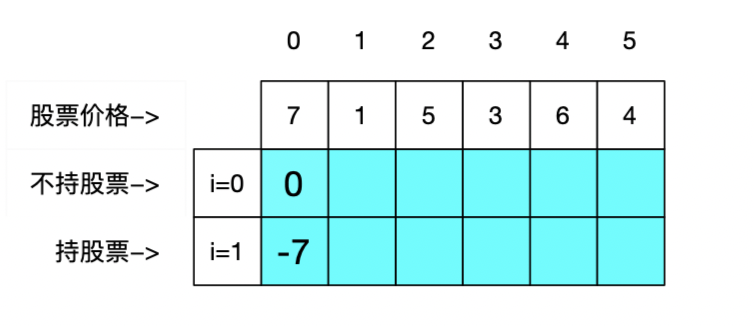
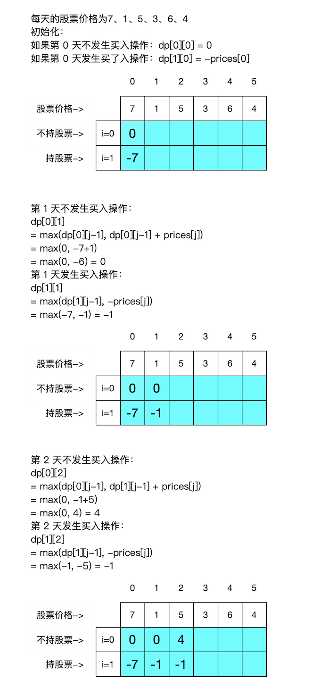
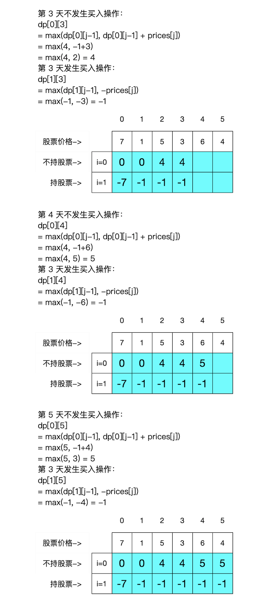
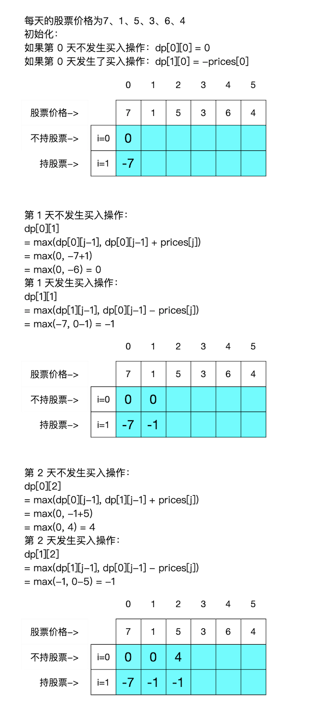
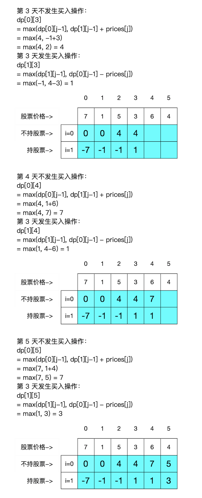
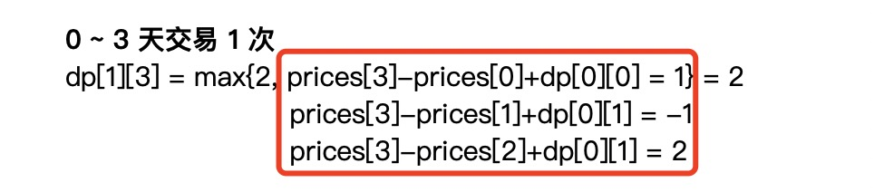
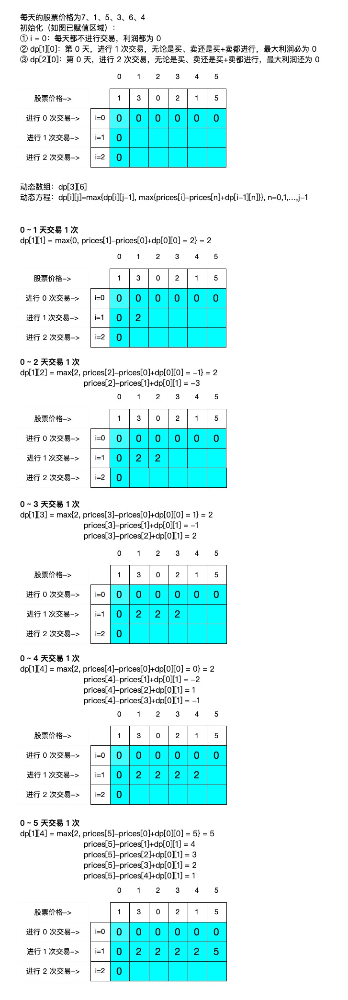
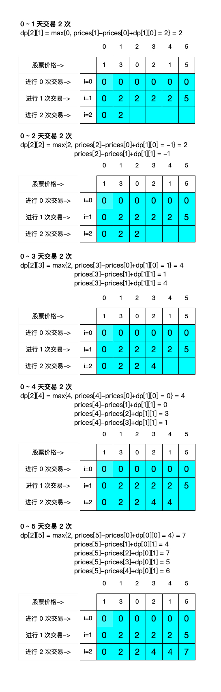

[toc]


hello，我是 Johngo！

股市一点红，股市一点绿！

激动的心，颤抖的手，无法控制的身子骨！

今天聊一聊股市，股价相关的问题，关系到身家的涨跌。

怎么用「动态规划」的思想去获得股市中最大利润。（LeetCode中的股价问题 手动狗头）！


## 说在前面

这周总算是把和大家一起刷题的「动态规划」的题目搞的差不多了。

在上一次的[动态规划总结](https://mp.weixin.qq.com/s/ZqOWomyra90BRzNukHr3-Q)中已经把基本的**解题方法四步骤**以及**无后效性**解释的很清楚了。

而动态规划的题目中，有一类「股票」问题，很值得大家进一步分析、学习、研究。

本文就来详细说说《买卖股票的最佳时机》系列题目，看看如果我们如果在知道未来几天的股价，怎么样买卖能够达到最大的利润（有人说了，这不胡扯吗？不胡扯！股价预测、动态规划都用起来）。

《买卖股票的最佳时机》系列题目，最主要的是四个题目：分别是 LeetCode 对应的 121、122、123 和 188。


## 引例：只能交易一次

首先用 LeetCode121《买卖股票的最佳时机》引出。

> 给定一个数组 prices ，它的第 i 个元素 prices[i] 表示一支给定股票第 i 天的价格。
>
> 你只能选择 **某一天** 买入这只股票，并选择在 **未来的某一个不同的日子** 卖出该股票。设计一个算法来计算你所能获取的最大利润。
>
> 返回你可以从这笔交易中获取的最大利润。如果你不能获取任何利润，返回 0 。

因为在前后购买的时间点是没有固定的，所以可以考虑「动态规划」的思路来解决。暴力方法就不解释了。

题目中强调只能在 **某一天** 买入这只股票，并选择在 **未来的某一个不同的日子** 卖出该股票，因此，买和卖发生在不同天，不能再同一天完成。这就涉及到在某一天是否持股。

另外，由于需要求得最大的利润，所以，定义动态数组 dp 用来表示当天手中的最大利润。

注意：dp 数组表示某一天结束的时候，手中的利润。（利润指的是手中的现金数，不算已买股票的价值）。

下面按照之前说的四步走的方法进行解题。


#### 一、动态数组定义

`dp[i][j]`,表示持股情况为`i`，第 `j`天结束，情况下，手中的最大利润。

> `i`代表是否持股，`i=0`不持股，`i=1`持股
>
> `j`代表第`j`天

所以，dp 是二维数组，并且是 2 行 `j` 列的二维数组。

举例：股票每天的价格 prices = [7, 1, 5, 3, 6, 4] 




#### 二、状态转移方程

`dp[0][j]`：表示该天不持股

很容易想到，如果今天不持股，那么昨天可能持股也可能不持股。分别讨论:

① 今天不持股，并且在昨天也不持股的情况下，手中的利润是不变的：

> `dp[0][j] = dp[0][j-1]`

② 今天不持股，而在昨天持股的情况下，手中的利润一定是增加的（卖掉股票）：

> `dp[0][j] = dp[1][j-1] + prices[j]`

所以，今天的最大价值是：`dp[0][j] = max(dp[0][j-1], dp[1][j-1] + prices[j])`

`dp[1][j]`：表示该天持股

① 今天持股，并且在昨天也持股的情况下，手中的利润是不变的：

> `dp[1][j] = dp[1][j-1]`

② 今天持股，而在昨天不持股的情况下，手中的利润一定是减少的，因为进行了**买操作**：

另外，由于本题规定只发生**买卖一次**，所以，在发生**买操作**的时候，直接就是减去当天的股价。

> `dp[1][j] = -prices[j]`

所以，今天的最大价值是：`dp[1][j] = max(dp[1][j-1], -prices[j])`


#### 三、初始化

如果第 0 天不发生买入操作：`dp[0][0] = 0`

如果第 0 天发生了买入操作：`dp[1][0] = -prices[0]`

下面，用一个长图进行一步一步把上述的二维数组填满：





因为要取最优利润值。所以，卖掉股票后才能有最大利润，除非，一次都没有交易。

故：`max_profit = dp[0][-1]`

看下核心代码：

```python
def maxProfit(self, prices):
    size = len(prices)
    if size == 0 or size == 1:
        return 0
    # 定义动态数组
    dp = [[0 for _ in range(size)] for _ in range(2)]
    # 初始化动态数组
    dp[0][0] = 0
    dp[1][0] = -prices[0]
    # 动态方程
    for j in range(1, size):
        dp[0][j] = max(dp[0][j - 1], dp[1][j - 1] + prices[j])
        dp[1][j] = max(dp[1][j - 1], -prices[j])
    return dp[0][-1]
```

是不是看完图中描述和代码后，这个题目的思路就很明显并且很通畅了。

别着急，咱们再看看优化项，除了思路的清晰通畅，看了下面的优化点思路会更加觉得优秀！（呃。。。）


#### 四、优化

在进行每一步计算的过程中可以发现，在每一天的计算中，只与前一天的计算结果有关系，与再之前的数据是没有关系的。

比如，在计算第 3 天的利润时，只与第 2 天的两个状态下的值有关系。

所以，只需要保留两个变量就可以将空间方面进行优化。可以动手按照上述思路画一下，很清晰的思路就出来了。

空间方面的优化代码：

```python
def maxProfit_opt(self, prices):
    size = len(prices)
    if size == 0 or size == 1:
        return 0
    dp1 = 0
    dp2 = -prices[0]
    for j in range(1, size):
        tmp1 = max(dp1, dp2+prices[j])
        tmp2 = max(dp2, -prices[j])
        dp1, dp2 = tmp1, tmp2
    return dp1
```


## 无限制买卖

上面 LeetCode121 题目限制了在给定的范围内，只能进行一次买卖。

下面的 LeetCode122 无限制进行买卖，进行求解最大利润。

> 给定一个数组 prices ，其中 prices[i] 是一支给定股票第 i 天的价格。
>
> 设计一个算法来计算你所能获取的最大利润。你可以**尽可能地完成更多的交易**（多次买卖一支股票）。
>
> 注意：你不能同时参与多笔交易（你必须在再次购买前出售掉之前的股票）。

近乎同样的解决逻辑，只是在进行买入股票的时候需要考虑之前的利润状态，上一个题目买入股票不需要考虑之前的利润状态，因为只进行一次买卖。

还是详细的来说说，每个步骤具体怎么状态转移。

#### 一、动态数组定义

`dp[i][j]`,表示持股情况为`i`，第 `j`天结束，情况下，手中的最大利润。

> `i`代表是否持股，`i=0`不持股，`i=1`持股
>
> `j`代表第`j`天

所以，dp 是依然是二维数组，并且是 2 行 `j` 列的二维数组。

举例：股票每天的价格 prices = [7, 1, 5, 3, 6, 4] 


#### 二、状态转移方程

**`dp[0][j]`：表示该天不持股**

很容易想到，如果今天不持股，那么昨天可能持股也可能不持股。分别讨论:

① 今天不持股，并且在昨天也不持股的情况下，手中的利润是不变的：

> `dp[0][j] = dp[0][j-1]`

② 今天不持股，而在昨天持股的情况下，手中的利润一定是增加的：

> `dp[0][j] = dp[1][j-1] + prices[j]`

今天的最大价值是：`dp[0][j] = max(dp[0][j-1], dp[1][j-1] + prices[j])`

**`dp[1][j]`：表示该天持股**

① 今天持股，并且在昨天也持股的情况下，手中的利润是不变的：

> `dp[1][j] = dp[1][j-1]`

② 今天持股，而在昨天不持股的情况下，手中的利润一定是减少的，因为进行了**买操作**：

因为无限次买卖。所以，在发生**买操作**的时候，需要将之前的利润状态减去当天的股价。

> `dp[1][j] = dp[0][j-1] - prices[j]`

所以，今天的最大价值是：`dp[1][j] = max(dp[1][j-1], dp[0][j-1] - prices[j])`


#### 三、初始化

如果第 0 天不发生买入操作：`dp[0][0] = 0`

如果第 0 天发生买入操作：`dp[1][0] = -prices[0]`

下面，依然用一个长图进行一步一步把上述的二维数组填满：





最后拿到 `dp[0]`的最后一个元素就是最大利润值，因为不持股手中的利润就是多的情况。

即：`max_profit = dp[0][-1]`

核心代码：

```python
def maxProfit(self, prices):
    size = len(prices)
    if size == 0 or size == 1:
        return 0
    # 定义动态数组
    dp = [[0 for _ in range(size)] for _ in range(2)]
    # 初始化动态数组
    dp[0][0] = 0
    dp[1][0] = -prices[0]
    # 动态方程
    for j in range(1, size):
        dp[0][j] = max(dp[0][j - 1], dp[1][j - 1] + prices[j])
        dp[1][j] = max(dp[1][j - 1], dp[0][j - 1] - prices[j])
    print(dp)
    return dp[0][-1]
```


#### 四、优化

同样的优化方案，还是从空间的角度进行优化。

同样很显然的，每一天利润值计算无论是买股票还是卖股票，都是只与前一天有关系。

因此，只需要设置两个值（dp1、dp2）存放持有和不持有股票的最大利润值，就可以简化空间计算。

核心代码：

```python
def maxProfit_opt(self, prices):

    size = len(prices)
    if size == 0 or size == 1:
        return 0
    # 初始化动态数组
    dp1 = 0
    dp2 = -prices[0]
    for j in range(1, size):
        tmp1 = max(dp1, dp2 + prices[j])
        tmp2 = max(dp2, dp1 - prices[j])
        dp1, dp2 = tmp1, tmp2
    return dp1
```

以上，在 LeetCode 中都属于 easy 模式的题目。

如果说，在一段时间内，只允许交易固定次数的时候，该怎么做？

比如，在 6 天时间内，允许交易 2 次，求最大利润？或者交易 k 次，求最大利润？


## 交易 2 次，最大利润？

下面的 LeetCode123 规定只进行 2 次买卖，进行求解最大利润。

> 给定一个数组，它的第 i 个元素是一支给定的股票在第 i 天的价格。
>
> 设计一个算法来计算你所能获取的最大利润。你最多可以完成 两笔 交易。
>
> 注意：你不能同时参与多笔交易（你必须在再次购买前出售掉之前的股票）。

还有一点注意，之前的题目强调，同一天不能既买又卖，但是当前的问题没有强调这一点，是可以在同一天进行买卖的。

思路和之前的题目还是有一点区别的， 建议一定细致读每一个字。

下面详细的来说说，每个步骤具体怎么状态转移。

#### 一、动态数组定义

`dp[i][j]`，代表进行 `i`次交易，在第 `j` 天的时候的最大利润。

> `i`代表交易次数
>
> `j`代表天数

举例：股票每天的价格 prices = [1, 3, 0, 2, 1, 5] 

根据案例，定义 dp 数组为 3 行 6 列。


#### 二、状态转移方程

和之前的有点不一样

动态方程：`dp[i][j]=max{dp[i][j-1], max{prices[i]-prices[n]+dp[i-1][n]}}, n=0,1,…,j-1`

看起来很复杂，公式复杂，其实思路还是比较简单。

不要着急，也不要被吓退，后面会每一步将上述动态数组填满，填满之后发现真的比较简单。


#### 三、初始化

`dp[0]=0` ：如果一直进行 0 次交易。那么，无论到第几天，利润都为 0 

`dp[1][0]`：第 0 天，进行 1 次交易，无论是买、卖还是买+卖都进行，最大利润必为 0

`dp[2][0]`：第 0 天，进行 2 次交易，无论是买、卖还是买+卖都进行，最大利润还为 0

初始化之后，就可以将上述二维数组填满，即可清晰看到每一步的计算过程。

【建议查看高清图片或者直接到 github 进行读取】



**注意，以上红框中也是要取最大值，对应动态方程中的第二个max。下面所有图示均符合此规律。**



上述步骤中，只填写了第 `i=1` 这一行。

最大利润值，要么取前一天的数据，要么就是公式中的计算逻辑。取其最大值。 

下面再把第 `i=2` 这一行填完，大家的思路会更加清晰起来。



这一顿操作，我简直差点要放弃了。

就按照上述思路，代码下来，发现执行超时，又一次差点放弃解答。

也不可谓难度为`困难`，而困难点就在这里。

至此，必须要进行优化，将**时间复杂度**降低下来。一般来说，动态规划的题目是将空间复杂度降低，时间复杂度降低的题目相对比较少一点。


#### 四、优化

从上面图中，很容易发现一点重复计算的部分。

下面就拿出来最后 2 个步骤的其中一些公式对照：

> prices[4]-`prices[0]+dp[0][0]`
> prices[4]-`prices[1]+dp[0][1]`
> prices[4]-`prices[2]+dp[0][1]`
> prices[4]-`prices[3]+dp[0][1]`

和

> prices[5]-`prices[0]+dp[0][0]`
> prices[5]-`prices[1]+dp[0][1]`
> prices[5]-`prices[2]+dp[0][1]`
> prices[5]-`prices[3]+dp[0][1]`
> prices[5]-prices[4]+dp[0][1\]

可以明显看出来，上述被标注的部分又是重复的计算。

最左侧一列都是当前的股票价格，也是不变的。

那么，这个时候就可以使用一个变量`max_profit`来进行记录右侧被标记部分的最大值。

将之前的动态方程：

`dp[i][j]=max{dp[i][j-1], max{prices[i]-prices[n]+dp[i-1][n]}}, n=0,1,…,j-1`

改为：

`dp[i][j]=max{dp[i][j-1], prices[j]+max_profit}`

其中，`max_profilt=max{dp[i-1][j]-prices[j], max_profit}`

**这里这里这里很重要，一定画图理解**。

也许就是该题目难度被设置为“困难”的地方！

看代码，很简单的实现：

```python
def maxProfit(self, prices):
    """
    使用动态规划解决: 最多完成 2 次交易
    """
    size = len(prices)
    if size == 0:
        return 0
    dp = [[0 for _ in range(size)] for _ in range(3)]
    print(dp)

    for i in range(1, 3):
        # 每一次交易的最大利润
        max_profit = -prices[0]
        for j in range(1, size):
            dp[i][j] = max(dp[i][j-1], max_profit + prices[j])
            max_profit = max(max_profit, dp[i-1][j] - prices[j])
    print(dp)
    return dp[-1][-1]
```

这样就完美解决了！


## 交易多次，最大利润？

LeetCode123 规定最多交易 2 次，下面再上升一个难度。

在 LeetCode188. 买卖股票的最佳时机 IV，最多可以完成 **k** 笔交易，求最大的利润。

> 给定一个整数数组 prices ，它的第 i 个元素 prices[i] 是一支给定的股票在第 i 天的价格。
>
> 设计一个算法来计算你所能获取的最大利润。你最多可以完成 k 笔交易。
>
> 注意：你不能同时参与多笔交易（你必须在再次购买前出售掉之前的股票）。

如果 LeetCode123  题目理解清楚的话，这个题目很快就可以解决了。

上一题规定最多交易 2 次，改题目最多交易 k 次。即：把 2 次的逻辑换为 k 次逻辑，就可以解决了。

直接看代码吧，和上一个题很类似：

```python
def maxProfit(self, k, prices):

    size = len(prices)
    if size == 0:
        return 0
    dp = [[0 for _ in range(size)] for _ in range(k+1)]
    print(dp)

    for i in range(1, k+1):
        # 每一次交易的最大利润
        max_profit = -prices[0]
        for j in range(1, size):
            dp[i][j] = max(dp[i][j-1], max_profit + prices[j])
            max_profit = max(max_profit, dp[i-1][j] - prices[j])
    print(dp)
    return dp[-1][-1]
```

看出来不一样的地方了吧，就是在之前逻辑设置为 2 的地方，在本地改为 k 次即可！

**注意：之前是 range(1, 3)代表 1 和 2， range(1,k+1) 代表 1,2,3,...,k**


以上！

《买卖股票的最佳时机》系列题目详细的进行了解释，后面还有其他的股票相关题目，但基本是基于今天文章的思路进行解决的。

刷题计划已经进行了有一段时间，需要一起来搞的，加我微信，我拉你进群哈！


