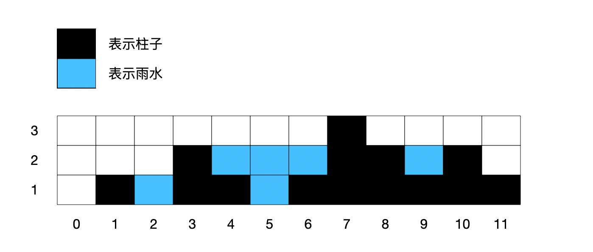
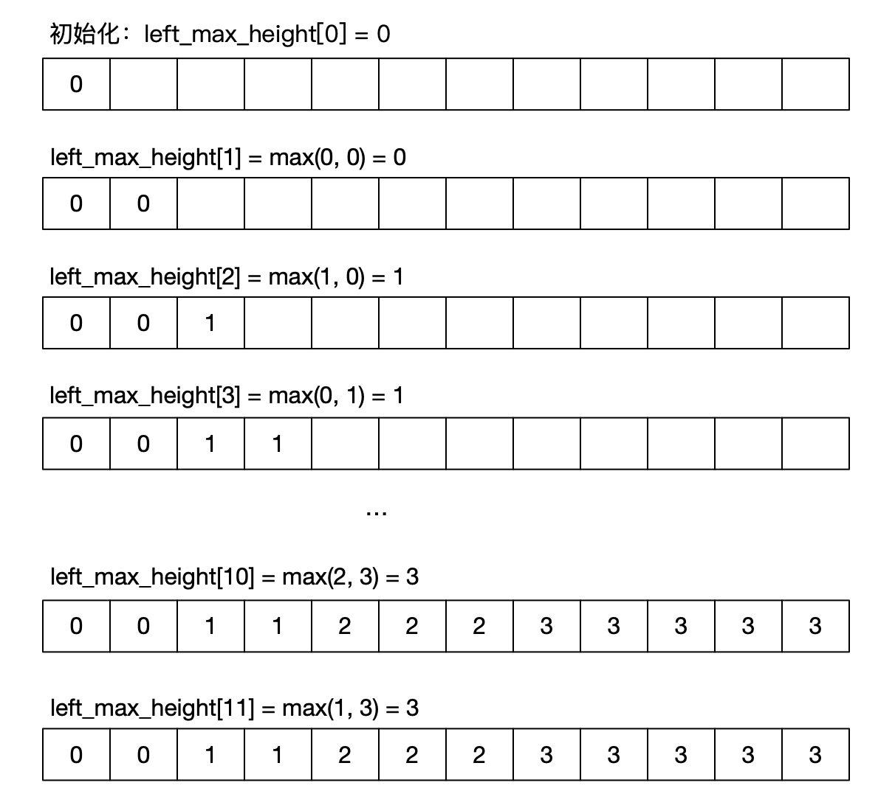
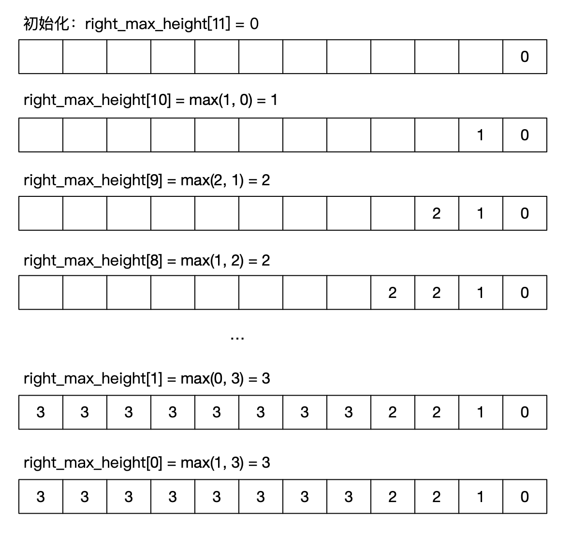
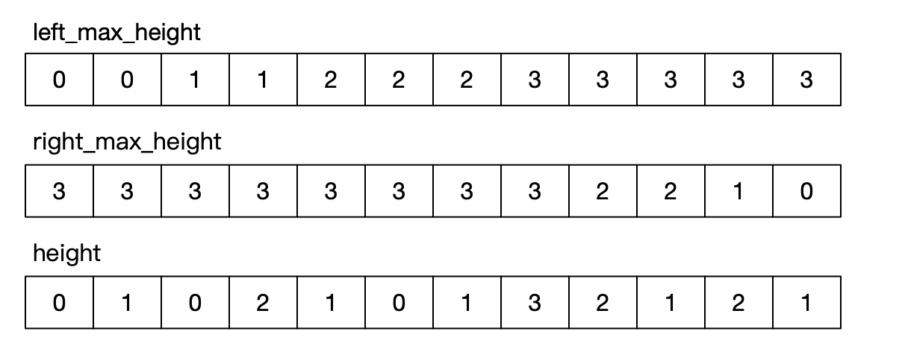
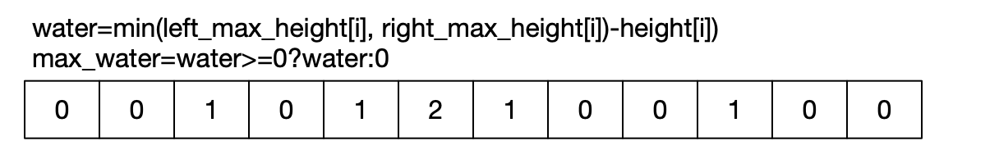
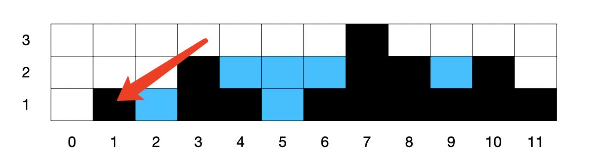

大家好！

动态规划题目是总结的比较完整了。下面是自从和大家刷开题总结的动态规划解题方法。

【】【】

今年全国夏天雨是真的多，突然想到今年北京的夏天也不像往年那么热。不知不觉就稳稳地度过了夏天来到秋天。

恰巧前几天有一个粉丝问到了我，网上接雨水的解决总是感觉有点混乱，能不能用动态规划解决。

今早北京大雨，借用大雨的感受，想了想接雨水问题，依然用长图一步一步说明！

##背景

先来看看题目，这个题目应该是很多人都已经遇到过了，因为它的题号是42，属于一个比较非常靠前的题目。

同时也属于一个非常经典的算法问题。

咱们今天的题目解决不做暴力法、也不做双指针，就用动态规划很清晰的进行说明。

看下图，12根柱子的围栏，接了6个单位的雨水。



从上图很显然能看到一点：

**如果想要接住雨水**。那么，决定雨量的多少在于「**左边的柱子高度**」、「**右边的柱子高度**」以及「**自身柱子的高度**」。

比如说，中间第 5 格雨水量为2，就是决定于左右侧柱子的较小值-本身柱子高度（0）而得到的。

*注意：左右侧的高度，指的是能围住雨水的柱子，而不是紧挨着的左右侧的柱子。*

> 左侧最高柱子：2
>
> 右侧最高柱子：3
>
> 自身柱子高度：0
>
> 雨水量 = min(左侧最高柱子, 右侧最高柱子) - 自身柱子高度 = 2

因此，需要定义两个数组，分别来存放相对于当前位置左侧和右侧柱子的最大高度。

最后，取左右侧柱子最小值-自身柱子高度=雨水量。


##思路

就用leetcode官方给的案例来进行一步一步解决。

柱子高度为：height = [0, 1, 0, 2, 1, 0, 1, 3, 2, 1, 2, 1]，再把图拿过来！


现在，定义两个数组，分别命名为 `left_max_height `和 `right_max_height`，存放相对于当前位置左侧和右侧柱子的最大高度。

先来定义第一个数组`left_max_height`，存放左侧最高柱子高度:

初始化：（因为左侧没有柱子，所以位置 0 左侧最大高度为 0）

```mathematica
left_max_height[0] = 0
```

动态方程：

```mathematica
left_max_height[i]=max(height[i-1], left_max_height[i-1])
```

下面还是用长图一步一步来进行说明：【点击高清显示】




下面开始定义第二个数组，存放右侧最高柱子高度。右侧最高度从最右侧开始进行计算。

初始化：（因为最后一个位置由侧没有柱子，所以位置 11 右侧最大高度为 0）

```
right_max_height[11] = 0
```

动态方程：

```mathematica
right_max_height[j]=max(height[j+1], right_max_height[j+1])
```

还是用长图一步一步来进行说明：【点击高清显示】




现在，当前位置的左侧和右侧柱子的最大高度数组计算完成后，下面就计算接水量。

> 雨水量 = min(左侧最高柱子, 右侧最高柱子) - 自身柱子高度 = 2

准备好三个数组：



上图中，height = [0, 1, 0, 2, 1, 0, 1, 3, 2, 1, 2, 1]，为了看起来清晰，可以参考最开始图示。

最大单位水量=左右取最小值-本身的高度

计算方式：

```mathematica
water=min(left_max_height[i], right_max_height[i])-height[i])
max_water=water>=0?water:0
```



上述需要注意一点，如果`左右取最小值-本身的高度<0`，说明当前本身柱子是凸出来左右侧最高值的，比如说位置 1：



所以说，位置 1 的计算结果为负数，需要强制转为 0。


##代码

```python
class Solution(object):
    def trap(self, height):
        size = len(height)
        # 小于等于 2 的时候，是接不住雨水的
        if size <= 2:
            return 0
        # 左边相对于当前位置的最大高度
        left_max_height = [0 for _ in range(size)]
        # 右边相对于当前位置的最大高度
        right_max_height = [0 for _ in range(size)]
        # 当前位置接雨水最大高度
        max_water = [0 for _ in range(size)]

        # 初始化 left_max_height, 第 0 个位置初始化为 0
        for i in range(1, size):
            left_max_height[i] = max(height[i-1], left_max_height[i-1])

        # 初始化 right_max_height, 第 size-1 个位置初始化为 0
        for j in range(1, size):
            right_max_height[size-j-1] = max(height[size-j], right_max_height[size-j])

        # 最大水量
        for k in range(1, size):
            max_water[k] = (min(left_max_height[k], right_max_height[k])-height[k] if min(left_max_height[k], right_max_height[k])-height[k]>=0 else 0)

        # 累计求单位水量
        waters = 0
        for z in range(1, size):
            waters += max_water[z]
        return waters

if __name__ == '__main__':
    s = Solution()
    print(s.trap([0, 1, 0, 2, 1, 0, 1, 3, 2, 1, 2, 1]))
```

这个题目总体来说，使用动态规划还是不容易想到的。尤其是上面两个数组使用了两次动态规划的过程。

接雨水问题还可以使用暴力解法和双指针解决，双指针可以试试，至于暴力。。心里有就好了哈哈。。

##多余的一句

边工作边带大家刷题确实是有点慢了，很抱歉！

不过，一定会坚持下去，也一定会把 LeetCode 各类型题目进行详细总结，做到大家想查看的时候随时能查到详细 LeetCode 资料的地方。


