[toc]


大家好！我是 Johngo 呀！

和大家一起刷题进行到了第二阶段，「动态规划」的题目做了一半，凭着之前对于「动态规划」的理解和最近做的题目做一个阶段性的总结！这篇文章其实是我之前写过的一篇，然后现在拿来再做一个润色。

「动态规划」看这篇我...保证可以！

**目标**：给小白以及没有明确思路的同学一个指引！

**拍胸脯保证：**读完这篇文章，对于大多数的动态规划的思维逻辑能有一个质的提升。

本文较长，建议先收藏，或者直接到 GitHub 中下载文档（https://github.com/xiaozhutec/share_leetcode.git）

那么，咱们开始吧...


## 零、初印象

**动态规划**，一直以来听着就是一种很高深莫测的算法思想。

尤其是上学时候算法的第一堂课，老师巴拉巴拉列了一大堆的算法核心思想，**贪心、回溯、动态规划**... ...，开始感觉要在算法世界里游刃有余的进行解决各种各样牛B问题了，没想到的还是稀里糊涂学过了之后还就真的是学过了（大学的课程还真是一个样子）。

再后来才明白，大学的课程一般来说就是入门级讲解，用来开拓眼界，真正想要有一番自己的见解，必须要在背后下一番辛苦，形成自己的**思考逻辑**。**tips**：这个思考逻辑一定是要有记录的，是真的有时候会忘记。

再后来返回头来看，**动态规划**理解起来还是比较困难，**重叠子问题、动态转移方程，优化点**等等等等，稀里糊涂，最后痛定思痛，好好看着其他人的分享理解了一部分，在之后疯狂刷题几十道。现在回过头来再看，算是基本可以佛挡杀佛了。

在我的这些学习积累过程中，把一部分「动态规划」的问题复盘出来。希望可以给到大家一点小小的帮助，相信在读完这篇文章的时候，你会感觉到**动态规划**给你带来的奇妙之处。也一定对**动态规划**形成自己的**思考方式**。

相信我！这不是一篇难以读懂的文章！


## 一、本文要点

1.相较于暴力解法，动态规划带给我们的是什么？为什么会有重叠子问题以及怎么去避免的?

2.用不同难度的动态规划问题举例说明， 最后会使用《打家劫舍》系列三个题再重温一次！

「动态规划」思维逻辑

看完本篇文章后，相信大家会对DP问题会有一个初步的思考，一定会入门。后面大家可以继续练习相关问题，熟能生巧，思考的多了就会形成自己的思维逻辑。


好了，话不多说，开搞...


## 二、动态规划带来的优势

**看完定有收获，加油！💪💪💪**

平时在我们算法设计的过程中，一般讲求的是算法的执行效率和空间效率的利用情况。

也就是我们熟知的**时间复杂度**（执行时耗费时间的长度）和**空间复杂度**（执行时占用存储单元的长度）

那下面用**时间复杂度和空间复杂度**来评估下**传统算法设计**和用**动态规划思想**解决下的效率情况。

### 引出：传统递归 vs. 动态规划

先用一个被大佬们举例举到烂的🌰，这个栗子很烂，但是真的**很香**：必须着重**强调**。

**斐波那契（Fibonacci）数列的第n项 **

**举荐理由：**在我自己看来 Fibonacci 是动态规划设计中的入门级案例，就好比说编程中的“hello world”，大数据中的“word count”。

Fibonacci 几乎完美的诠释了**动态规划带来的思想和技巧**然而没有任何其他的要考虑的细枝末节，这种很清晰的方法看起来很适合整个的动态规划的思维方式，很适合入门来进行的思考方式。

接下来咱们先来看题目：

```题目
写一个函数，输入n，求斐波那契（Fibonacci）数列的第 n 项。斐波那契数列的定义如下：

F(0) = 0, F(1) = 1
F(N) = F(N - 1) + F(N - 2), 其中 N > 1.
斐波那契数列由 0 和 1 开始，之后的斐波那契数就是由之前的两数相加而得出。
```

比较一下传统递归解法和动态规划思想下的解决对比

### 1. 递归解决

这个例子恐怕是我们大学中第一堂递归的经典案例了。

那么首先尝试用递归来解决。做起来比较简单，就是不断的去递归调用。

看下面代码：

```python
def fib(self, n):
    print('计算 F(%d)' % n)
    if n < 2:
        return n
    return self.fib(n-1) + self.fib(n-2)
```

输出的结果：

```python
计算 F(4)
计算 F(3)
计算 F(2)
计算 F(1)
计算 F(0)
计算 F(1)
计算 F(2)
计算 F(1)
计算 F(0)
```

**可以明显看到一个现象：重复计算**

总计 9 次的计算过程中，相同的计算结果有三对进行了**重复计算**（下图中同色项，不包含灰色），也就是说在递归的过程中，把曾经计算过的项进行了**又一次的重复计算**，这样对于时间效率是比较低的，唯一的好处可能就是代码看起来比较好懂，但是终归不是一个好的算法设计方法。

代码中，在计算N的时候就去递归计算 `fib(N-1) + fib(N-2)`，那么，这种情况下的计算过程中。会是下面图中的一个计算过程。

可以发现，会有相当一部分的重复计算，这样对于时间和空间都是重复的资源消耗。

> 参考图中相同颜色的项，比如说粉色的重复计算、黄色的重复计算等
>

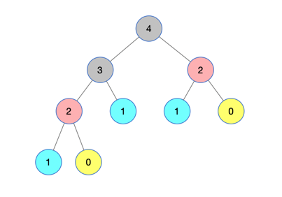

为了更好的说明这种重复计算带来时间效率的低下。再比如说，相比上述图中的计算节点，再增加一个节点的计算，增加计算`F(5)`，那么由于递归的计算方式，会有更多的项（下图中线框中部分）进行了重复的计算。在计算`F(5)`的时候，会递归调用`F(4)`和`F(3)`，而在下图中，计算`F(4)`的时候，又会完整的去计算`F(3)`。这样，如果N很大的话，会产生更大的时间消耗。

这样，这棵树的规模进行进行成倍增加，时间复杂度很明显的进行了成倍的扩张。对于时间上来说是很恐怖的.

时间复杂度带来的低效率严重超过了代码的可读性，所以我们可以想办法将**过去计算**过的节点**进行保存**。这样，我们就会用到下面要说的「动态规划」思想带来的时间上的高效。

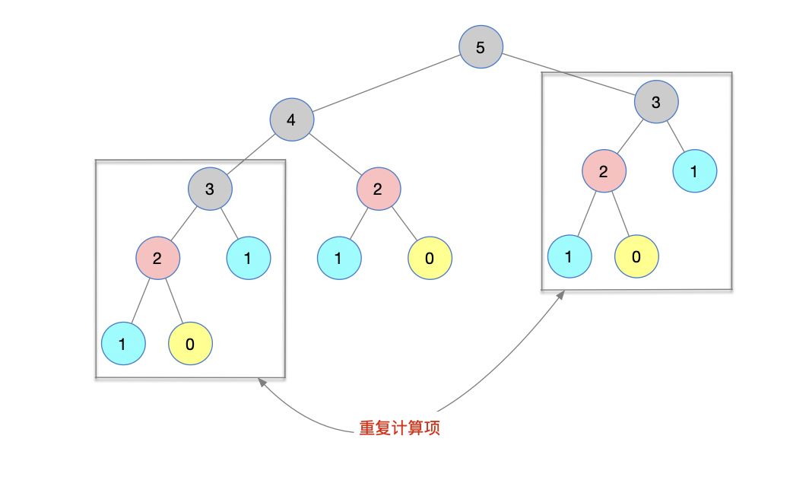

> 时间复杂度：O(2^N)​   ---> 指数级
>
> 空间复杂度：O(N)​


### 2. 动态规划解决

**到重点了：大概解释一下字面意思：**

**动态规划：**我们不直接去解决问题，而是在每一步解决问题的时候，达到每一步的最优情况。换句话说，就是在每一步解决问题过程中，利用**过去的状态**以及**当前状态**的情况而达到一个当前的最优状态.

**规划：**在一般解决该类问题的时候，会有一个“填表格”的过程，无论是简单情况下的**一维表格**还是复杂一点的**二维表格**，都是以**开辟空间换时间**的思想，以争取最佳的时间效率. （保存过程中间值，方便后续直接使用）.

**动态：**用上面的案例来说，递归解决过程中的每一步都会从基本问题不断的“自顶向下”去求解，在每一步骤中，会有相同的计算逻辑进行了重复的计算。相比于递归思想，动态规划思想增加了对历史上计算结果的保存，逐步记录下中间的计算结果，在每一步求得最优值.

因此，动态规划可以避免重复计算，达到了时间上的最优，从$O(2^N)$指数级变为$O(N)$常数级别，相较于开辟的一段内存空间存放中间过程值的开销，是非常值得的.

**那么，「动态规划」思维方式对 Fibonacci 进行问题的解决有什么实质性的帮助**

依据题中的规则：

`F(0) = 0, F(1) = 1`

`F(N) = F(N - 1) + F(N - 2),  when N > 1`

那么，👇👇F(N) 的值只与他的前两个状态有关系👇👇

a. 初始化值 : `F(0) = 0, F(1) = 1`

b. 想要计算得到`F(2)`

那么`F(2) = F(0) + F(1)`   -->  `F(0)、F(1)`直接拿取，保存 `F(2)`

c. 想要计算得到`F(3)`

那么`F(3) = F(2) + F(1) `  -->  `F(1)、F(2)`直接拿取，保存 `F(3)`

d. 想要计算得到`F(4)`

那么`F(4) = F(3) + F(2)`   -->   `F(2)、F(3)`直接拿取，保存 `F(4)`

利用动态规划思想，以一维数组辅助实现的Fibonacci，看下图

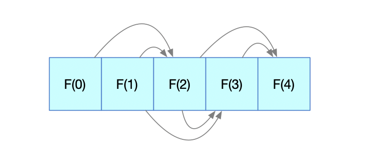

结合之前的递归调用，这样子解决是不是很简单的思路，仅仅靠保存过程中的一些值就能很简单的利用循环就可以实现了，没必要用递归反复计算进行实现。

想要计算得到第 n 个值的多少？那么，以下几点是我们必须要做到的

>第一、**定义一个一维数组**   --->  一般用dp来命名
>
>第二、**动态方程的设定**   --->  题中的F(N) = F(N - 1) + F(N - 2)
>
>第三、**初始化数值**   --->  F(0) = 0和F(1) = 1

上述的 3 点就是动态规划思想的几个核心要素或者说是解决问题的步骤！

下面来看下要实现的代码（代码中，用dp来代替上面的`F()`）

```python
class Solution(object):
    def fib(self, N):
        if N == 0:
            return 0
     
        dp = [0 for _ in range(N+1)]		# 1定义dp[i]保存第i个计算得到的数值
        dp[0] = 0   	# 2初始化
        dp[1] = 1			# 2初始化
        for i in range(2, N+1):	# 3动态方程实现，由于0和1都实现了赋值，现在需要从第2个位置开始赋值
            dp[i] = dp[i - 1] + dp[i - 2]
       
        print dp		 # 记录计算过程中的次数，与上述递归形成对比
        return dp[N]
```

输出:

```python
[0, 1, 1, 2, 3]
3
```

以上，最重要的就是1 2 3 点，而执行过程参照**输出**对比递归算法，计算少了很多，同样的计算只计算了一次。

> 时间复杂度：$O(N)$ 
>
> 空间复杂度：$O(N)$


介绍了上面的内容了，此处来条分割线吧，针对上述的 **递归 vs. DP** 


***


既然动态规划的方案也介绍了，下面咱们再仔细看看，是否有优化的空间，毕竟对于一个算法方案的设计，都有找到其优化点，无论是时间还是空间的效率都想要达到一个理想的值。


### 3. 动态规划 + 优化

咱们看下这张图解，发现每个计算节点都**只与前两个项有关系**。换句话说，咱们只要保存两个值就好了，计算新的节点值的时候，把新的值赋值给前两个值的第一个就好。


话说只要两个值，现在定义两个变量 dp1 和 dp2。那么，现在咱们一步一步模拟一下：

a. 初始化值 : F(0) = 0, F(1) = 1

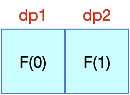

b. 想要计算得到F(2)， 那么F(2) = F(0) + F(1)   -->  保存 F(2)

	顺带将F(1)赋值给dp1， f(2)赋值给dp2


c. 想要计算得到F(3)， 那么F(3) = F(2) + F(1)   -->  保存 F(3)

	顺带将F(2)赋值给dp1， F(3)赋值给dp2

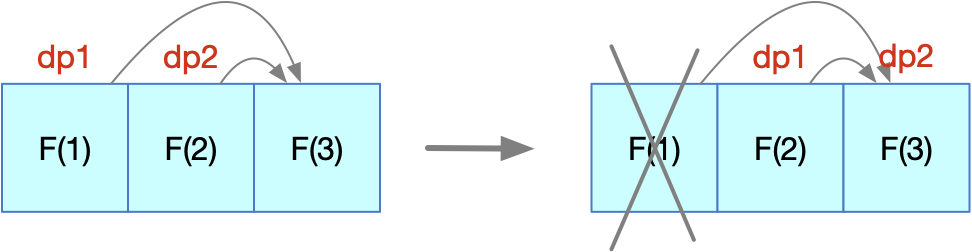

d. 想要计算得到F(3)， 那么F(4) = F(3) + F(2)   -->  保存 F(4)

	顺带将F(3)赋值给dp1， F(4)赋值给dp2

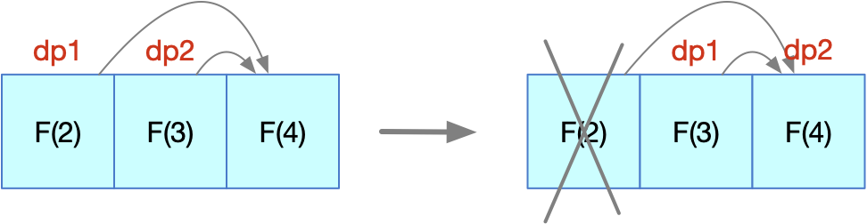

至此为止，整个过程仅仅用到了两个变量来存储过程中产生的值，也就之前没有优化的空间效率得到了优化。

咱们把代码也贴一下吧，供参考

```python
class Solution(object):
    def fib_dp1(self, N):
        if N == 0: return 0

        dp1, dp2 = 0, 1

        for i in range(2, N+1):
            dp1 = dp1 + dp2
            dp1, dp2 = dp2, dp1

        return dp2
```

看起来是不是更加简洁了。

再回想一次递归解决，这简直令人兴奋！！

洋洋洒洒不知不觉写了这么多了。

> 如果有读者说这太简单了，我这篇文章内容面对的是小白级别的，如果读者是中等往上的水平，可直接跳到后面的案例三开始参考。
>
> 另外，如果有任何的意见可随时对我的文章进行评论，欢迎&感谢大家一起讨论！
>
> 为了方便查看，GitHub已经存好：https://github.com/xiaozhutec/share_leetcode.git

大家感觉这个例子怎么样，三点说明：**1.定义dp数组  2.动态方程  3.初始化数值 4.优化项**

这也说明了为什么用**斐波那契数列**来引入**动态规划**的，因为斐波那契数列本身就明确的告诉你动态方程是什么，初始化的值是什么，所以好好的体会这种思想，尤其是从传统递归 -> 动态规划的思想解决，再到优化的方面，很值得深思。

那接下来，咱们就找几个有代表性的栗子来尝尝鲜，下面是案例的一个说明图：


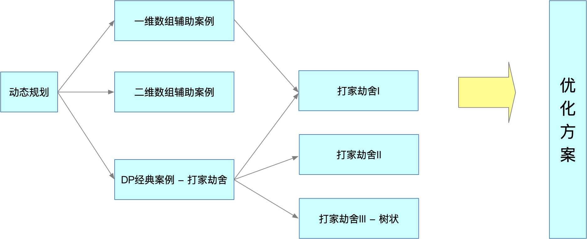


## 三、利用动态规划四大解题步骤处理问题

上面用斐波那契数列问题，引出了下面的几点，在这里再详细赘述一下。

在后面的案例中将会尽量严格按照这几个步骤进行解决问题：

> 步骤一：定义dp数组的含义
>
> 步骤二：定义状态转移方程
>
> 步骤三：初始化过程转移的初始值
>
> 步骤四：可优化点(可选)

#### 步骤一：定义dp数组的含义

绝大部分情况下，我们需要定义一维数组或者二维数组进行存储在计算过程中产生的最优值，这里为什么是最优值呢？是因为在解决问题过程中，一般情况dp数组用来保存**从开始到当前情况的最优值**，故而保存的是截止到目前的最优值，避免重复计算（这里看起来思维有混乱的同学们，想想上面 Fibonacci 递归解法和动态规划的对比）

**所以，dp无论是一维的还是二维的**，要想清楚**代表什么**，一般来说代表的是**截止到目前情况下的最优值**。

#### 步骤二：定义状态转移方程

什么是动态转移方程？ 如果有一个问题摆在我们面前，然后这个问题在解决的过程中，会发现有很多的**重叠子问题**，重叠子结构，而通过这些子问题的解决，最终将会把该问题进行解决。

通俗来说，在解决问题过程中，能够发现一个不断解决子问题的动态规律，比如说 Fibonacci 中的`F(N) = F(N - 1) + F(N - 2)`，而在其他的可以用动态规划解决的问题中，需要我们自己去发现这样的内在规律。这个是最难的也是最终于要的，只要这一步解决了，接下来我们解决这个问题基本就没问题了。

#### 步骤三：初始化过程转移的初始值

顺着步骤二的思路来，既然动态方程定义好了，是不是需要一个**支点**来撬动它进行不断的计算下去。

那么，这个**支点**就需要我们来初始定义，将动态方程激活，进行计算。举例来说Fibonacci中的`F(0) = 0`和`F(1) = 1`，有了这两个值，它的动态方程F(N) = F(N - 1) + F(N - 2)就可以进行下去了

这个就是我们要想好的初始值，实际问题可能还需要我们想想清楚.

#### 步骤四：可优化点(可选)

可优化的这里，最重要的会是dp数组这块，也会有不同问题不同的优化点。

在例子中，我们会进行不同的优化，其中，最主要的优化点还是在空间的优化方面。

总之一点，建议大家动笔多画画图，很多细节慢慢就会出现了。


下面按照之前设定的案例顺序，都来看看

### 案例一：打家劫舍I 「来自leetcode198」

你是一个专业的小偷，计划偷窃沿街的房屋。每间房内都藏有一定的现金，影响你偷窃的唯一制约因素就是相邻的房屋装有相互连通的防盗系统，如果两间相邻的房屋在同一晚上被小偷闯入，系统会自动报警。

给定一个代表每个房屋存放金额的非负整数数组，计算你在不触动警报装置的情况下，能够偷窃到的最高金额。

**示例 1:**

```题目
输入: [1,2,3,1]
输出: 4
解释: 偷窃 1 号房屋 (金额 = 1) ，然后偷窃 3 号房屋 (金额 = 3)。
     偷窃到的最高金额 = 1 + 3 = 4 。
```

**示例2：**

```python
输入: [2,7,9,3,1]
输出: 12
解释: 偷窃 1 号房屋 (金额 = 2), 偷窃 3 号房屋 (金额 = 9)，接着偷窃 5 号房屋 (金额 = 1)。
     偷窃到的最高金额 = 2 + 9 + 1 = 12 。
```

把经典案例系列拆分开讨论下吧，咱们首先将「打家劫舍I」来看看

该题可以用动态规划的思想来解决的原因是，在小偷不断偷取的过程中，始终想要偷得的物品价值最大，最优，每一步骤都与之前的偷取情况有关系，而且每一步都要考虑是否能偷，是否会带来最大利益，这就使得我们可以用动态规划的思想来解决问题。  然后严格按照四步骤进行解题。

##### 步骤一： 定义dp数组的含义

> 之前提到的，dp数组存储的值一般代表截止目前的最优值，在该题目中，我们定义：
>
> **dp[i] 代表到达第 i 个房屋偷得的最高金额，也就是当前最大子序和**
>
> 无论房屋有几间，最后我们取到dp数组的最后一个值就求得小偷偷得的最高金额

##### 步骤二：找出关系元素间的动态方程

> 动态规划解决的问题，一般来说就是解决最优子问题，“**自顶向下**” 的去不断的计算每一步骤的最优值;
>
> 也就是想要得到`dp[i]`的值，我们必须要知道`dp[i-1]`，`dp[i-2]`，`dp[i-3]` ... 的每一步的最优值，在这个状态转移的过程中，我们必须要想清楚怎么去定义关系式。然而在每一步的计算中，都与前几项有关系，这个固定的关系就是我们要寻找的重叠子问题，也同样是接下来要详细定义的动态方程;
>
> 该题目中，当小偷到达第 `i`个屋子的时候，他的选择有两种：一种是偷，另外一种是不偷， 然后选择价值较大者
>
> a. 偷的情况计算：以下图为例，必然是dp[3] = nums[2] + dp[1]，如果是偷取该屋子的话，相邻屋子是不能偷取的，因此，通项式子是：dp[i] =  nums[i-1] + dp[i-2]


> b. 不偷的情况计算：必然是dp[3] = dp[2]，如果是不偷取该屋子的话，相邻屋子就是其最优值，因此，通项式子是：`dp[i] =  dp[i-1]`

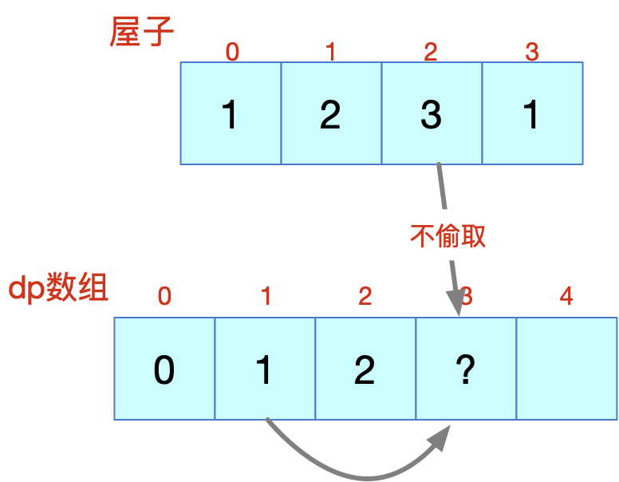

>最后，要想偷得最高金额，那么，必须选取在偷与不偷之间的最大值作为我们是否选取的关键点。即：
>
>**动态方程:** `dp[i] = max(dp[i-1], nums[i-1]+dp[i-2])`

##### 步骤三：初始化数值设定

> 初始化: 给没有房子时，dp一个位置，即：`dp[0]`
>
> 1 当size=0时，没有房子，`dp[0]=0`；
>
> 2 当size=1时，有一间房子，偷即可：`dp[1]=nums[0]`

那么，按照这个思路来整理一下代码：

```python
class Solution(object):

    def rob(self, nums):
      # 1.dp[i] 代表当前最大子序和
      # 2.动态方程: dp[i] = max(dp[i-1], nums[i-1]+dp[i-2])
      # 3.初始化: 给没有房子时，dp一个位置，即：dp[0]
      #   3.1 当size=0时，没有房子，dp[0]=0；
      #   3.2 当size=1时，有一间房子，偷即可：dp[1]=nums[0]
      size = len(nums)
      if size == 0:
        return 0

      dp = [0 for _ in range(size+1)]

      dp[0] = 0
      dp[1] = nums[0]
      for i in range(2, size+1):
        dp[i] = max(dp[i-1], nums[i-1]+dp[i-2])
        return dp[size]
```

> 时间复杂度：O(N)
>
> 空间复杂度：O(N)

那下面想想看有没有可优化的地方，尽量的释放一部分计算机资源。

##### 步骤四：优化

从 `dp[i] = max(dp[i-1], nums[i-1]+dp[i-2])` 关系来看，每一次动态变化，都与**前两次状态**有关系（`dp[i-1], dp[i-2]`)，而前面的一些值是没有必要留存的。

所以，dp只需要定义两个变量就好，将空间复杂度降为`O(1)`

```python
class Solution(object):

    def rob_o(self, nums):
        # 依照上面的思路，其实我们用到的数据永远都是dp的dp[i-1]和dp[i-2]两个变量
        # 因此，我们可以使用两个变量来存放前两个状态值
        # 空间使用由O(N) -> O(1)

        size = len(nums)
        if size == 0:
            return 0

        dp1 = 0
        dp2 = nums[0]
        for i in range(2, size+1):
            dp1 = max(dp2, nums[i-1]+dp1)
            dp1, dp2 = dp2, dp1
        return dp2
```

> 时间复杂度：O(N)
>
> 空间复杂度：O(1)

说完《打家劫舍I 》，中间穿插另外一道题目，利用二维dp来解决的一个问题。

最后再说说《打家劫舍II 》和《打家劫舍III》，把这一系列的**打家劫舍**问题搞明白了，相信你对动态规划有一个较为深刻的入门体验

> 如果有读者说这太简单了，我这篇文章内容面对的是小白级别的，如果读者是中等往上的水平，可直接跳到后面的案例三开始参考。
>
> 另外，如果有任何的意见可随时对我的文章进行评论，欢迎大家一起讨论！

### 案例二：不同路径「来自leetcode62」

一个机器人位于一个 m x n 网格的左上角 （起始点在下图中标记为“Start” ）。

机器人每次只能向下或者向右移动一步。机器人试图达到网格的右下角（在下图中标记为“Finish”）。

问总共有多少条不同的路径？


**示例 1:**

```python
输入: m = 3, n = 2
输出: 3
解释:
从左上角开始，总共有 3 条路径可以到达右下角。

1. 向右 -> 向右 -> 向下
2. 向右 -> 向下 -> 向右
3. 向下 -> 向右 -> 向右
```

**示例 2:**

```python
输入: m = 7, n = 3
输出: 28
```

*提示：*

1 <= m, n <= 100
题目数据保证答案小于等于 2 * 10 ^ 9

下面依然按照四个步骤来进行讨论：

##### 步骤一：定义dp数组的含义

> 当前这道题是从左上角到右下角的，题目中规定只能向右或者向下走，所以我们必须要定义一个二维数组来保存计算过程中的值。
>
> 所以，这块定义：**dp[i]\[j]: 代表到达位置 (i, j) 的所有路径的总数**
>
> 即：机器人从左上角到右下角所有路径的总和，dp中每个位置的值代表行走到达 (i, j) 每个位置的总共的路径数

##### 步骤二：找出关系元素间的动态方程

> 由于题目中规定只能向右或者向下走，所以在机器人行进的时候，只能是向右或向下.
>
> 那么，分别讨论下两种情况，想要到达位置(i, j)，可以从位置(i-1, j)或者(i, j-1)出发到达。因此，到达位置(i, j) 的总的路径数一定是 **到达位置(i-1, j)路径数** + **到达位置(i, j-1)路径数**。那么，现在可以定义动态方程：
>
> **动态方程：dp[i]\[j] = dp[i-1]\[j] + dp[i]\[j-1]**

##### 步骤三：初始化数值设定

>很明显，在机器人走第 0 行，第 0 列的时候，无论怎么走，都只有 1 种走法。
>
>因此，初始化值的设定，一定是 `dp[0..m]\[1]` 或者 `dp[1]\[0..n]` 都等于1
>
>因此初始值如下：
>
>**dp[0] [0….n-1] = 1;**  // 机器人一直向右走，第 0 列统统为 1
>
>**dp[0…m-1] [0] = 1;**  // 机器人一直向下走，第 0 列统统为 1

现在，按照这个思路来整理一下代码

```python
class Solution(object):

    def uniquePaths1(self, m, n):

        # 初始化表格，由于初始化0行 0列都为1。那么，先全部置为1
        dp = [[1 for _ in range(m)] for _ in range(n)]

        for i in range(1, n):
            for j in range(1, m):
                dp[i][j] = dp[i-1][j] + dp[i][j-1]

        return dp[n-1][m-1]
```

上述代码中由于`dp[0..m]\[1]` 或者 `dp[1]\[0..n]` 都等于1，所以在定义二维数组`dp`时候，统统赋初始值为 1

然后从位置(1, 1)开始计算每个位置的总路径数

> 时间复杂度：O(M*N)
>
> 空间复杂度：O(M*N)

既然到这里了，下面再想想看有没有可优化的地方

##### 步骤四：优化

>可以依照前面的解决的思路，应该也可以从空间上进行一定的优化
>
>参照前面的案例，之前定义的是一维数组`dp`，优化点是每一步骤都只与前面的两个计算好的数值有关系，然后优化点就是将`dp[N] -> dp1`和`dp2`，空间复杂度由 `O(N) -> O(1)`，如果是很大规模的数据计算的话，空间效率提升了不少.
>
>现在这个例子中的动态方程是**dp[i]\[j] = dp[i-1]\[j] + dp[i]\[j-1]**，很明显，每一步骤中的状态值只与左边相邻的值和上面的值相关。举例（为了方便，用 3*4 来举例）

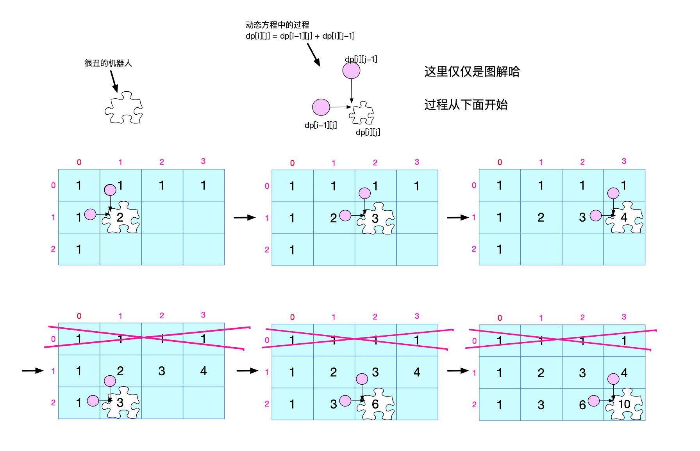

这个完整的图片描述中，机器人从左上角的位置(1, 1)开始移动，逐渐每一步都根据动态方程进行前进，明显的可以看出机器人每移动一格，所得到的路径总和只与它的上方和左方数值有关系。也就是我们会发现，机器人移动到第2行的时候，**第0行数据完全是没有用的状态**。

因此，这个优化点就出来了，在算法设计的时候，dp仅仅定义**2行N列**的数组就ok了，省去了`m-2`行的空间开销。这个代码如果大家想明白了请自行设计出来，自己写出来一定会有更加深刻的理解，再强调：多思考，形成潜移默化的思维方式！

看完这个步骤之后，是不是很明显的优化点，为什么上面没有给出大家代码呢？是因为我看到貌似可以**继续优化的点**（粘住空间优化项了哈哈哈），那就继续在空间开销上做文章。

**引导：**根据上述咱们的优化方案，说道 "机器人移动到第2行的时候，第0行数据完全是没有用的状态"，其实当前聪明的读者你想想，再看看，下面的图中（从上图截取过来）。 其实，不仅仅是第 0 行完全没用了，而且在第2 行做移动的时候，移动到位置(i, j)的时候，计算好位置(i, j)，那么接下来，位置(i-1, j)的数据也就没用了。

换句话说，一边走着，第 1 行开始的某些数据也就没用了，还在占着空间！

**这块大家一定多想想，多理解，多画图**

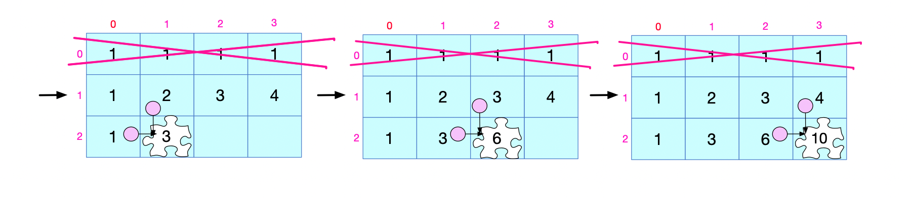

下面按照这种思路，看下图的步骤，也画好了用一维数组进行解决问题，也画出来每一步骤与上图的类比过程：

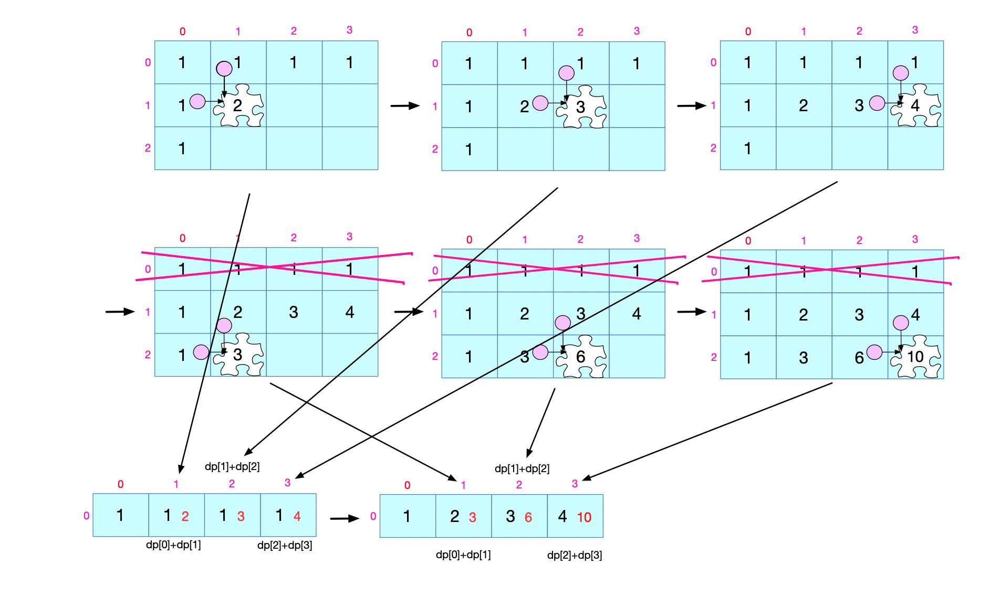

在这里，有犯困的同学可以自己动手画一画，理解一下，个人感觉是一个很好的思维扩展！挺有意思！

接下来，就按照这样的思路进行代码实现，会发现码起来很简单

```python
class Solution(object):

    def uniquePaths2(self, m, n):
        if m > n:
            m, n = n, m

        dp = [1 for _ in range(m)]

        for i in range(1, n):
            for j in range(1, m):
                dp[j] = dp[j] + dp[j-1]

        return dp[m-1]
```

> 时间复杂度：O(m*n)
>
> 空间复杂度：O(min(m ,n))

是不是从思维方面简单干净了许多？

搞清楚上面的栗子之后呢，我们将上面的例题进行一个简单的难度增加，说白了，就是在路上打几个阻碍点！

来看:


### 案例三：不同路径II 「来自leetcode63」

一个机器人位于一个 m x n 网格的左上角 （起始点在下图中标记为“Start” ）。

机器人每次只能向下或者向右移动一步。机器人试图达到网格的右下角（在下图中标记为“Finish”）。

现在考虑网格中有障碍物。那么从左上角到右下角将会有多少条不同的路径？


> 说明：m 和 n 的值均不超过 100。

**示例 1:**

```python
输入:
[
  [0,0,0],
  [0,1,0],
  [0,0,0]
]
输出: 2
解释:
3x3 网格的正中间有一个障碍物。
从左上角到右下角一共有 2 条不同的路径：

1. 向右 -> 向右 -> 向下 -> 向下
2. 向下 -> 向下 -> 向右 -> 向右
```

**咱们先看一下题中的两个关键点：**

关键点1：只能向右或者向下

关键点2：有障碍物为1， 无障碍物为0


根据 关键点1 和 关键点2 依然按照四个步骤来进行讨论：

##### 步骤一：定义dp数组的含义
> 这个题目中定义的dp数组是和上一个例题中定义的dp数组的含义是相同的，但由于该题中已经定义有数组 obstacleGrid，可以直接利用，无需额外开辟空间。
>
> 那么，就利用**obstacleGrid**作为动态规划中存储计算过程中的最优值。

##### 步骤二：找出关系元素间的动态方程
> 参照上一题目，规定动态方程: `obstacleGrid[i]\[j] = obstacleGrid[i-1]\[j] + obstacleGrid[i]\[j-1]`
>
> 由于机器人在移动过程中有障碍物，那么，对上面动态方程加一些限制条件
>
> a.若当前 obstacleGrid[i][j] 为0。那么，直接计算动态方程下的计算过程
>
> b.若当前 obstacleGrid[i][j] 不为0。那么，直接置该位置的值为0

  所以，在进行动态方程遍历的时候，先进行 obstacleGrid[i][j]的判断，再进行动态方程的计算执行。

##### 步骤三：初始化数值设定

>相比于上一题目，相似的是，在机器人走第 0 行，第 0 列的时候，无论怎么走，都只有 1 种走法
>
>但由于有障碍物，那走到障碍物的时候，后面都是走不下去的（下图用第一行来举例）。

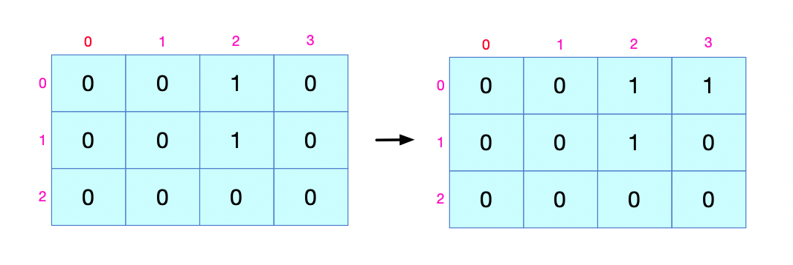

>所以，初始化第 0 行，第 0 列的时候，障碍物 1 后面的都是不可达的。所以，初始化行和列的逻辑表达：
>
>**该位置是否可达=前一个位置的状态and该位置能否可达 得到能否到达这个位置**
>
>只有前一个位置为1（可达，只有1种方式） ，当前位置为0（无障碍物）这种情况才能到达该位置，然后为该位置设 1 （可达，只有1种方式）

```python
# 0 行初始化表达式: 
obstacleGrid[0][row] = int(obstacleGrid[0][row] == 0 and obstacleGrid[0][row-1] == 1)
# 0 列初始化表达式: 
obstacleGrid[clo][0] = int(obstacleGrid[clo][0] == 0 and obstacleGrid[clo-1][0] == 1)
```

  这些都准备就绪之后，按照相关思路进行编码
```python
class Solution(object):

    def uniquePathsWithObstacles1(self, obstacleGrid):
      	# 行列长度
        m = len(obstacleGrid)
        n = len(obstacleGrid[0])

        # 如果在位置(0, 0)，哪里都去不了，直接返回0
        if obstacleGrid[0][0] == 1:
            return 0

        # 否则，位置(0, 0)可以到达
        obstacleGrid[0][0] = 1

        # 初始化 0 列
        for clo in range(1, m):
            obstacleGrid[clo][0] = int(obstacleGrid[clo][0] == 0 and obstacleGrid[clo-1][0] == 1)

        # 初始化 0 行
        for row in range(1, n):
            obstacleGrid[0][row] = int(obstacleGrid[0][row] == 0 and obstacleGrid[0][row-1] == 1)

        # 从位置(1, 1)根据动态方程开始计算
        for i in range(1, m):
            for j in range(1, n):
                if obstacleGrid[i][j] == 0:
                    obstacleGrid[i][j] = obstacleGrid[i-1][j] + obstacleGrid[i][j-1]
                else:
                    obstacleGrid[i][j] = 0

        return obstacleGrid[m-1][n-1]
```
> 时间复杂度: O(mxn)
>
> 空间复杂度: O(1)

##### 步骤四：优化

这块的优化先不谈了，这里基本没有什么优化点，之前都是由于自己要开辟内存空间，通过空间的优化来进行，而本题是在给定的数组中进行操作的。

有了这几个案例的基础之后，咱们后面把经典的《打家劫舍》系列剩下的两个题目讨论完，就先告一段落，后面也希望以不同的方式与大家多多交流，互相学习

如果有读者看着累了，可以先保存，收藏下来，待消化了前面的内容，方便再回来看看。

再次备注GitHub地址，里面有该文档的地址：https://github.com/xiaozhutec/share_leetcode.git


### 案例四：打家劫舍II 「来自leetcode213」

你是一个专业的小偷，计划偷窃沿街的房屋，每间房内都藏有一定的现金。这个地方所有的房屋都围成一圈，这意味着第一个房屋和最后一个房屋是紧挨着的。同时，相邻的房屋装有相互连通的防盗系统，如果两间相邻的房屋在同一晚上被小偷闯入，系统会自动报警。

给定一个代表每个房屋存放金额的非负整数数组，计算你在不触动警报装置的情况下，能够偷窃到的最高金额。

**示例 1:**

```python
输入: [2,3,2]
输出: 3
解释: 你不能先偷窃 1 号房屋（金额 = 2），然后偷窃 3 号房屋（金额 = 2）, 因为他们是相邻的。
```

**示例 2:**

```python
输入: [1,2,3,1]
输出: 4
解释: 你可以先偷窃 1 号房屋（金额 = 1），然后偷窃 3 号房屋（金额 = 3）。
     偷窃到的最高金额 = 1 + 3 = 4 。
```

与《打家劫舍I》不同的是，《打家劫舍I》的屋子是线性的，而《打家劫舍II》是环状的，所以要考虑的点会增加一些，因为首位相连接的情况，咱们分为下面三种情况进行设定：

a. 不偷首偷尾

b. 偷首不偷尾

c. 首位都不偷

显然，c 种方式损失太大，不会获得最高的金额，故选取 a 和 b。

那么，下面分为两种情况，分别计算不包含首和不包含尾这两种情况来判断小偷哪种方式偷取的金额最高。

下面依然按照之前的四个步骤来进行分析：

##### 步骤一： 定义dp数组的含义

>dp[i] 代表的含义和之前一致，dp数组存储的值一般代表截止目前的最优值
>
>所以，**dp[i] 代表到达第 i 个房屋偷得的最高金额，也就是当前最大子序和**
>
>但是最后会讨论**不包含首**和**不包含尾**这两种情况下得到的dp数组的最后一位，然后获取其中较大者，就是我们要取得的最高金额

##### 步骤二：找出关系元素间的动态方程

> 动态方程可参照《打家劫舍I》，有很详细的图解过程，该例子动态方程的变化和之前是完全一致的：
>
> **dp[i] = max(dp[i-1], nums[i-1]+dp[i-2])**

##### 步骤三：初始化设定

> 初始化: 给没有房子时，dp一个位置，即：`dp[0]`
> 	a. 当 size=0 时，没有房子，小偷没办法偷：`dp[0]=0`；
> 	b. 当 size=1 时，有一间房子，只要偷即可：`dp[1]=nums[0]`

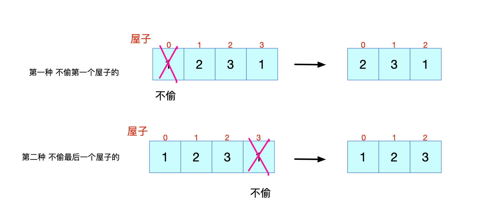

由于屋子首位相连接，所以在计算时候，直接分为两种情况。

第一种略过第一个屋子，第二种略过第二个屋子，这样得到的两个数组结果。最后只要比较最后一位数值的大小就ok了。解决！

该例子步骤三之后，感兴趣的同学可以自己写一下代码，和《打家劫舍I》的代码很类似，后面我写了优化后的代码，可能会更加的明白怎么写。咱们直接到步骤四，有了上面的案例，直接来看看优化后的方案:

##### 步骤四：优化

> 同样从 `dp[i] = max(dp[i-1], nums[i-1]+dp[i-2]) `关系来看
>
> 每一次动态变化，都与前两次状态有关系（dp[i-1], dp[i-2])，而前面的一些值是没有必要留存的，只要保存两个变量来保存过程最优值就好。

代码中有详细的注释：

```python
class Solution(object):

    def rob(self, nums):
        # 点睛：与打家劫舍I的区别是屋子围成了一个环
        #   那么，很明显可以分为三种情况：
        #   1. 首位都不偷
        #   2. 偷首不偷尾
        #   3. 不偷首偷尾
        # 显然，第1种方式损失太大，选取2、3。
        # 那么，分为两种情况，分别计算不包含首和不包含尾这两种情况来判断哪个大哪个小

        # 1.dp[i] 代表当前最大子序和
        # 2.动态方程: dp[i] = max(dp[i-1] and , nums[i-1]+dp[i-2])
        # 3.初始化: 给没有房子时，dp一个位置，即：dp[0]
        #   3.1 当size=0时，没有房子，dp[0]=0；
        #   3.2 当size=1时，有一间房子，偷即可：dp[1]=nums[0]

        # 依照《打家劫舍I》的优化方案进行计算

        # nums处理，分别切割出去首和去尾的子串
        nums1 = nums[1:]
        nums2 = nums[:-1]

        size = len(nums)
        if size == 0:
            return 0
        if size == 1:
            return nums[0]

        def handle(size, nums):
            dp1 = 0
            dp2 = nums[0]
            for i in range(2, size+1):
                dp1 = max(dp2, nums[i-1]+dp1)
                dp1, dp2 = dp2, dp1
            return dp2

        res1 = handle(size-1, nums1)
        res2 = handle(size-1, nums2)

        return max(res1, res2)
```

> 时间复杂度：O(N)
>
> 空间复杂度：O(1)

再看看下面小偷遇到的情况，小偷很难...

### 案例五：打家劫舍III 「来自leetcode337」

在上次打劫完一条街道之后和一圈房屋后，小偷又发现了一个新的可行窃的地区。这个地区只有一个入口，我们称之为“根”。 除了“根”之外，每栋房子有且只有一个“父“房子与之相连。一番侦察之后，聪明的小偷意识到“这个地方的所有房屋的排列类似于一棵二叉树”。 如果两个直接相连的房子在同一天晚上被打劫，房屋将自动报警。

计算在不触动警报的情况下，小偷一晚能够盗取的最高金额。

**示例 1:**

```python
输入: [3,2,3,null,3,null,1]

 		 3
		/ \
   2   3
    \   \ 
     3   1

输出: 7 
解释: 小偷一晚能够盗取的最高金额 = 3 + 3 + 1 = 7.
```

**示例 2:**

```python
输入: [3,4,5,1,3,null,1]

 		 3
		/ \
   4   5
  / \   \ 
 1   3   1
输出: 9
解释: 小偷一晚能够盗取的最高金额 = 4 + 5 = 9.
```

题目出的很好，但是立马会给人一种小偷也不是好当的的赶脚...

言归正传，咱们先来说说题目本身！

《打家劫舍》的小偷从一维线性到环形，再到二维矩形的屋子？是我想简单了，直接就干到树形了，是不是看着很香，而且很想，看下去，研究研究...

来整理几点思路，再来按照四步走：

> 1.由于房屋是树状的，因此，我们可以使用遍历树的传统方法进行遍历(前序、中序、后续)
>
> 2.简单的思路是，从树低进行往上遍历，拿到最优的打劫值。可以选用后续遍历
>
> 3.得到每一节点的最优值，最后选取最优的结果

依然按照三个步骤来进行分析（无优化点）

##### 步骤一： 定义dp数组的含义

> dp[i]代表该节点及以下打最多的劫（拿到最多的钱）

##### 步骤二：找出关系元素间的动态方程

> 根据我们每走到一个节点，都会有两种情况，那就是 **偷(1)** 与 **不偷(0)**。我们分开来讨论：
>
> a. 用 **dp[0]** 代表不偷取该节点到目前为止拿到最多的钱，那么儿子节点偷不偷都ok。
>
> 所以： **dp[0] = max(left[0], left[1]) + max(right[0], right[1])**
>
> b. 用 **dp[1]** 代表偷了该节点到目前为止拿到最多的钱，则儿子节点都不能被偷。
>
> 所以：**dp[1] = value + left[0] + right[0]**  (value代表该结点的价值)

有看不懂的地方吗？再紧接着解释一下：

>`left[0]`代表不偷取左孩子拿到最高的金额
>
>`left[1]`代表偷取左孩子拿到最高的金额
>
>`right[0]`代表不偷取右孩子拿到最高的金额
>
>`right[1]`代表偷取右孩子拿到最高的金额

##### 步骤三：初始化设定

该例子的初始化比较简单，就是当前树的形状为空的时候，直接返回`dp[0, 0]`

下面贴出完整代码，其中包含**树的初始化**代码 && 一大堆的注释：

```python
# Definition for a binary tree node.
class TreeNode(object):
    def __init__(self, x):
        self.val = x
        self.left = None
        self.right = None

class Solution():

    def rob(self, root):

        # 说明：
        # 1.由于房屋是树状的，因此，我们可以使用遍历树的传统方法进行遍历(前序、中序、后续)
        # 2.简单的思路是，从树低进行往上遍历，拿到最优的打劫值。可以选用后续遍历
        # 3.得到每一节点的最优值，最后选取最优的结果

        # 1.dp[i]代表该节点及以下拿到的最多的钱
        # 2.动态方程：
        #   2.1 dp[0]代表不偷该节点拿到最多的钱，则儿子节点偷不偷都ok。dp[0] = max(left[0], left[1]) + max(right[0], right[1])
        #   2.2 dp[1]代表偷了该节点拿到最多的钱，则儿子节点都不能被偷。dp[1] = var + left[0] + right[0]
        # 3.初始化：当前树的形状为空的时候，直接返回dp[0, 0]
        def postTrasval(root):
            dp = [0, 0]
            if not root:
                return dp
            left = postTrasval(root.left)
            right = postTrasval(root.right)

            dp[0] = max(left[0], left[1]) + max(right[0], right[1])
            dp[1] = root.val + left[0] + right[0]

            return dp

        dp = postTrasval(root)
        return max(dp[0], dp[1])


if __name__ == '__main__':
    # initial tree structure
    T = TreeNode(3)
    T.left = TreeNode(2)
    T.right = TreeNode(3)
    T.left.right = TreeNode(3)
    T.right.right = TreeNode(1)

    # The solution to the Question
    s = Solution()
    print(s.rob(T))
```

至此为止，想要讲解的全部完毕了！

洋洋洒洒过万字，自己都没想到写了这么多！

在强调一点吧，这些题目全部理解加自己另外练习，理解了文中的题目，再加以练习，一定能够cover**关于动态规划80%以上的题目**，基本上都是dp为一维数组，二维数组的题目，很少有很奇怪的题型出现。所以，本文将《打家劫舍》经典案例详细讲解了一次，还有不同路径的问题，也是很经典的题目，而经典题目一定很具有代表性。优化方向很多，本文也只介绍了关于空间方面的优化，因为这个是最最常见的。

最后，大家一定多画图多画图多画图，多思考，题解百边其义自见！！

还有，**多理解四步骤**， 加油！


