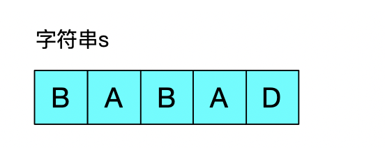
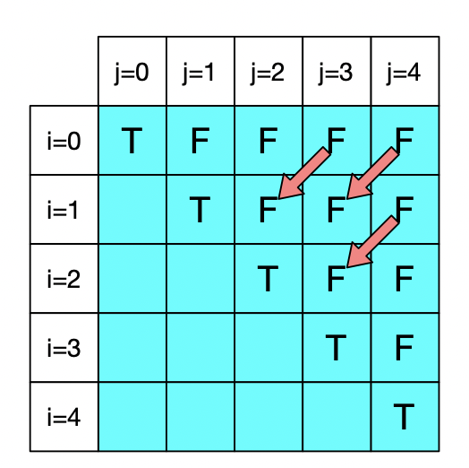
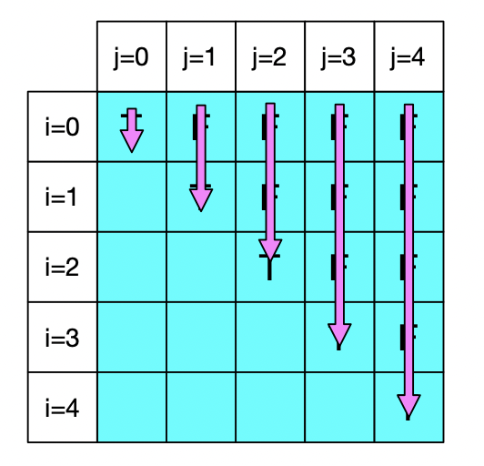
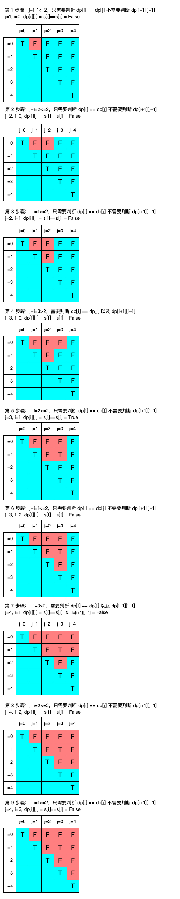

[toc]


hello，大家好！我是Johngo..

这几天**校招**的脚步越来越近，不少小伙伴、朋友最近私信我很多关于校招的问题。后面打算做一期出来，帮助大家避避坑。

另外，好像也有**金九银十**这回事情也要到来了，最近好多面试题出现在微信中和其他地方。

大多数是围绕面试，要刷什么题，怎么刷？除了刷题还需要看哪些面经来阻挡八股文似的面试等等...


## 一、脚步紧凑

很多小伙伴知道在前一段时间组织了一个刷题群，而且在上周的时候送了大家不少资料出来。

【刷题链接】

意在提供尽可能多的信息，让大家少走弯路。因为在我毕业的时候的的确确走了不少弯路。

这个弯路真的不能走，否则，真的是未来几年的弥补不回来的。

在我毕业的那会儿，不知道是校园的信息欠缺还是新校区带给我们比较一个封闭的环境。种种原因吧，居然大多数人不知道各大厂都各自的校园招聘的网站，大多数人不知道官网投简历后，可以线上笔试。

而很多人所理解的校园招聘指的是亲自来学校招生的企业。

对的！我至今清晰的记得很多学习优秀的同学，由于信息不对称，没有去到他们理想中的企业。

上面的 LeetCode 群，不仅仅是刷题群，也是大家校招讨论的一个场地，我也会在各方面给大家提供我能力范围内的帮助。


## 二、快手二面题目

就在前两天的下午，大学同学在快手的大数据面试中，被问到一个题目，在**动态规划**中算是很有代表性的一个题目。 

前几天也把动态规划的题目进行了第一步总结，侧重解题方法，如果没有看到过并且对动态规划不通透的建议看一下，这怕文章整整写了一周，个人认为很清晰和详尽。

【动态规划题目总结】

朋友碰到的题目是**最长回文子串**

LeetCode链接是：https://leetcode-cn.com/problems/longest-palindromic-substring/

> 输入：s = "babad"
> 输出："bab"
> 解释："aba" 同样是符合题意的答案。

下面详细聊聊这个题目。

同时运用之前写的解题方法按套路走。


## 三、最长回文子串

这个题目解决的方式很多，比如说马拉车算法、中心扩展算法等等...

但动态规划的方式解决这个题目才是最有意思的。刻骨铭心！

**动态规划**，有人说这个名字起得太吓人了，应该叫**状态记录**。试着一句话解释：程序计算过程中，在不断记录过程值的过程中规划求得当前最优值。

先来看一个字符串：s = [ A, B, C, B, A ]

这是一个回文串，同时可以说明一个很显然的现象，`s[2]` 是回文，如果 `s[1] == s[3]` 相同，那么，`s[1: 3]` 必然是回文串；如果 `s[0] == s[4]` 相同，那么，`s[0: 4]` 必然是回文串。

也就是说外围的值一样，同时里面已经证实是回文串，那么，此时的字符串一定是回文串。

下面用字符串s =[ B, A, B, A, D ] 详细的长图一步一步讲解最长回文子串的计算流程：



由于要判断是否是回文，那么一定会涉及到从 i 到 j 这个逻辑。

所以，需要一个二维数组来存放状态值。

而根据从 i 到 j 的逻辑，是没有反着来的，仅仅需要二维数组的右上三角区域存储

另外，使用我们之前【】【】【】【】说过的四步走，除了最后一步优化，其他 3 步骤为：

> 第 1 步 定义动态数组 dp；
> 
> 第 2 步 动态方程：`dp[i][j] = s[i] == s[j] and dp[i+1][j-1]`
> 
> 如下图，判断当前的状态，一定是依赖于左下角元素；
> 
> 第 3 步 初始化，对角线一定是True，其他初始化为False。
> 
> 注：当` j-i<=2` 的时候，只需要判断`s[i] == s[j]`不需要判断`dp[i+1][j-1]`，因为当` j-i<=2` ，最多就 3 个字符，如果`s[i] == s[j]`，可推理出肯定为回文。



另外，需要提一点，由于动态方程规则的性质，我们必须要从左到右，从上到下填写表格：



下面，一步一步来看。

同时注意上面所说的，**当` j-i<=2` 的时候，只需要判断`dp[i] == dp[j]`不需要判断`dp[i+1][j-1]`，因为当` j-i<=2` ，最多就 3 个字符，如果`dp[i] == dp[j]`，可推理出肯定为回文。**



所有的步骤都走过一次，在计算过程中，记录 dp 数组中最后一次出现 True 的 i 和 j，即可得到最长回文子串。

但是在实际代码中，可以利用 dp 数组中为 True 的记录所在的 i 和 j，给出 `max_len=j-1`，然后不断更新 dp 数组为 True 记录所在的 i 和 j，直到取得最大的 `max_len`。最后用 `max_len`所在位置 `i`和`max_len`得到最长回文子串。

上图制作不易，感觉还凑活的，给一个三连激励激励...

全部的逻辑从文字到代码都讲解完毕了！下面看看代码，使用 Python 写的，很简洁：

```python
def longestPalindrome(self, s):
    size = len(s)
    if size == 1:
        return s
    # 定义动态数组 dp，同时初始化
    dp = [[False for _ in range(size)] for _ in range(size)]
    for i in range(size):
        dp[i][i] = True

    max_len = 1     # 记录回文串长度
    start = 0       # 记录回文串起始位置
    # 动态方程：dp[i][j] = s[i] == s[j] and dp[i+1][j-1]
    for j in range(1, size):
        for i in range(0, j):
            dp[i][j] = (s[i] == s[j]) and (j - i <=2 or dp[i + 1][j - 1])
            if dp[i][j]:
                if j-i+1 > max_len:
                    max_len = j - i + 1
                    start = i

    return s[start: start+max_len]
```

以上！

全部结束。有人可能会想起优化的点来，嗯。。这个题目用动态规划解决在空间方面其实是没有办法进行进一步优化的，如果有其他优化想法的，群里或者底部留言讨论。


