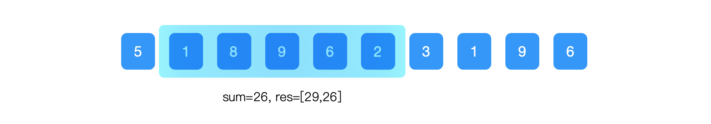
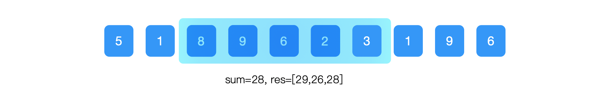
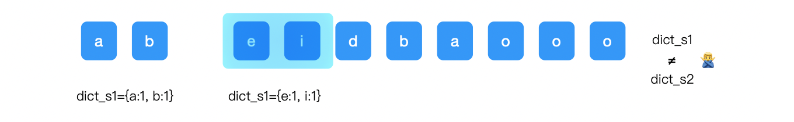
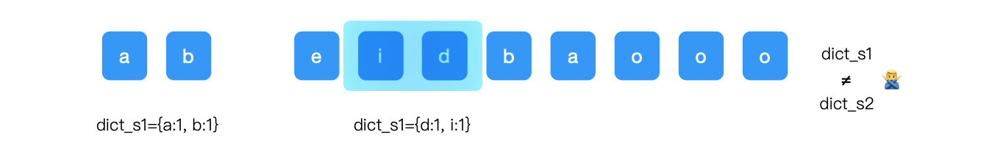
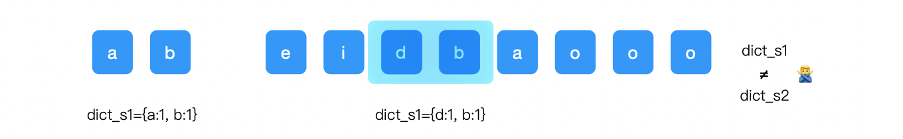
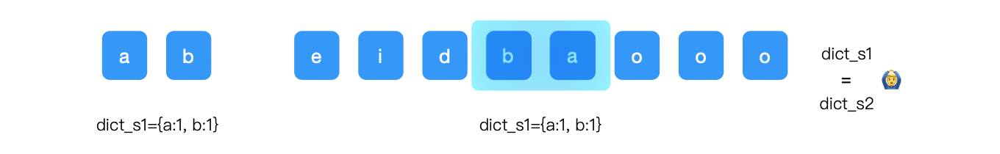
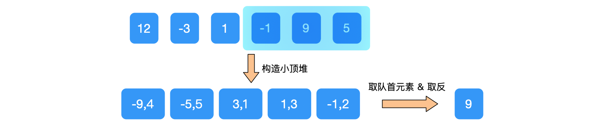
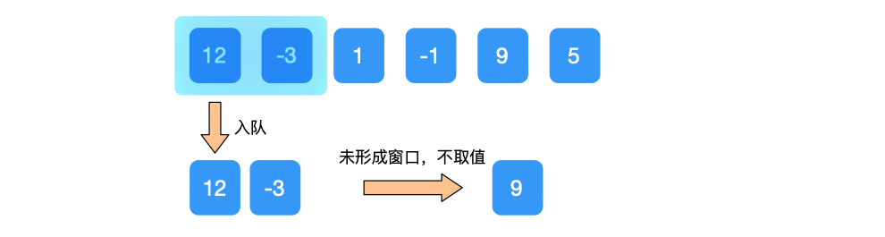
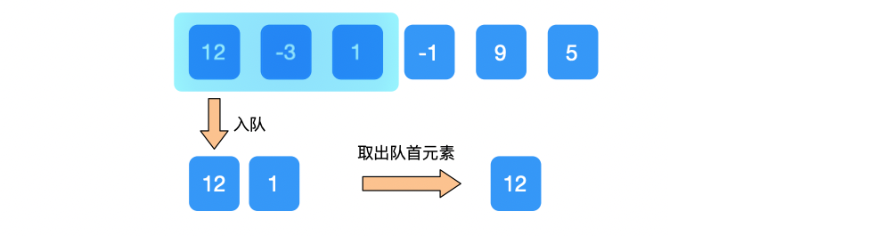
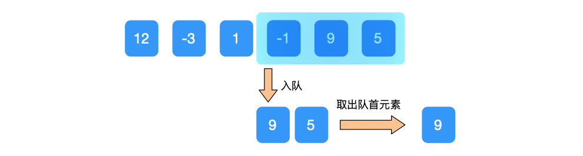

[toc]


LeetCode 刷题的进展有段时间没有更新了，过去的一篇文章有过这方面的解释，今天再来说一下。

穿插一句，今天文末再送书哈...

回归正题：

两点原因，第一点就是有读者说过去文章太长，是否可以考虑截取出来，分类讨论。这一点我是有考虑的，事实上本身文章已经是一个类别了，比如说动态规划，整个介绍超过万字，自我感觉才把一个问题描述的比较清楚。所以，后面考虑再细分，使得想要表述的问题更加调理清楚，可读性更强。

另外一点原因呢，就是关于文章页面展示。也是关于一个可读性的方面，这个是真真切切花了将近一个月搞的一个事情。就是重新打理了一个网站（www.johngo689.com，感觉还是比较漂亮的，每天都要看几眼、、哈哈）。

这中间还有人问到为什么域名起这样的一个名字，还穿插着数字，咱们还是后面有空在说说（later。。。）

今天咱们一起要讨论的是关于「字符串」的第一块内容。


### 字符串 - 滑动窗口

今天再把整个的刷题脑图放出来，前面的已经细化，后面一块一块逐渐会整理出来。

可以看在整个大的脑图当中**「字符串 - 滑动窗口」**这一块。


上面是整个 LeetCode 算法刷题计划，图中只细化了**二叉树、动态规划和字符串**相关理论分析和题目的讲解。所以，没有加入的同学们可以私信我，即使现在没有计划刷题的也可以加入进来，当个看客也不错，身处互联网，迟早会用到。

之前说到过，**「字符串」**这一块会出 10 篇复盘总结，今天是第一篇**「字符串 - 滑动窗口」**。

**「字符串 - 滑动窗口」**这一块咱们安排了四个问题，准备用这四个问题将滑动窗口的使用以及相关题目讨论清楚。

【简单】滑动窗口数字之和（引例）

【中等】567.字符串的排列 https://leetcode-cn.com/problems/permutation-in-string/

【困难】239.滑动窗口最大值  https://leetcode-cn.com/problems/sliding-window-maximum/

【中等】3.无重复字符的最长子串 https://leetcode-cn.com/problems/longest-substring-without-repeating-characters/


### 滑动窗口-引例

滑动窗口算法一般是作用在**字符串**或者**数组**上，通过不断的滑动逻辑窗口，在特定窗口大小内进行计算的过程。

滑动窗口的方式可以降低时间复杂度，从而减短计算的执行时间。

引例：比如说在字符串` s="5189623196"` 中，窗口大小 `w=5`，找出每个窗口字符子串的和。

**普通的计算方式**：每 5 个进行一次求个计算，时间复杂度方面能够达到 `O(N^2)`。

**利用窗口的方式**：可很大程度可以减小时间方面的消耗。就拿引例来说，时间复杂度应该是`O(N)`的线性复杂度。

该案例核心思路是：窗口在每一次的滑动前后，中间元素内容没有改变，仅仅改变的是开头和结尾元素。

即：`下一窗口内元素之和 = 上一窗口元素和 - 离开窗口元素值 + 新加入窗口元素值`

下面分步骤进行讨论，将最终结果写入到 `res` 中。

**步骤一**：直接计算窗口内元素和，res = [29]


**步骤二**：在上一步骤的基础上，减去离开窗口的元素，加上新加入窗口的元素。



**步骤三**：继续在上一步骤的基础上，减去离开窗口的元素，加上新加入窗口的元素



相同逻辑继续执行....

**步骤六**：滑动窗口将最后一个元素包含进来


上述每一步骤中，将 `sum` 值都添加到最终的结果变量 `res` 中。

滑动窗口这样的思维方式就很巧妙的进行在窗口的不断移动，进而产生各元素在窗口边界进进出出，利用这一点，在时间复杂度方面进行了一个很大提升！

代码简单的写一下，还是利用 Python，也是因为 Python 的话，绝大多数人还是比较熟悉。

```python
class Solution(object):
    def sumSlidingWindow(self, s, w):
        sum = 0
        res = []
        # 计算第一个窗口数字之和
        for item in range(5):
            sum += s[item]
        res.append(sum)
        # 后面利用滑动窗口思想进行计算
        for item in range(w, len(s)):
            sum -= s[item-w]
            sum += s[item]
            res.append(sum)
        return res
```


下面咱们用三个 LeetCode 经典案例进一步阐述滑动窗口这类题目。

### 滑动窗口经典题目

#### 567.字符串的排列【中等】

> 给你两个字符串 s1 和 s2 ，写一个函数来判断 s2 是否包含 s1 的排列。如果是，返回 true ；否则，返回 false 。
>
> 换句话说，s1 的排列之一是 s2 的 子串 。
>
> ```
> 输入：s1 = "ab" s2 = "eidbaooo"
> 输出：true
> 解释：s2 包含 s1 的排列之一 ("ba").
> ```

首先，两个字符串的排列，首先可以想到字典，根据字典去比较。

词典可根据两个不同字符串将给到的字符进行计数，因此，这样很同容易进行比较。

另外，在遍历 `s2` 的时候，使用滑动窗口，该窗口的长度是字符串 `s1 ` 的长度，遍历 `s2` 使得字符不断的出入，在此过程中比较两个字典。

整个过程，记 `s1` 的长度为 `size1`，`s2` 的长度为 `size2`，窗口大小为 `size1`，不断遍历 `s2`，直到 `s2` 的结尾。

记  `s1 ` 的字典为 `dict_s1`，记`s1`的字典为`dict_s2`，在遍历`s2`的过程中，每滑动一次窗口，比较  `dict_s1` 和 `dict_s2` 是否相等。

窗口滑动过程中，需要**删除滑出窗口的元素**以及**新增滑入窗口的元素**。

**删除滑出窗口的元素**：广义上是从字典 `dict_s2` 中删除，注意此处不能直接删除，因为可能会有重复元素存在，比如：`{'a':2}`，所以只能是将 value 值减 1。之后再判断 value 值为否为 0，如果为 0 了，这个时候就可以直接将该元素从字典中删除。

**新增滑入窗口的元素**：直接将滑入窗口的元素添加进字典中。

下面用几个图清晰的一步一步操作：

初始化 `s1` 对应的字典 `dict_s1={'a':1,'b':1} `

① `s2` 对应的字典为图中窗口中的元素 `dict_s2={'e':1,'i':1}`。

最后判断 `dict_s1 != dict_s2`



② 向右滑动窗口，由于元素`e`的 value 值为 1，直接删除该元素，加入新元素`d`，此时，`dict_s2={'i':1,'d':1}`。

最后判断 `dict_s1 != dict_s2 `



③ 继续向右滑动窗口，由于元素 `i` 的 value 值为 1，直接删除该元素，加入新元素 `b`，此时，`dict_s2={'d':1,'b':1}`。

最后判断 `dict_s1 != dict_s2 `



③ 继续向右滑动窗口，由于元素 `d` 的 value 值为 1，直接删除该元素，加入新元素 `a`，此时，`dict_s2={'b':1,'a':1}`。

最后判断 `dict_s1 == dict_s2 `，此时可以直接返回 `True`。不用在继续窗口滑动了。



这个题虽然在 LeetCode 中标记为中等，但是用滑动窗口的方式去解决还是非常容易理解的。

下面是 Python 代码的实现：

```python
class Solution(object):
    def checkInclusion(self, s1, s2):
        size1 = len(s1)
        size2 = len(s2)
        if size1 > size2:
            return False

        dict_s1 = collections.Counter(s1)
        dict_s2 = collections.Counter(s2[:size1-1])
        left = 0
        for right in range(size1-1, size2):
            # 增加新添加的元素
            dict_s2[s2[right]] += 1
            # 判断如果字典相同，则返回 True
            if dict_s1 == dict_s2:
                return True
            # 删除左边剔除的元素(首先需要将左边元素的 value 值减 1)
            dict_s2[s2[left]] -= 1
            # value 值为 0 的时候，就可以删除该元素了
            if dict_s2[s2[left]] == 0:
                del(dict_s2[s2[left]])
            # 窗口整体向右移动一格
            left += 1
            right += 1
        return False
```

下面再看一个稍微复杂一点的，也是滑动窗口的典型例题。


#### 239.滑动窗口最大值【困难】

> 给你一个整数数组 nums，有一个大小为 k 的滑动窗口从数组的最左侧移动到数组的最右侧。你只可以看到在滑动窗口内的 k 个数字。滑动窗口每次只向右移动一位。
>
> 返回滑动窗口中的最大值。
>
> ```
> 输入：nums = [1,3,-1,-3,5,3,6,7], k = 3
> 输出：[3,3,5,5,6,7]
> 解释：
> 滑动窗口的位置                最大值
> ---------------             -----
> [1  3  -1] -3  5  3  6  7      3
>  1 [3  -1  -3] 5  3  6  7       3
>  1  3 [-1  -3  5] 3  6  7       5
>  1  3  -1 [-3  5  3] 6  7       5
>  1  3  -1  -3 [5  3  6] 7       6
>  1  3  -1  -3  5 [3  6  7]      7
> ```

滑动窗口最大值是一道典型的滑动窗口的例题。该题被标记为困难，可能就在于**最大值**的判断，如果使用传统方式的话，时间复杂度就会很高。

关于**最大值**，可是尝试使用**优先队列**去解决，即**构造大顶堆**，也可以使用**双向队列**解决问题。

以下用两种方式都来解决一下。

**方法一：优先队列解决**

由于题目要求是选择窗口内的最大值，因此需要构造了大顶堆，此时得出来队首元素就是整个队列的最大值。

>  **注意点**：我们这里由于采用 Python 的 heapq 库来实现，而 heapq 库只能构造小顶堆。
>
> 因此，可以换一个思路进行实现，例如列表 [1,-3,12]：
>
> 首先，每个元素的负值都插入到优先队列中，构造小顶堆，产生的结果是这样的 [-12, 3, -1]
>
> 然后，将队首元素去除并且取反，得到的结果是 12。这就是我们想要的结果，取到了其中的最大值。
>
> -----------
>
> 关于 Python 使用优先队列的方式，可以查看这一篇文章【https://mp.weixin.qq.com/s/94Rnnt7R5_kTfoAW0j-wyQ】，有详细的使用方式。

首先，初始化一个窗口大小的优先队列 `window`，并且记录元素（**注意这里要取反**）以及元素下标，组装成一个元祖 `(-num, index)`。

然后，当不断向右移动窗口，把新加进来的元素（元祖）加入到优先队列中。

最后，判断当前优先队列中的队首元素对应的 `index`，是否在固定窗口内，如果在，则取值并且取反；否则，删除队首元素，继续判断。

下面依旧用几个图清晰的一步一步操作：

> 我们用字符串为 nums=[12, -3, 1, -1, 9, 5], k = 3 来进行说明。

初始化 `res` 用来存储每个窗口最大值。

① 初始化优先队列 window=[(-12, 0), (3, 1), (-1, 2)]，判断队首元素的下标值 `value=0  `在当前窗口内。

所以，取出队首元素`-12`，并且取反，`res=[12]`


② 优先队列 window=[(-12, 0), (-1, 2), (1, 3), (3, 1)]，判断队首元素的下标值 `value=0  ` 不在当前窗口内，弹出队首元素。

此时，window=[(-12, 0), (-1, 2), (1, 3), (3, 1)]，再判断此时队首元素的下标值 `value=2` 在当前窗口内。


所以，取出队首元素`-1`，并且取反，`res=[12, 1]`

③ 优先队列 window=[(-9, 4), (-1, 2), (3, 1), (1, 3)]，判断队首元素的下标值 `value=4` 在当前窗口内。


所以，取出队首元素`-9`，并且取反，`res=[12, 1, 9]`

④优先队列 window=[(-9, 4), (-5, 5), (3, 1), (1, 3), (-1, 2)]，判断队首元素的下标值 `value=4` 在当前窗口内。



所以，取出队首元素`-9`，并且取反，`res=[12, 1, 9, 9]`

这个时候就都所有取数完成了！

中间关于 Python 的 hepq 库构造大顶堆有点绕，这点稍微理解下，对于后面的解题帮助特别大。

思路描述完了，再看下代码实现：

```python
    def maxSlidingWindow(self, nums, k):
        size = len(nums)
        window = [(-nums[i], i) for i in range(k)]
        heapq.heapify(window)
        res = [-window[0][0]]

        for i in range(k, size):
            heapq.heappush(window, (-nums[i], i))
            while window[0][1] <= i-k:
                heapq.heappop(window)
            res.append(-window[0][0])
        return res
```

感觉描述了一堆，但是代码倒是很简洁。

说完方法一，下面看看方法二...


**方法二：双向队列解决**

为什么要使用双向队列呢？在算法执行过程中，需要两边进行入队和出队的操作。

大致思路也比较容易：

首先，初始化一个空队列 queue；

然后，逐个入队，但当下一个元素入队时，判断与队尾元素大小。如果小于队尾元素，则入队。否则，队尾依次出队，直到大于要入队的元素；

最后，判断队首元素是否是在窗口内，如果在窗口内，直接取值，否则，队首元素出队。

下面依旧用几个图清晰的一步一步操作：

① 元素 `12` 入队；窗口范围 [0, 0]

未形成窗口，不取值；


② 元素 `-3` 入队；窗口范围 [0, 1]

比队尾元素 `12` 小，直接入队；

未形成窗口，不取值；



③ 元素 `1` 入队；窗口范围 [0, 2]

比队尾元素 `-3` 大，所以，队尾元素出队，元素 `1` 入队。而且队首元素`12` 下标`0`在窗口内

取队首元素 `12`；



④ 元素 `-1` 入队；窗口范围 [1, 3]

比队尾元素 `1` 小，元素 `-1` 入队。队首元素`12` 下标 `0` 不在窗口内，元素 `12` 出队；取队首元素 `1` 的下标 `2` 在窗口内；

取队首元素 `1`；


⑤ 元素 `9` 入队；窗口范围 [2, 4]

比队尾元素 `-1` 和 `1` 都大，所以，比他小的队尾元素均出队，元素 `9` 入队。而且队首元素 `9` 下标`4`在窗口内

取队首元素 `9`；


⑤ 元素 `5` 入队；窗口范围 [3, 5]

比队尾元素 `9`  小，元素 `5` 入队。而且队首元素 `9` 下标`4`在窗口内

取队首元素 `9`；



利用双向队列的方式也将窗口内最大元素取出来了！

上面是整体的思路，具体到代码中，是把进入队列的元素替换为元素的下标，这样实现起来更加容易！

看下 Python 代码的实现：

```python
class Solution(object):
    def maxSlidingWindow1(self, nums, k):
        size = len(nums)
        queue = collections.deque()
        res = []
        for i in range(0, size):
            # 新元素进队，在队不空的情况下，需要判断与队尾元素的大小
            while queue and nums[i] > nums[queue[-1]]:
                queue.pop()
            queue.append(i)
            # 在已经形成窗口(i+1>=k)的前提下，判断队首是否在窗口内
            while queue[0] < i-k+1:
                queue.popleft()
            # 从形成窗口的时刻开始将元素置于结果集 res 中
            if i+1 >= k:
                res.append(nums[queue[0]])
        return res
```

无论是利用优先队列还是双向队列，都需要注意所取的元素是否在当前的窗口内。


#### 3.无重复字符的最长子串【中等】

> 给定一个字符串 `s` ，请你找出其中不含有重复字符的 **最长子串** 的长度。
>
> ```
> 输入: s = "abcabcbb"
> 输出: 3 
> 解释: 因为无重复字符的最长子串是 "abc"，所以其长度为 3。
> ```

想要判断字符是否存在，通常会使用到字典结构来判断是否存在。

首先，初始化窗口左右端 `left=0` 和 `right=0`，初始化字典 `words` 用来存放已加入字符的元素（key）和元素下标（value），例如，`words={'a':0,'b':1,'c':2}`

然后，`right` 指针向右移动，判断新加入元素是否存在于字典中，如果存在，让窗口左边界指向字典对应 value 值的下一个位置，并且更新字典中对应元素的下标值（value）；如果不存在，则加入字典 `words `中；

> **注意点：**
>
> 中间有可能 left 已经更新到后边，而新判断的元素可能在前面，会导致 left 变小，所以需要采用 max 来进行判断
>
> 举例：abba，执行到第二个 b 的时候，left=2，此时words={'a':0,'b':2}。后面再判断最后的 a 的时候，就会使得 left=0+1=1
>
> 因此，需要 left = max(words.get(v) + 1, left)

最后，每一步骤记录最长子串长度。

依旧用几个图清晰的一步一步操作：

① left=0, right=0, 加入新元素 `'a'`，words={'a':0}, 窗口长度为1


② left=0, right=1, 加入新元素 `'b'`，words={'a':0, 'b':1}, 窗口长度为2 


③ left=0, right=2, 加入新元素 `'c'`，words={'a':0, 'b':1, 'c':2}, 窗口长度为3


④ left=0, right=3, 加入新元素 `'a'`;

发现 `a` 已经在 words={'a':0, 'b':1, 'c':2} 存在；

则更新 left=max(words.get('a') + 1, left)=1，words={'a':3, 'b':1, 'c':2}

窗口长度为3


⑤ left=1, right=4, 加入新元素 `'b'`;

发现 `'b'` 已经在 words={'a':3, 'b':1, 'c':2} 存在；

则更新 left=max(words.get('b') + 1, left)=2，words={'a':3, 'b':4, 'c':2}

窗口长度为3


⑥ left=2, right=5, 加入新元素 `'c'`;

发现 `'c'` 已经在 words={'a':3, 'b':4, 'c':2} 存在；

则更新 left=max(words.get('c') + 1, left)=3，words={'a':3, 'b':4, 'c':5}

窗口长度为3


⑦ left=3, right=6, 加入新元素 `'b'`;

发现 `b` 已经在 words={'a':3, 'b':4, 'c':5} 存在；

则更新 left=max(words.get('b') + 1, left)=5，words={'a':3, 'b':6, 'c':5}

窗口长度为2


⑧ left=5, right=7, 加入新元素 `'b'`;

发现 `'b'` 已经在 words={'a':3, 'b':6, 'c':5} 存在；

则更新 left=max(words.get('b') + 1, left)=7，words={'a':3, 'b':7, 'c':5}

窗口长度为1

左右步骤描述完毕！

根据每一步骤记录的窗口长度，可得到**最长窗口为 3**。

下面就由上述逻辑得到最终的代码：

```python
class Solution(object):
    def lengthOfLongestSubstring(self, s):
        if not s:
            return 0
        left, right = 0, 0
        length = 1
        words = {}
        for right, v in enumerate(s):
            if s[right] in words.keys():
                print(words.get(v) + 1, left)
                left = max(words.get(v) + 1, left)
            length = max(right-left+1, length)
            # 将当前值的 value 值覆盖
            words[v] = right
        print(words)
        return length
```


