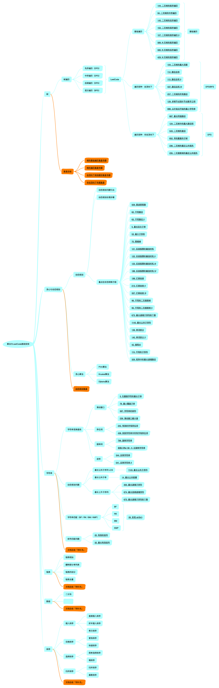
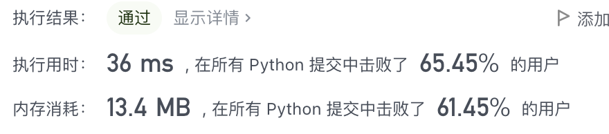
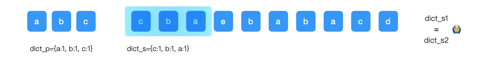
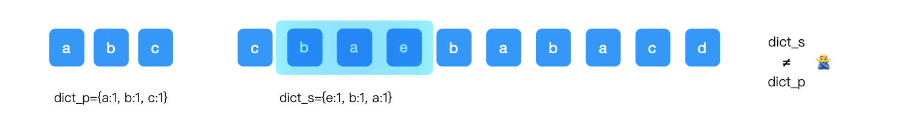
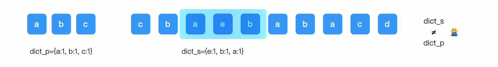
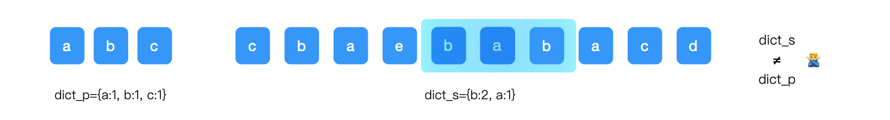
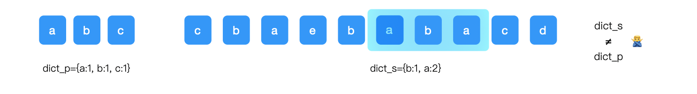
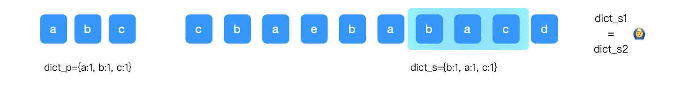
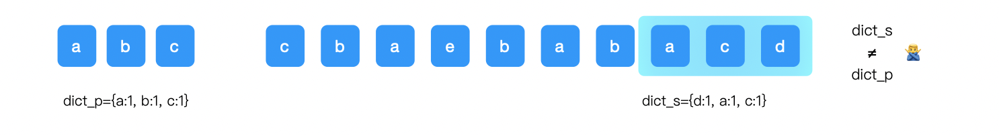

[toc]


大家好吖，我是Johngo！

这一期来说说字符串的第二块内容**「字符串 - 异位词」**

> github：https://github.com/xiaozhutec/share_leetcode
>
> 文档地址：https://github.com/xiaozhutec/share_leetcode/tree/master/docs
>
> 整体架构：



### 字符串 - 异位词

今天是字符串专题的第二期内容，关于异位词的概念和解题的逻辑

什么是异位词？

> 若 `s` 和 `t` 中每个字符出现的次数都相同，则称 `s` 和 `t` 互为字母异位词。
>
> 比如说："abc "和 "cba"，或者 "anagram", "nagaram"

通常进行判断互为异位词的方法是通过字典进行词频统计.

上述案例中，"abc "和 "cba" 词频统计的结果是 {'a':1, 'b':1, 'c':1}；

另外一个例子，"anagram", "nagaram" 词频统计的结果是 {'a': 3, 'n': 1, 'g': 1, 'r': 1, 'm': 1}；

就是说两个字符串通过字典，进行词频统计结果是一致的。

### 案例

下面会通过两个案例进行举例，分别是LeetCode 的242题 和 438 题

242.有效的字母异位词【简单】

438.找到字符串中所有字母异位词【中等】

#### 242.有效的字母异位词【简单】

> 给定两个字符串 `s` 和 `t` ，编写一个函数来判断 `t` 是否是 `s` 的字母异位词。
>
> ```
> 输入: s = "anagram", t = "nagaram"
> 输出: true
> ```

这个题目是相对容易的，容易到什么底部？

下面使用 Python 的一个 collections 库，一行代码完事儿居然在 github 效率超过50% 的人？？

代码：

```python
class Solution(object):
    def isAnagram(self, s, t):
        return collections.Counter(s) == collections.Counter(t)
```



有这么结果还是比较惊讶的，不知道如果这个题目在超过 10% 的人的情况下，代码是怎样的！？

好了，回到题目解释上来。

开头说过，异位词类型的题目一般解决的方案是通过词频统计进行字典比较得出答案。

也就是说把两个字符串分别转换为字典结构，最后进行比较就ok！

上面 Python 直接用 API 解答的过程，下面咱们使用手动生成字典的方式进行解决。

今天的代码仍然需要引入 Python 的 `collections` 库，关于 `collections.defaultdict` 可以参考https://www.johngo689.com/2258/

首先，初始化定义两个变量用来存放字符串对应的字典，分别为 `dict_s1` 和 `dict_s2`：

```python
dict_s1 = collections.defaultdict(int)
dict_s2 = collections.defaultdict(int)
```

然后，循环将两个字符串的字符插入到字典中：

```python
for item1 in s:
    dict_s1[item1] += 1
for item2 in t:
    dict_s2[item2] += 1
```

最后进行字典的比较就的出来答案。

完整代码（涉及到 2 个方法）：

```python
class Solution(object):
    def isAnagram(self, s, t):
        """
        字典做词频统计即可, 这里直接使用 API
        """
        return collections.Counter(s) == collections.Counter(t)

    def isAnagram1(self, s, t):
        """
        自己构造 dict 对象进行比较
        collections.defaultdict() 说明文档：https://www.johngo689.com/2258/
        """
        dict_s1 = collections.defaultdict(int)
        dict_s2 = collections.defaultdict(int)
        for item1 in s:
            dict_s1[item1] += 1
        for item2 in t:
            dict_s2[item2] += 1
        return dict_s1 == dict_s2
```


#### 438.找到字符串中所有字母异位词【中等】

> 给定两个字符串 `s` 和 `p`，找到 `s` 中所有 `p` 的 **异位词** 的子串，返回这些子串的起始索引。不考虑答案输出的顺序。
>
> ```
> 输入: s = "cbaebabacd", p = "abc"
> 输出: [0,6]
> 解释:
> 起始索引等于 0 的子串是 "cba", 它是 "abc" 的异位词。
> 起始索引等于 6 的子串是 "bac", 它是 "abc" 的异位词。
> ```

这个题目比上一个稍微增加了点难度，同样的地方是，该问题依然用字典进行解决。

这个题目和 LeetCode567 很类似，但会稍微上一个台阶。

当然，该题目也会用到滑动窗口的解决方法。

首先，初始化 2 个字典 dict_s 和 dict_p，以及字符串 `s` 的长度 `size_s`，字符串 `p` 的长度 `size_p`；

然后，固定窗口大小为 `size_p`，循环右移，右移过程中，新增元素加入到字典 `dict_s `中，滑出窗口的字符，将  dict_s 对应元素的value减 1。

*注意：之后需要判断对应元素的value是否为 0，如果为 0 的时候，需要将 该元素从字典 dict_s 中剔除*

最后，窗口在不断的右移过程中对比 字典 `dict_s  `和 字典 `dict_p `，如果匹配到一致的话，记录该子串的起始位置。

**下面用几个图清晰的一步一步操作：**

初始化字符串 p 对应的字典：`dict_p={a:1, b:1, c:1}`

初始化字符串 s 前`size_p-1`对应的字典：`dict_s={c:1, b:1}`

初始化结果集：`res`

① dict_s 中添加元素 `a`，得到 `dict_s={c:1, b:1, a:1}`

判断 `dict_p == dict_s`，将此时窗口左边界记录下来，res=[0]



② 窗口向右滑动，dict_s 中添加元素 `e`，减去元素`c`，得到 `dict_s={c:0, b:1, a:1，e:1}`，随后判断此时元素 `c `对应的 value 值为 0，从 `dict_s` 中剔除，得到 `dict_s={b:1, a:1，e:1}`

判断 `dict_p != dict_s`，继续执行。

 

③ 窗口向右滑动，dict_s 中添加元素 `b`，减去元素`b`，得到 `dict_s={b:1, a:1，e:1}`，随后判断此时元素 `b `对应的 value 值为 1，不做任何操作

判断 `dict_p != dict_s`，继续执行。



④ 窗口向右滑动，dict_s 中添加元素 `a`，减去元素`a`，得到 `dict_s={b:1, a:1，e:1}`，随后判断此时元素`a  `对应的 value 值为 1，不做任何操作

判断 `dict_p != dict_s`，继续执行。


⑤ 窗口向右滑动，dict_s 中添加元素 `b`，减去元素`e`，得到 `dict_s={b:2, a:1，e:0}`，随后判断此时元素`e`对应的 value 值为 0，从 `dict_s` 中剔除，得到 `dict_s={b:2, a:1}`

判断 `dict_p != dict_s`，继续执行。



⑥ 窗口向右滑动，dict_s 中添加元素 `a`，减去元素`b`，得到 `dict_s={b:1, a:2}`，随后判断此时元素`b`对应的 value 值为 1，不做任何操作

判断 `dict_p != dict_s`，继续执行。



⑦ 窗口向右滑动，dict_s 中添加元素 `c`，减去元素`a`，得到 `dict_s={b:1, a:1, c:1}`，随后判断此时元素`a`对应的 value 值为 1，不做任何操作

判断 `dict_p == dict_s`，将此时窗口左边界记录下来，res=[0, 6]。



⑧ 窗口向右滑动，dict_s 中添加元素 `d`，减去元素`b`，得到 `dict_s={b:0, a:1, c:1, d:1}`，随后判断此时元素`b`对应的 value 值为 0，从 `dict_s` 中剔除，得到 `dict_s={a:1, c:1, d:1}`

判断 `dict_p != dict_s`，此时，窗口走到最右边，循环结束。



最终返回 `res=[0, 6]`。

也是最后的正确答案。

异位词这块的判断事实上是比较简单的，尤其是利用 Python 来操作的时候。

下面咱们看看代码实现：

```python
class Solution(object):
    def findAnagrams(self, s, p):
        size_s = len(s)
        size_p = len(p)
        dict_s = collections.Counter(s[0:size_p-1])
        dict_p = collections.Counter(p)
        res = []

        for i in range(size_p-1, size_s):
            dict_s[s[i]] += 1
            # 当满足窗口的时候，才进行元素的增加和删除同时操作进行
            if i >= size_p:
                dict_s[s[i-size_p]] -= 1
                if dict_s[s[i-size_p]] == 0:
                    del(dict_s[s[i-size_p]])
						# res 中添加结果
            if dict_s == dict_p:
                res.append(i-size_p+1)
        return res
```

好了，**「字符串 - 异位词」**部分本文就分享结束了。

如果有问题加微信xiaozhu_tec，非常非常欢迎和大家一起交流！

另外，方便的话也在我的`github`👇 加颗星，它是我持续输出最大最大的动力，感谢大家！

github：https://github.com/xiaozhutec/share_leetcode

下面不要忘记抽取福利吖，好了~ 咱们下期见！bye~~


