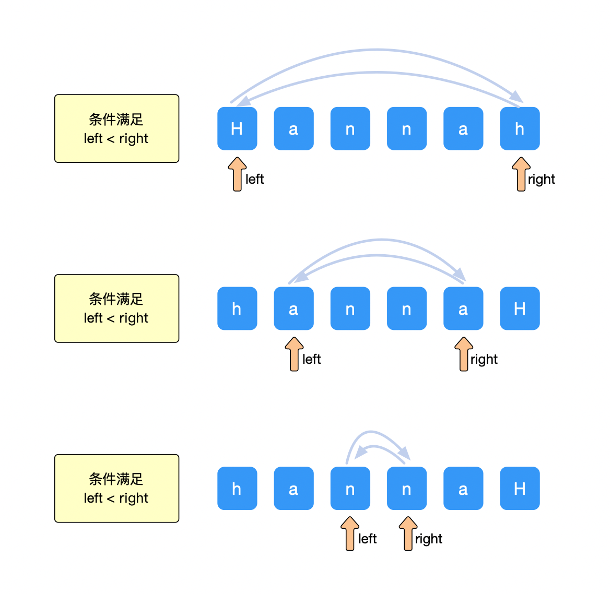
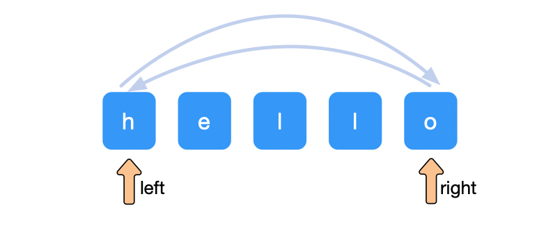
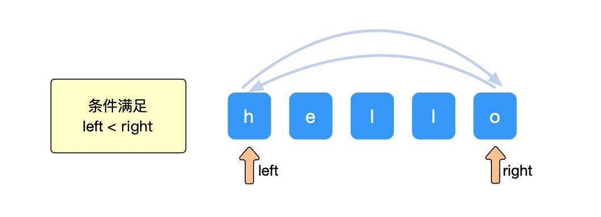
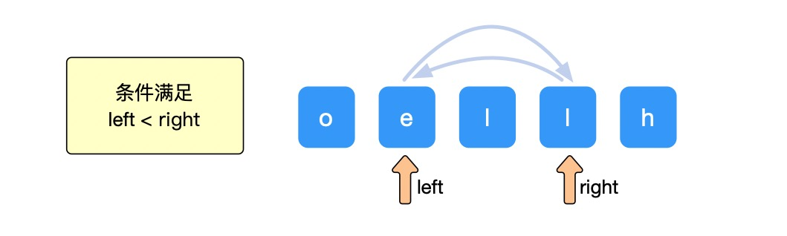
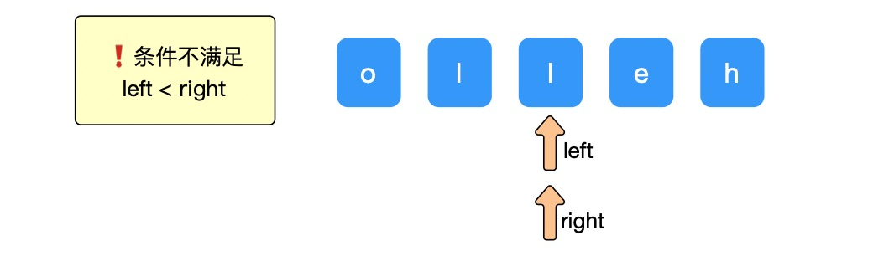
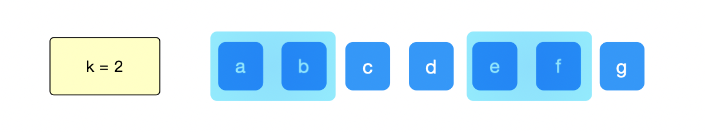
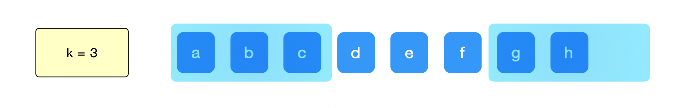

[TOC]


大家好！

今天分享字符串中的逆序问题！

这一块也是字符串中比较简单的内容。

然后后面两节会是字符串中比较硬核的内容，分别是字符串中的动态规划问题和 KMP 算法。

今天先来说逆序！

### 说在前面

言归正传，这一期来说说字符串的第四块内容 **「字符串 - 逆序」**

> github：https://github.com/xiaozhutec/share_leetcode
>
> 文档地址：https://github.com/xiaozhutec/share_leetcode/tree/master/docs
>
> 整体架构：


### 字符串 - 逆序

今天这期内容是字符串的第四期。

逆序这个逻辑很简单哈，就是在有限的时间范围内把字符串倒置：

> 比如："Hannah" 逆序后为 "hannaH"

一般是要在时间复杂度为 O(N)，空间额外复杂度为 O(1)

字符串「逆序」方面的问题（还拿字符串 "Hannah" 逆序后为 "hannaH" 为例）

一般的思路是：

设两个指针 left 和 right 分别指向字符串最左边和最右边，然后指针指向的字符不断交换，直到 left 不小于 right。

下图为例，left 指向字符串最左边，right 指向字符串最右边，进行不断的交换。



再往后，会发现 left < right 的条件不满足，退出执行。

而此时，字符串已经全部逆序了。

时间复杂度方面，由于是线性执行，所以是 O(N)；

额外空间复杂度方面，仅仅是在交换的时候会借助一个字符的空间进行交换。所以额外空间复杂度是 O(1)。

大概的思路基本就是这样，下面用两个常见的案例来感受这种类型题目的具体解决方法。


### 案例

整体关于字符串「逆序」方面的问题是很简单的，只要稍加注意一点中间的细节即可！

下面会通过两个案例进行举例，分别是 <u>LeetCode 的 344 题</u> 和 <u>LeetCode 的 541 题</u>

344.反转字符串【简单】

541.反转字符串【简单】


#### 344.反转字符串【简单】

> 编写一个函数，其作用是将输入的字符串反转过来。输入字符串以字符数组 s 的形式给出。不要给另外的数组分配额外的空间，你必须原地修改输入数组、使用 O(1) 的额外空间解决这一问题。
>
> ```
> 输入：s = ["h","e","l","l","o"]
> 输出：["o","l","l","e","h"]
> ```

整体这个题目还是比较简单的，解决的思路就是上述介绍的方式。

分别设定左指针 left 和 右指针 right 分别指向字符串的最左边和最右边。

然后把指针指向的字符进行交换



但是每一步需要满足 `left < right`。

下面用清晰的图进行一步一步解决：

① left 指向字符 'h'， right 指向字符 'o'，满足 `left < right` 进行交换.



② left 指向字符 'e'， right 指向字符 'l'，满足 `left < right` 进行交换.



② left 指向字符 'l'， right 指向字符 'l'，❗️不满足 `left < right` ，所以就不进行交换，退出程序。



这个题目只要注意`left < right`这个细节点就可以了。

而且实现起来也比较简单

咱们直接用 Python 来解决：

```python
def reverseString(self, s):
    size = len(s)
    left, right = 0, size-1
    while left < right:
        s[left], s[right] = s[right], s[left]
        left += 1
        right -= 1
    return s
```

这个题目解决了。

咱们看下一个！


#### 541.反转字符串【简单】

>给定一个字符串 s 和一个整数 k，从字符串开头算起，每计数至 2k 个字符，就反转这 2k 字符中的前 k 个字符。
>
>如果剩余字符少于 k 个，则将剩余字符全部反转。
>如果剩余字符小于 2k 但大于或等于 k 个，则反转前 k 个字符，其余字符保持原样。
>
>```
>输入：s = "abcdefg", k = 2
>输出："bacdfeg"
>```

其实这个题目和上面的很类似，就是需要加一个位置的判断。

以上个案例为例，下图就是需要逆序的部分。



所以，在问题解决的时候，是需要根据 k 值判断要逆序的位置。

在遍历字符串时候，每次循环的位置一定是 `2k` 的倍数，即 4 的倍数，即：0, 4, 8...

需要注意的是，因为要在 `2k` 的倍数处进判断子串位置。以下图为例：

当最后一组， left 指向位置 6，而 right 需要指向位置 8，但是字符串不够 8。这里需要特殊处理一下：

```python
left = index
right = index+k-1 if index+k < size else size-1
```



现在看下整体的代码，相较于上面多了位置的判断：

```python
def reverseStr(self, s, k):
    list_s = list(s)
    size = len(list_s)
    for index in range(0, size, 2*k):
        left = index
        right = index+k-1 if index+k < size else size-1
        while left < right:
            list_s[left], list_s[right] = list_s[right], list_s[left]
            left += 1
            right -= 1

    return "".join(list_s)
```

今天内容依然是比较简单。

就关于字符串「逆序」进行了分享。

另外，方便的话也在我的`github`👇 加颗星，它是我持续输出最大最大的动力，感谢大家！

github：https://github.com/xiaozhutec/share_leetcode

----


如果感觉内容对你有些许的帮助，求点赞，求在看！

下期想看哪方面的，评论区告诉我！

下面不要忘记抽取福利吖，好了~ 咱们下期见！bye~~