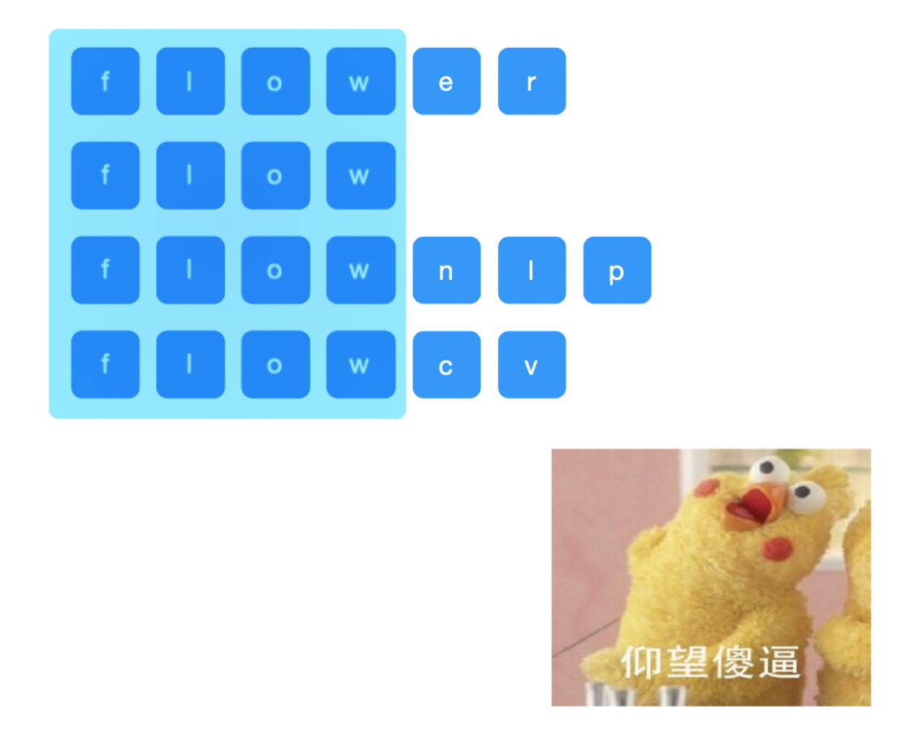
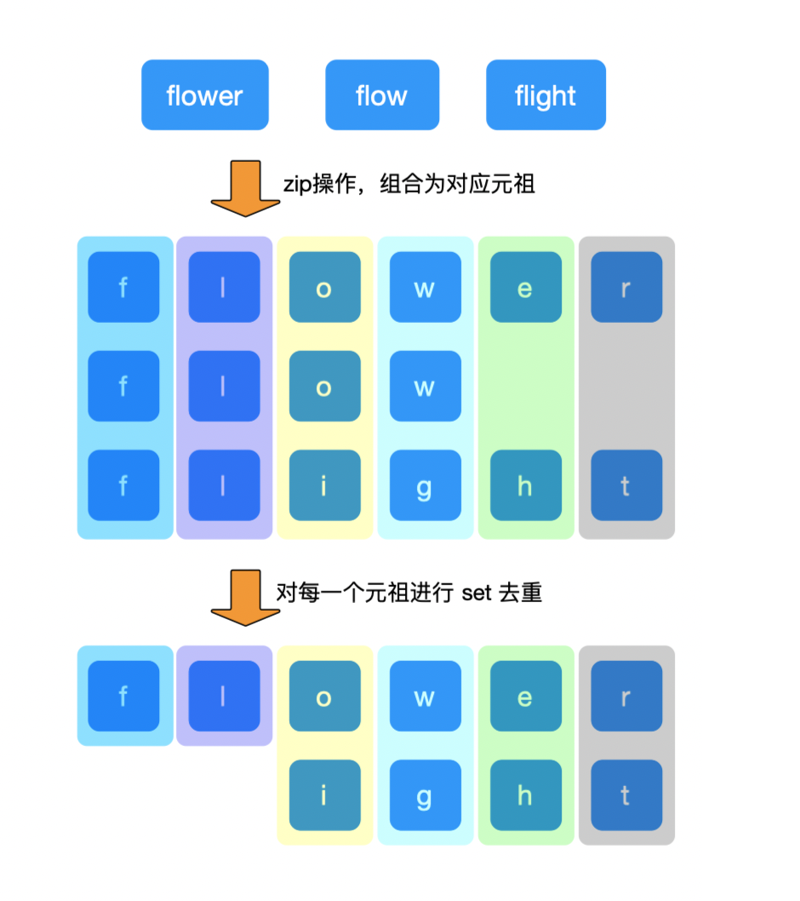
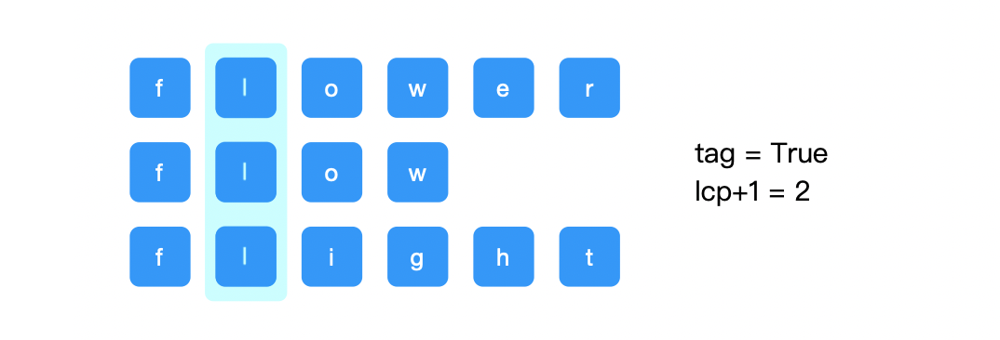
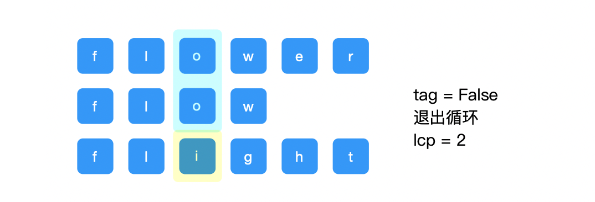
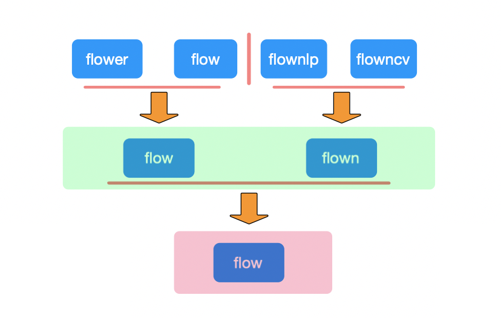
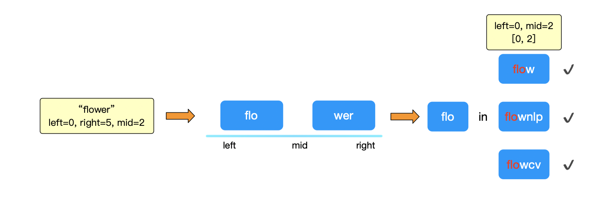
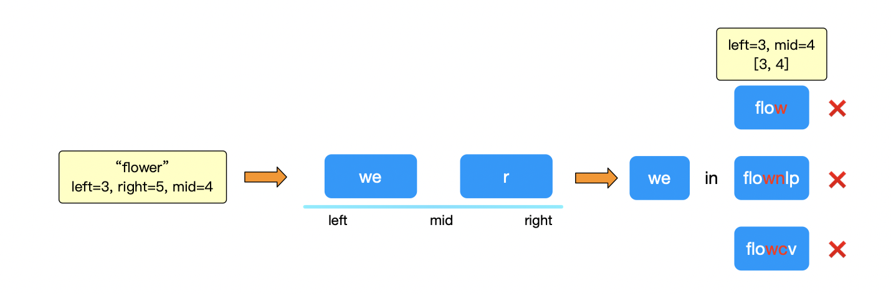
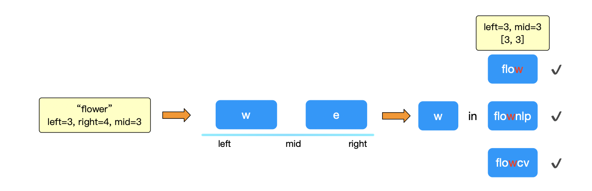

[toc]


大家好！我是Johngo！

今天不准备一个专题的模块进行分享。

最近在专题制作过程中遇到了**最长前缀公共子串**的问题，也是读者最近校招面试到的一个题目。为什么拿出这个来说呢？

可怕的是，他居然给了 5 种解题方法。

更可怕的是，因此他直接少了一轮面试，天哪！！


今天顺便分享出来，作为「字符串」的第 5 个部分。


### 说在前面

言归正传，这一期来说说字符串的第五块内容 **「字符串 - 最长公共前缀」**问题

> github：https://github.com/xiaozhutec/share_leetcode
>
> 文档地址：https://github.com/xiaozhutec/share_leetcode/tree/master/docs
>
> 整体架构：


### 字符串 - 最长公共前缀

小概念：子串的必须要连续，和子序列不同。

> 比如说一个字符串 "flower"
>
> 子串："flow", "ower", "low" 等等都是它的子串，子串必须要连续；
>
> 子序列："flwer", "fler", "wer" 等等都是它的子序列，可以不连续；
>
> 但需要注意的是它们的顺序需要和原字符串保持一致。

另外，前缀，一定是从字符串的开头进行计算的。

今天大概说的就是个这...



对，被框住的合集中，就是**公共前缀（LCP）**!

而且这期只举一个 LeetCode 中比较简单的案例来说明。

思路上比较简单！

但是！就是因为这个思路比较简单，本期就用 5 种方式进行分析。

分别是 **Python 提供的 zip 方式解决、横向扫描、纵向扫描、分治、二分法**。


### 案例 - 14.最长公共前缀【简单】

整体关于字符串「最长公共前缀」方面的问题。

利用 LeetCode 的 第 14 题，最长公共前缀【简单】来举例！


> 编写一个函数来查找字符串数组中的最长公共前缀。
>
> 如果不存在公共前缀，返回空字符串 ""。
>
> ```
> 输入：strs = ["flower","flow","flight"]
> 输出："fl"
> ```


#### 方法一 Python zip轻松解决

熟悉的我的同学都知道，咱们刷题一直用的是 Python 进行刷题，然后也会用到不少 Python 提供的库函数进行问题的解决。

不熟悉 zip 作用的同学不要着急，此处不说原理，10 秒钟用一个例子说明它存在的实际意义。

zip() 函数简单说来，就是将可迭代对象中，各个对应元素打包成一个一个的元祖。

看例子：

```python
>>> str1 = [1,2,3]
>>> str2 = [4,5,6]
>>> str3 = [7,8,9]
>>> zip(str1, str2, str3)
[(1, 4, 7), (2, 5, 8), (3, 6, 9)]
```

又或者这个例子：

```python
>>> strs = ["flower", "flow", "flight"]
>>> zip(*strs)
[('f', 'f', 'f'), ('l', 'l', 'l'), ('o', 'o', 'i'), ('w', 'w', 'g')]
```

> *str 有解包的作用，即把字符串解为一个一个的字符。

zip() 函数的大概作用明白了吧~

如果仔细看第二个例子的话，其实已经可以看出解决方式了。

将上述各个元祖进行 set 操作去重！

```python
[('f'), ('l'), ('o', 'i'), ('w', 'g')]
```

继续对各个进行长度计算操作，如果长度为 1 的，那么，前缀必然相同。

即可求出公共前缀了！



图中：**最后长度为 1 的字符串**，就是咱们要得出来的最长公共前缀了。

简单看下代码：

```python
def longestCommonPrefix1(self, strs):
    lcp = ""
    for tmp in zip(*strs):
        if len(set(tmp)) == 1:
            lcp += tmp[0]
        else:
            break
    return lcp
```


#### 方法二 纵向比较

循环比较个字符串的各个位置。

在第一次循环中比较每个字符串的第 0 位，在第二次循环中比较每个字符串的第 1 位，...， 以此类推，直到匹配到不是相同字符。

以下图做一个详细的分析：

> tag 表示在比较过程中，是否相同，相同为True，不同为False；
>
> lcp 表示最长公共前缀的长度；

第一次循环：字符都相同，则，tag=True，lcp+1=1


第二次循环：字符都相同，则，tag=True，lcp+1=2



第三次循环：字符在第三个字符比较中出现了不同，则，tag=False，退出循环，得到最终答案。

lcp的值停留在了上一次循环中。。



这就是纵向比较的全部流程，只要遇到不匹配的就退出循环。

下面看下代码实现：

```python
def longestCommonPrefix2(self, strs):
    s = strs[0]
    size = len(s)
    lcp = 0
    tag = False
    for index in range(size):
      	# 循环比较每一个位置的字符是否相同
        for item in range(len(strs)):
            # 需要判断位置 index 在 strs 中字符串是否越界
            if index < len(strs[item]) and s[index] == strs[item][index]:
                tag = True
            else:
                # 当匹配不到的时候，退出该次循环
                tag = False
                break
        if tag is True:
            lcp += 1
        else:
            break
    return s[:lcp]
```

下面再看一种方法，是横向比较，即躺着比较，也称为**“咸鱼比较法”**。


#### 方法三 横向比较（咸鱼比较法）

方法一 和 方法二的思路差不多，都是从每一个字符串的每一位进行比较。

横向比较方法，是利用每两个字符串相互比较，保留公共前缀，将保留下来的公共前缀和后面的字符串再进行比较。

还是用这个例子进行说明：strs = ["flower","flow","flight"]

将 0 位置的字符串作为哨兵，与 1 位置的字符串进行比较，得到最长公共前缀。

再用得到的最长公共前缀再与 2 位置的字符串进行比较。得到最后的结果。


以上述例子，看下图：

第一次比较：字符串"flower" 和 "flow" 进行比较，最长公共前缀是 4


第二次比较：将上一步中得到的字符串 “flow” 与下一个字符串再做比较，得到“fl”。


至此，问题解决！

看代码实现：

```python
def longestCommonPrefix3(self, strs):
    s = strs[0]
    for index in range(1, len(strs)):
        w_index, size = 0, min(len(s), len(strs[index]))
        for w_index in range(size):
            if s[w_index] != strs[index][w_index]:
                break
            w_index += 1
        s = s[0: w_index]
    return s
```

再下面的两种解法是运用了分治和二分的思想。

有很多人可能很容易想到分治的思路，但是立马想不到二分的思路进行解决。


#### 方法四 分治思想解决【较重要】

分治思想要比前两种明显感觉要高级一点。。

前两种想法设法的去比较，而当引入分治的时候，就要进行用高级的方式进行比较了。

如下如，分治体现的就是分而治之，部分决策。

将一个大问题，拆分为两个子问题，对子问题继续向下求解。



这个题目就非常清楚的阐明了分治思想的核心。

下面看下这块的代码：

```python
def longestCommonPrefix4(self, strs):
    def lcp(left, right):
        if left == right:
            return strs[left]
        mid = (left + right)//2
        # 得到左右两个字符串
        left_str, right_str = lcp(left, mid), lcp(mid+1, right)
        index, min_len = 0, min(len(left_str), len(right_str))
        while index < min_len:
            if left_str[index] != right_str[index]:
                return left_str[:index]
            index += 1
        return left_str[:index]
    return lcp(0, len(strs)-1)
```

这块是一个典型的二分法的运用。

所以，要理解其中递归的思维逻辑，这个题目就很好的解决了。


#### 方法五 二分思想解决【较重要】

再有一个方法呢，就是利用二分的思路进行解决。

还是用 ["flower", "flow", "flownlp", "flowcv"]来举例子。

利用二分查找，以第一个字符串为基准，不断跟后面字符串进行比较。

初始化左右指针以及`mid`，`left=0`，`right=len(s)-1`, `mid=(left+right)/2`。

> "flower" -> left=0,right=5,mid=(left+right)//2=2 => 左:["flo"], 右:["wer"]
>
> 如果左:["flo"]在后面每个单词[left:mid]中，说明左侧子串都能够匹配，需要右面子串进行匹配，则 left=mid+1, mid=(left+right)//2
>
> 否则，right=mid, mid=(left+right)//2

所以以上述列表中字符串为例：

> right=2，mid=1，左:["fl"]，右:["o"]
>
> 如果左:["fl"]在后面每个单词[left:mid]中，则 left=mid+1,mid=(left+right)//2
>
> 否则，right=mid, mid=(left+right)//2

如果看不清楚，可以看下面图解！

第一次比较：

**left=0，right=5，mid=2**，发现字符串左半部分"flo"与剩余的每一个字符串都匹配。

所以下面需要进行有半部分的匹配即可，即 left=mid+1！



第二次比较：

**left=3，right=5，mid=4**，发现子串左半部分"we"与剩余的每一个字符串都不匹配。

因此，需要缩小左半部分的范围，右指针 right=mid。



第三次比较：

**left=3，right=4，mid=3**，发现子串左半部分"w"与剩余的每一个字符串都匹配。

此时，已经得到了最后的结果。退出循环！



这样看下来，思路也是很清晰，下面用Python来实现一下：

```python
def longestCommonPrefix5(self, strs):
    s = strs[0]
    lcp = ""
    left, right = 0, len(strs[0])-1
    mid = (left+right)//2
    # 只有一个字符串的情况下
    if len(strs) == 1:
        return s
    while left <= right:
        tag = True
        # 轮询判断子串与后面每个字符串对应位置的子串是否相同
        for i in range(1, len(strs)):
            if s[left:mid+1] not in strs[i][left:mid+1]:
                tag = False
                break

        # 左边子串存在后面每个字符串中
        if tag is True:
            # 将匹配到的子串加入到结果集中
            lcp += s[left:mid+1]
            left = mid+1
            mid = (left+right)//2
        # 左边子串不存在后面每个字符串中
        else:
            if right == mid: # 当 right == mid，说明right指针已经无法靠左移动了，退出循环
                break
            else:
                right = mid
            mid = (left+right)//2
    return lcp
```


以上就是就关于字符串「最长公共前缀」的全部分享了。

另外，方便的话也在我的`github`👇 加颗星，它是我持续输出最大最大的动力，感谢大家！

github：https://github.com/xiaozhutec/share_leetcode

----


如果感觉内容对你有些许的帮助！

点赞、在看！

评论、转发！

下期想看哪方面的，评论区告诉我！

好了~ 咱们下期见！bye~~


