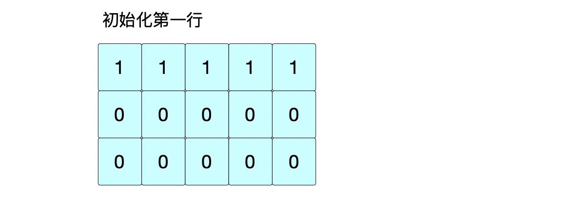

[toc]

你好！我是Johngo！

动态规划作为面试的重镇之地，都有。。

**不同路径 爬楼梯！**

**打家劫舍 卖股票!**

**单词拆分 接雨水！**

其实是这样，突然想到今年夏天，大学同宿舍在抖音的总监中，让他用动态规划的思路解决「最长公共子序列」的一道题目。

不过作为一个游戏通关者而言，确实不太难！因为他心目中的总监面应该是很难的！

但是，万万没有想到，这仅仅是开始....总监面今天就到这里了，下期分享他后面遇到了什么？？！！


好了，先把总监面开始遇到的问题跟大家分享，正好对应 LeetCode专题「字符串」的第 5 期。

趁着对那次面试还有点印象，赶紧记录下来！

本来想要把「最长公共子序列」和「最长上升子序列」一起和大家把思路分享一下，都属于可以使用动态规划的思想进行解决。但貌似还是两块内容。

所以，今天先把「最长公共子序列」分享出来和大家聊聊。

后面再出一期把「最长上升子序列」详细的分享，后面这一期内容估计会比较多。

题外话，上一期的抽书活动还没有结束，感兴趣的可以继续参与哈！【 https://mp.weixin.qq.com/s/V9srFVVrDxVRW8XYNK8pLg 】

## 说在前面

言归正传，这一期来说说字符串的第 6 块内容 **「字符串 - 最长公共子序列」**

> github：https://leetcode-cn.com/problems/longest-common-subsequence/
>
> 文档地址：https://github.com/xiaozhutec/share_leetcode/tree/master/docs
>
> 整体架构（github中可查看高清图）：


## 字符串 - 最长公共子序列

今天这期内容是字符串的第 5 期。

之前谈到过**子串和子序列的区别**，子串指的是向字符串截取固定长度的子字符串。

而子序列在LeetCode有过解释：

> 一个字符串的子序列是指这样一个新的字符串：它是由原字符串在不改变字符的相对顺序的情况下删除某些字符（也可以不删除任何字符）后组成的新字符串。

既然是公共子序列，涉及到的肯定**至少是两个字符串**的公共子序列比较

比如：

```
text1 = "abcde", text2 = "ace" 
```

它的公共元素就是"ace"。

如何在两个字符串中找到其公共的公共的部分，首先想到的肯定是暴力求解，逐项对比。最先想到，然而也是最先放弃的，因为时间复杂度最高。这块也不做讨论。

其次，最先想到的是动态规划来解决，记录遍历时的每一个状态。

关于动态规划的部分，之前已经完整的写过一篇，超过万字，非常全面【 https://mp.weixin.qq.com/s/ZqOWomyra90BRzNukHr3-Q 】


## 案例

整体关于字符串「最长公共子序列」方面的问题一般来说都会用动态规划的思想去解决！

下面会通过一个典型案例具体来看是怎么解决的，使用 <u>LeetCode 的 1143 题</u> 进行举例。

1143.最长公共子序列【中等】


### 1143.最长公共子序列【中等】

> 给定两个字符串 text1 和 text2，返回这两个字符串的最长 公共子序列的长度。如果不存在公共子序列 ，返回 0 。
>
> 一个字符串的子序列是指这样一个新的字符串：它是由原字符串在不改变字符的相对顺序的情况下删除某些字符（也可以不删除任何字符）后组成的新字符串。
>
> 例如，"ace" 是 "abcde" 的子序列，但 "aec" 不是 "abcde" 的子序列。
> 两个字符串的 公共子序列 是这两个字符串所共同拥有的子序列。
>
> ```
> 输入：text1 = "abcde", text2 = "ace" 
> 输出：3  
> 解释：最长公共子序列是 "ace" ，它的长度为 3 。
> ```

这里用动态规划的思想进行解决。对于两个字符串的比较，一定会涉及到利用二维数组来进行解决。

按照之前说的四步骤，**动态数组定义**、**初始化**、**状态转移方程**、**优化**、、。

以下利用字符串 “abcde" 和 ”ace” 为例，计算最长公共子序列。

令 s1="abcde", s2="ace"

#### 一、动态数组定义

根据`s1`的长度为5，`s2`的长度为3。

初始化一个 3 行 5 列的二维数组`dp`，赋初值全为 0。用来存储动态规划过程中记录的值。

$dp[i][j]$ 代表位置 $(i, j)$ 最长公共子序列的值！


#### 二、初始化

针对动态规划一般的初始化方法，一定是边界的初始化。

这里是二维数组，咱们这里要初始化的地方是第 0 行和第 0 列。

① 针对 0 行

s1=“abcde”, s2=“ace”，s2[0] 与 s1 的每一个字符进行比较，只有第 0 位置字符是相同的，第 0 位置为 1。由于公共子序列的规则，那第 0 行初始化全为 1。



① 针对 0 列

s1=“abcde”, s2=“ace”，s1[0] 与 s2 的每一个字符进行比较，同样只有第 0 位置字符是相同的，第 0 位置为 1。依然是由于公共子序列的规则那第 0 列初始化全为 1。


根据初始化的情况，下面用代码描述：

```python
if text1[0] == text2[0]:
    dp[0][0] = 1
for i in range(1, size1):
    dp[0][i] = 1 if dp[0][i-1] == 1 else int(text1[i] == text2[0])
for j in range(1, size2):
    dp[j][0] = 1 if dp[j-1][0] == 1 else int(text2[j] == text1[0])
```


#### 三、状态转移方程

很明显可以分为两种情况：

* 当前位置的字符相同
* 当前位置的字符不相同

① 当 text1\[i\] == text2\[j\] 的时候，说明当前字符相同，只要将上一个字符对应的 dp 的值加 1 就可以了。即 dp\[i\]\[j\] = dp\[i-1\]\[j-1\] + 1。

注意，这里一定是 dp\[i-1\]\[j-1\]，因为此处的字符相同。那么，要想计算此处 dp\[i\]\[j\] 的值，一定是与位置 i-1 与 j-1 的位置相关的。

② 当 text1\[i\] != text2\[j\] 的时候，此时当前字符不相同，那么此处 dp[i\]\[j\] 的数值一定沿用上一个 dp 的数值。所以，取得一定是其中的最大值 max(dp\[i-1\]\[j], dp\[i\][j-1])。

综上所述，可以得到该问题的状态转移方程：

$$
dp[i][j]= \begin{cases} 

dp[i-1][j-1] + 1, & text1[i] = text2[j] \\[2ex]
max(dp[i-1][j], dp[i][j-1]), & text1[i]  \neq text2[j]

\end{cases}
$$

从位置 (1, 1) 位置开始计算，判断两个字符串在当前字符串是否相等：

* 如果相等，则取dp[i-1][j-1\]+1

* 如果不相等，则取max(dp[i\][j-1\], dp[i-1]\[j])

根据上述的状态转移方程，以及s1="abcde", s2="ace"，下面把二维数组填满，得到最后的答案！

① 位置(1,1)：$s1[1] \neq s2[1] => dp[1][1]=max(dp[0][1], dp[1][0])=1$ 


② 位置(1,2)：$s1[2] == s2[1] => dp[1][2]=dp[0][0]+1$ 


③ 位置(1,3)：$s1[3] \neq s2[1] => dp[1][3]=max(dp[0][3], dp[1][2])=2$ 


④ 位置(1,4)：$s1[4] \neq s2[1] => dp[1][4]=max(dp[0][4], dp[1][3])=2$


⑤ 位置(2,1)：$s1[1] \neq s2[2] => dp[2][1]=max(dp[2][0], dp[1][1])=1$


⑥ 位置(2,2)：$s1[2] != s2[2] => dp[2][2]=max(dp[2][1], dp[1][2])=2$


⑦ 位置(2,3)：$s1[3] != s2[2] => dp[2][3]=max(dp[2][2], dp[1][3])=2$


⑧ 位置(2,4)：$s1[4] == s2[2] => dp[2][4]=dp[1][3]+1=3$


这个就是二维数据中，每一格的填充方式。

根据上述的一个清晰的思路，状态转移填充二位数组的代码描述：

```python
for i in range(1, size2):
    for j in range(1, size1):
        if text2[i] == text1[j]:
            # 注意这里是dp[i-1][j-1]+1
            dp[i][j] = dp[i-1][j-1] + 1
        else:
            dp[i][j] = max(dp[i][j-1], dp[i-1][j])
return dp[-1][-1]
```

好了，这个是一个全面的答案：

```python
def longestCommonSubsequence(self, text1, text2):
    size1 = len(text1)
    size2 = len(text2)
    # 1 先定义 dp 数组
    dp = [[0 for _ in range(size1)] for _ in range(size2)]
    # 2 初始化 dp 数组的第 0 行和第 0 列
    if text1[0] == text2[0]:
        dp[0][0] = 1
    for i in range(1, size1):
        dp[0][i] = 1 if dp[0][i-1] == 1 else int(text1[i] == text2[0])
    for j in range(1, size2):
        dp[j][0] = 1 if dp[j-1][0] == 1 else int(text2[j] == text1[0])
    # 3 动态方程进行求解
    for i in range(1, size2):
        for j in range(1, size1):
            if text2[i] == text1[j]:
                # 注意这里是dp[i-1][j-1]+1
                dp[i][j] = dp[i-1][j-1] + 1
            else:
                dp[i][j] = max(dp[i][j-1], dp[i-1][j])
    return dp[-1][-1]
```

最后，$dp[-1][-1]$ 代表的就是最后一个位置的值，也是截止到最后最长公共子序列的最大值！

以上就是该类型题目使用动态规划的常规思路了。

为什么说常规思路？因为一般情况下动态规划问题可以有空间方面的优化，而且该类型题目上述解决方案中是有优化空间的。


#### 四、优化

在很多时候，咱们遇到使用动态规划利用二维数据解决问题的时候，通常可以进行空间方面的优化。

在之前的文章有很详细的说明，有兴趣大家可以看看【 https://mp.weixin.qq.com/s/ZqOWomyra90BRzNukHr3-Q 】

因为通常，在二维的情况下，当前$(i, j)$的取值，最多只与上一个位置或者左面位置的值有关系，而与跨行或者跨列是没有关系的。

比如说在计算位置(2,3)的时候：$s1[3] != s2[2] => dp[2][3]=max(dp[2][2], dp[1][3])=2$


发现是与第 0 行以及之前和第 1 列以及之前的所有数据都是没有关系的，所以可以从这方面进行空间的优化。

空间上除了定义变量外，一个2行2列的二维数组就可以解决！

有兴趣的同学可以在评论区写出优化后的代码，或者如果有需要，在评论区留言，我在后面文章中进行这类题目关于优化方式的分享！


好了，今天就关于字符串「最长公共子序列」进行了分享。

另外，方便的话也在我的`github`👇 加颗星，它是我持续输出最大最大的动力，感谢大家！

github：https://github.com/xiaozhutec/share_leetcode

----

对了，「一周送书」上周的抽书活动还没有结束，感兴趣的可以继续参与哈！

如果感觉内容对你有些许的帮助，求点赞，求在看！

下期想看哪方面的，评论区告诉我！

咱们下期见！bye~~


