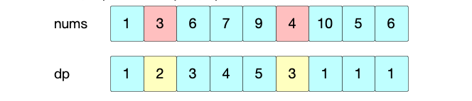
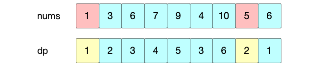

[toc]


你好，我是Johngo！

今天是「动态规划解决字符串」类型中另外一类问题。

而且有一个很典型的 「字符串」题目，尤其是第二个例子需要静下心好好捉摸。

经过本期「字符串」的讲解，一定能够让你在关于「动态规划解字符串」方面有一个新的清晰的认识。

回顾上一期的【总监面】https://mp.weixin.qq.com/s/yfTd-NZUS-Qc8yXaAXymhQ，也就是涉及到动态规划解决公共子序列的问题。然后大学宿舍同学给出了一个完美的解决方案。

另外，可能是由于面试太过于顺利，他自己居然还把「上升子序列」的问题引出来了！

不愧是高手，要是搁一般人，能做完给定的题目，哪敢自己再引题目出来！

既然都聊到这里了。

今天把咱们计划中「字符串-最长上升子序列」问题，好好再说道说道。

## 说在前面

言归正传，这一期来说说字符串的第 7 块内容 **「字符串 - 最长公共子序列」**

> github：https://leetcode-cn.com/problems/longest-common-subsequence/
>
> 文档地址：https://github.com/xiaozhutec/share_leetcode/tree/master/docs
>
> 整体架构（github中可查看完整源文件）：


## 字符串 - 最长上升子序列

一般情况下，「最长上升子序列」会涉及到 2 种情况！

### 情况 1，非连续子序列

之前分享过「最长公共前缀」、「最长公共子序列」，都是针对两个以及两个以上字符串进行一些问题的解决。

所以在使用『动态规划』思想解决问题的时候，通常会借用二维以及多维数组辅助记录中间计算的数值（动态规划中的空间换时间策略）

而本文涉及到的「最长上升子序列」，肯定是针对一个字符串的问题。

那么，在使用『动态规划』的时候，也一定是会利用一维辅助数组进行问题的解决。

### 情况 2，连续子序列

另外呢，还有一类情况是，要得到最长**连续**上升子序列。

谈到连续，就要求得局部最优解了，这种情况一定会使用到的是『贪心算法』。动态规划也能解决，如果熟练之后， 发现有些地方确实是想通的！

「贪心算法」通过记录局部最优解，进而求得全局最优！


## 案例

整体关于字符串「最长上升子序列」方面的问题用到的解决办法无非两种！

* 动态规划
* 贪心算法

下面会通过 3 个典型的案例讲解，分别是 LeetCode 的三个题目：

* 300.最长递增子序列
* 673.最长递增子序列的个数
* 674.最长连续递增序列

### 300.最长递增子序列

> 给你一个整数数组 nums ，找到其中最长严格递增子序列的长度。
>
> 子序列是由数组派生而来的序列，删除（或不删除）数组中的元素而不改变其余元素的顺序。例如，[3,6,2,7] 是数组 [0,3,1,6,2,2,7] 的子序列。
>
> 输入：nums = [1, 3, 6, 7, 9, 4, 10, 5, 6]
> 输出：6
> 解释：最长递增子序列是 [1, 3, 6, 7, 9, 10]，因此长度为 6 。

该例子就要用到「动态规划」的思想去解决，而且使用到一维辅助数组。

还是在动态规划模块提到的四步骤，**动态数组定义**、**初始化**、**状态转移方程**、**优化**、、。

当然，这四个步骤要灵活运用，可以充当一个解决类似问题的敲门砖。

就拿上述例子，利用四步骤进行问题的分析和解决。

#### 一、动态数组定义

定义动态数组 `dp`，和 `nums `长度一致，即长度为 9 的数组。

动态数组 `dp` 每一个位置的数值代表：截止位置 `i`（一定包括位置 `i`）最长上升子序列长度。

> **比如** ：字符串[1, 6,  7, 4]，dp 数组为[1, 2, 3, 2]，注意dp 的最后一位是 2，而不是 3。
>
> dp 数组的每一位一定是截止到位置 i，而且要包括位置 i 的最长上升子序列。

因为至少也会有 1 个最长递增子序列。

所以全部初始化为 1。


#### 二、初始化

上述全部初始化为 1 即可！

#### 三、状态转移方程定义

位置 $i$ 的数值大于位置 $j$ 的数值的情况下，说明序列是上升的。

应该计算得到 $dp[i] = dp[j]+1$ 或者 如果 $dp[i]$ 本身如果很大的话，能取自身。这里好像有点不好理解，后面的详细步骤中会有提及，其实很简单！（下面第六轮计算得以体现~）

动态方程：

$dp[i] = max(dp[i], dp[j]+1), 0<=j<=i-1 \quad and \quad nums[i]>nums[j]$

另外，从动态转移方程的定义可以看出，每一个第 i 个位置，都要与前 0 到 $i-1$ 位置的数字作对比。

所以，需要 $i-1$ 轮，即 8 轮，去填充 $dp $ 数组。

下面就案例进行每一步骤的详细说明：

**第一轮：填充 dp 数组位置 1**

先从位置 i=1 位置开始，由于比位置 j=0 大。

所以，$dp[1]=max(dp[1], dp[0]+1) = max(1, 1+1) = 2$


**第二轮：填充 dp 数组位置 2**

位置 i=2 的数值，比位置 j=0 大。

所以，$dp[2]=max(dp[2], dp[0]+1) = max(1, 1+1) = 2$


位置 i=2 的数值，比位置 j=1 大。

所以，$dp[2]=max(dp[2], dp[1]+1) = max(2, 2+1) = 3$


**第三轮：填充 dp 数组位置 3**

位置 i=3 的数值，比位置 j=0 大。

所以，$dp[3]=max(dp[3], dp[0]+1) = max(1, 1+1) = 2$


位置 i=3 的数值，比位置 j=1 大。

所以，$dp[3]=max(dp[3], dp[1]+1) = max(2, 2+1) = 3$


位置 i=3 的数值，比位置 j=2 大。

所以，$dp[3]=max(dp[3], dp[2]+1) = max(2, 3+1) = 4$


**第四轮：填充 dp 数组位置 4**

位置 i=4 的数值，比位置 j=0 大。

所以，$dp[4]=max(dp[4], dp[0]+1) = max(1, 1+1) = 2$


位置 i=4 的数值，比位置 j=1 大。

所以，$dp[4]=max(dp[4], dp[1]+1) = max(2, 2+1) = 3$


位置 i=4 的数值，比位置 j=2 大。

所以，$dp[4]=max(dp[4], dp[2]+1) = max(3, 3+1) = 4$


位置 i=4 的数值，比位置 j=3 大。

所以，$dp[4]=max(dp[4], dp[3]+1) = max(4, 4+1) = 5$


**第五轮：填充 dp 数组位置 5**

位置 i=5 的数值，比位置 j=0 大。

所以，$dp[5]=max(dp[5], dp[0]+1) = max(1, 1+1) = 2$


位置 i=5 的数值，比位置 j=1 大。

所以，$dp[5]=max(dp[5], dp[1]+1) = max(2, 2+1) = 3$



位置 i=5 的数值，不比位置 j=2 大。

而且 i=5 的数值，循环判断，比 j=2,3,4 的数值都小

所以，本轮结束!

**第六轮：填充 dp 数组位置 6**

位置 i=6 的数值，比位置 j=0 大。

所以，$dp[6]=max(dp[6], dp[0]+1) = max(1, 1+1) = 2$


位置 i=6 的数值，比位置 j=1 大。

所以，$dp[6]=max(dp[6], dp[1]+1) = max(2, 2+1) = 3$


位置 i=6 的数值，比位置 j=2 大。

所以，$dp[6]=max(dp[6], dp[2]+1) = max(3, 3+1) = 4$


位置 i=6 的数值，比位置 j=3 大。

所以，$dp[6]=max(dp[6], dp[3]+1) = max(4, 4+1) = 5$


位置 i=6 的数值，比位置 j=4 大。

所以，$dp[6]=max(dp[6], dp[4]+1) = max(5, 5+1) = 6$


位置 i=6 的数值，比位置 j=5 大。

所以，$dp[6]=max(dp[6], dp[5]+1) = max(6, 3+1) = 6$


> **注意：**
> 
> **这一步是最好诠释取 max 作用的地方：**
> 
> **如果不取 max 的话，这里 dp[6] 取到的就是4。**
> 
> **显然是不对的！**


**第七轮：填充 dp 数组位置 7**

位置 i=7 的数值，比位置 j=0 大。

所以，$dp[7]=max(dp[7], dp[0]+1) = max(1, 1+1) = 2$



位置 i=7 的数值，比位置 j=1 大。

所以，$dp[7]=max(dp[7], dp[1]+1) = max(2, 2+1) = 3$


循环判断，直到 j=5 才比位置 i=7 的数值大。

所以，$dp[7]=max(dp[7], dp[5]+1) = max(3, 3+1) = 4$


位置 i=7 的数值，不比位置 j=6 大。

所以，本轮结束!!


**第八轮：填充 dp 数组位置 8**

位置 i=8 的数值，比位置 j=0 大。

所以，$dp[8]=max(dp[8], dp[0]+1) = max(1, 1+1) = 2$


位置 i=8 的数值，比位置 j=1 大。

所以，$dp[8]=max(dp[8], dp[1]+1) = max(2, 2+1) = 3$


循环判断，直到位置 j=5 的数值，比位置 i=8 小。

所以，$dp[8]=max(dp[8], dp[5]+1) = max(3, 3+1) = 4$


继续循环判断，直到位置 j=7 的数值，比位置 i=8 小。

所以，$dp[8]=max(dp[8], dp[7]+1) = max(4, 4+1) = 5$


以上就是整个最长递增子序列在利用动态规划思想的全部计算细节。


#### 四、优化

在优化这个模块，动态规划在这个题目是没有优化点的， 以往都是在空间方面进行优化。

今天的案例在一维数组作为辅助的同时，需要记录每个位置的最优解，最后求得最大值。

最后，把主要的代码贴出来，看似步骤挺多，不太容易阅读，其实代码很简单：

```python
def lengthOfLIS(self, nums):
    size = len(nums)
    if size == 1:
        return 1
    # 1.初始化dp数组，内容初始化为全1
    dp = [1 for _ in range(size)] 
    # 2.动态方程定义：dp[i] = max(dp[i], dp[j]+1), 0<=j<=i-1 and nums[i]>nums[j]
    for i in range(1, size):
        for j in range(0, i):
            if nums[i] > nums[j]:
                dp[i] = max(dp[i], dp[j]+1)
    return max(dp)
```

现在就是最长上升子序列的第一个例题的全部分享内容。

在这个题目之后，有一个进阶的题目，会不会出现几个相同长度的最长上升子序列。

看下一个题目。


### 673.最长递增子序列的个数

> 给定一个未排序的整数数组，找到最长递增子序列的个数。
>
> 输入: [1,3,5,4,7]
> 输出: 2
> 解释: 有两个最长递增子序列，分别是 [1, 3, 4, 7] 和[1, 3, 5, 7]。

思路和上面的题目类似，就是多求一个**最长递增子序列的个数**。

所以直观上来说，这里需要定义两个数组变量，一个存放最长上升子序列的长度，另外一个存放最长上升子序列的个数：

* $dp[]$：到 $nums[i]$ 为止的最长递增子序列长度

* $count[]$：到 $nums[i]$ 为止的最长递增子序列个数

最重要的一个思路点是：如果 $dp[i]$ 的值增加了，说明长度增加，所以个数 $count[i]$ 不加；如果 $dp$ 值不变，说明长度未增加，个数 $count[i]$ 对应的值要增加。

#### 一、动态数组定义

$dp[i]$：到 $nums[i]$ 为止的最长递增子序列长度；

$count[i]$：到 $nums[i]$ 为止的最长递增子序列个数；

注意理解：是截止到位置 $i$ 为止，要包含位置 $i$ 的元素，而不是符合 $<=i$ 之前字符串或者整体最长递增子序列。

#### 二、初始化状态

$dp = [1] * n$：代表最长递增子序列的长度至少为 1

$count = [1] * n$：代表最长递增子序列的个数至少为 1

#### 三、状态转移方程

对于每一个数 $nums[i]$，看在它之前的数 $nums[j](0<=j<i)$ 是否比当前数 $nums[i]$ 小。

辅助解释 ①：如果 $nums[i]>nums[j]$，那么相当于到 $nums[j]$ 为止的最长递增子序列长度到 $nums[i]$ 增加了1，到 $nums[i]$ 为止的最长递增子序列长度就变成了 $dp[i]=dp[j]+1$；

辅助解释 ②：但因为满足 $nums[i]>nums[j]$ 的 $nums[j]$ 不止一个，$dp[i]$ 应该取这些 $dp[j]+1$ 的最值，并且这些$ dp[j]+1$ 还会有相等的情况，一旦相等，到 $nums[i]$ 为止的最长递增子序列个数 $count[i]$ 就应该增加了。

**因此，在 $nums[i]>nums[j]$ 的大前提下，具体的状态转移如下**：

3.1 如果 $dp[j]+1>dp[i]$，说明最长递增子序列的长度增加了，$dp[i]=dp[j]+1$，长度增加，数量不变 $count[i]=count[j]$

3.2 如果 $dp[j]+1==dp[i]$，说明最长递增子序列的长度并没有增加，但是出现了长度一样的情况，数量增加 $count[i]+=count[j]$

当然，在这中间需要不断记录和更新，最长递增子序列的最大长度 max_length。

最后，遍历 $dp$ 数组，如果 $dp$ 数组记录的最大长度 $dp[i]$ 等于 $max_length$，将对应的数量 $count[i]$ 加到结果 $res$ 中。

该例和上一例的区别在于需要记录最长上述子序列的个数，即增加了 $count[]$ 来记录计算的中间结果。

和上例思路相仿，下面直接给出核心代码：

```python
def findNumberOfLIS(self, nums):
    size = len(nums)
    if size == 1:
        return 1
    # 最长递增子序列长度
    max_len = 1
    # 初始化dp和count数组，初始化为全 1
    dp = [1 for _ in range(size)]
    count = [1 for _ in range(size)]

    for i in range(1, size):
        for j in range(0, i):
            if nums[i] > nums[j]:
                if dp[i] < dp[j] + 1:
                    dp[i] = dp[j] + 1
                    count[i] = count[j]
                elif dp[i] == dp[j] + 1:
                    count[i] += count[j]
            # 记录最长子序列长度
            if max_len < dp[i]:
                max_len = dp[i]
    # 获取最长子序列个数
    max_len_num = 0
    for i in range(size):
        if dp[i] == max_len:
            max_len_num += count[i]
    return max_len_num
```

好了，这就是利用「动态规划」的思路去解决「最长上升子序列」问题的全部解释以及两个典型例题的完整讲解。

下面也是类似的题目，但利用贪心将会极其容易的进行解决！


### 674.最长连续递增序列

>给定一个未经排序的整数数组，找到最长且连续递增的子序列，并返回该序列的长度。
>
>连续递增的子序列 可以由两个下标 l 和 r（l < r）确定，如果对于每个 l <= i < r，都有 nums[i] < nums[i + 1] ，那么子序列 [nums[l], nums[l + 1], ..., nums[r - 1], nums[r]] 就是连续递增子序列。
>
>输入：nums = [1,3,5,4,7]
>输出：3
>解释：最长连续递增序列是 [1,3,5], 长度为3。
>尽管 [1,3,5,7] 也是升序的子序列, 但它不是连续的，因为 5 和 7 在原数组里被 4 隔开。 

看到这个题目之后，立马会想到的可能就是贪心算法。

既然是连续递增，而且是求解每个局部的最优值（局部局可能长的连续上升子序列），一般来说就要用贪心策略来解决了。

**通过记录局部最优解，而得出全局的最优解！**

通过两个下标，开始和结束，逐次比较相邻的两个元素，做出更新开始下标以及记录局部最长相邻上升子序列的操作。

初始化 start=0，然后移动 i 到后面每个位置

如果 nums[i]>nums[i-1]，则 i++

如果 nums[i]<=nums[i-1]，则 start=i

① start = 0, res_len = i-start+1 = 1


② start = 0, 由于nums[i] > nums[i-1]，所以 i++， res_len = i-start+1 = 2


③ start = 0, 由于nums[i] > nums[i-1]，所以 i++， res_len = i-start+1 = 3


④ start = 0, 由于nums[I]<nums[i-1]，start=i， 

此时，start = 3，res_len = max(res_len, i-start+1) = 3。

也就是当 start 被重新赋值之后，取最后结果的时候，需要判断之前的长度和当前长度，取其大值！


⑤ start = 3, 由于nums[i] > nums[i-1]，所以 i++。

此时，当前局部的长度还是小于之前局部的长度值。故 res_len = max(res_len, i-start+1) = 3。


其实看到最后，发现整体的思路依旧是动态规划。只是把 res_len 变量设为一个值。

如果把 res_len 设为一个数组，就会更加清晰了。

再补充一句，此时的解法是相较于设为数组解法优化后的方法，即在空间上进行了优化。

下面看下核心代码：

```python
def findLengthOfLCIS(self, nums):
    size = len(nums)
    start = 0
    res_len = 0
    for i in range(size):
        if nums[i] <= nums[i-1]:
            start = i
        res_len = max(res_len, i-start+1)

    return res_len
```

很短，不过这也属于一道简单题目。

好了，今年就是关于「字符串-最长上升子序列」的全部分享，这类型题目在面试中有过大量的出现，如果你有遇到过也可以在评论区留言，给到其他同学一些建议。


