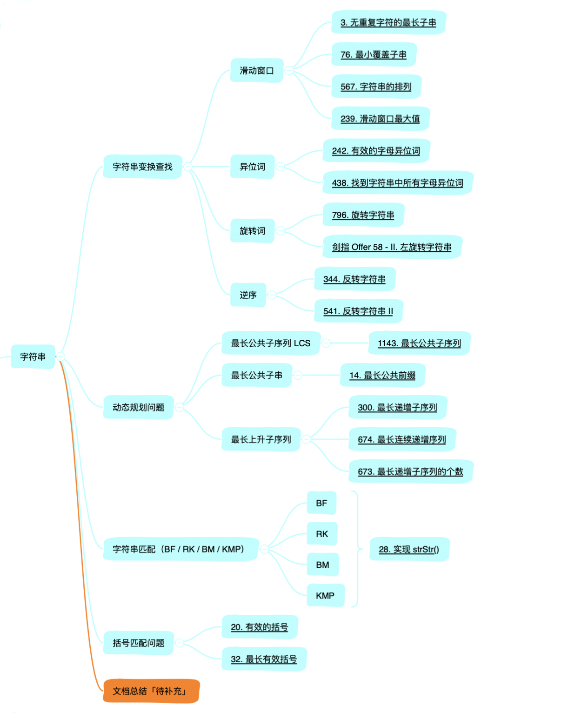

### 背景

刷题这件事情隔了大概有些日子了，今天正式开始「字符串」系列分享。

今天先不分享具体的算法和 LeetCode 题目，就是把接下来要完成的分享罗列一下。

下图把字符串涉及到的内容贴出来，接下来一段时间会按照下面的进度进分别进行文章的更新。



看完上图，有很多朋友可能会有疑问，可以在评论区提出来，我来进行解释和修正。

其实字符串涉及到的内容还是比较杂、而且逻辑上是比较复杂的。

基本分为四类：

* 字符串的变换查找
* 动态规划问题
* 字符串匹配（重点）
* 其他问题（括号匹配、Huffman、。。。）

而上面的每一个分支都会进行具体的细分，字符串的变化查找涉及到利用滑动窗口解决的题目，字符串的异位词、旋转词以及字符串的逆序。

动态规划问题，可以大致分为两类，分为是最长公共子序列（以及子串）和最长递增子序列

剩下的一个大类，也是最重要的，就是字符串的匹配问题，这一类问题估计会有万字长文产生了，还请各位细品哈哈。

大概看了下，估计字符串这一个系列会出 10 篇文章进行分享。

之前有一些万字长文，当时自认为很详细很系统，但是有些读者给我的反馈是文章太长了，太难一次看完，但收藏起来慢慢看，公众号有不是太方便看技术文。

针对这两点问题，其实是有解决的。

这段时间 LeetCode 刷题有些没跟上进度，就是因为最近把之前的网站进行了更新，重新搞了一把，就是为了文章更好的展现。

网站网址：www.johngo689.com

另外一点，不会有特别长特别长的文章了，都会恰当的截开，只不过有些难以分开的文章，还需要长篇解释了。

所以，现在有一个漂亮的网站可以阅读文章，而且文章会以短小的形式呈现给大家。


### 字符串名词解释

在二叉树很多理论概念和题目中，涉及到一些与字符串相关的概念需要弄清楚。

* 异位词：内容一致，这是字符的位置不同，例如 abc和bac；
* 旋转词：字符串向左移动或者向右移动，比如 abcde向右移动 2 位得到deabc；
* 回文：从前向后看和从后向前看是一样的，例如 abcba；
* 子串：子串是连续的，比如 abc 是 dfsabcafd 的子串；
* 子序列：子串不连续，比如 facda 是 dfsabcafd 的子序列；
* 字典序：符合字典顺序的字符串，比如abcde；
* 字符串匹配：判断模式串 abc 是否与主串 abcde 部分匹配。

过去一段时间，其实对于子串和子序列已经有点朦朦胧胧的感觉。

所以，这些常见名词还是要搞清楚的。

emmm...

好了，后面保持上述内容的文章更新起来，到时候和大家一起探讨！


### 一点点提示

**第一点**

刚刚提到的，以后的文章会首发公众号和个人网站（www.johngo689.com），和大家一起成长。

网站还是很漂亮的，大家不妨看看，也可以注册哦！

**第二点**

后面每篇原创文章末尾，都会随机抽取以为朋友，送大家一本书出来（书单中自选）！

而且规则超级简单，朋友圈点赞，本文会在第一时间在朋友圈分享出来，大家进行点赞。

利用下面的**`random`** 函数进行随机抽取 1 位朋友！

```python
import random 
random.sample([str(x) for x in range(1, n)], 1)
```


