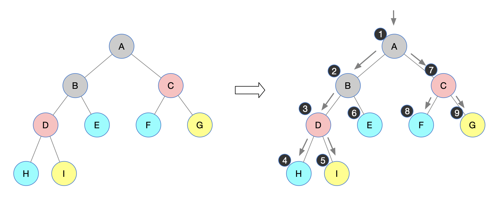
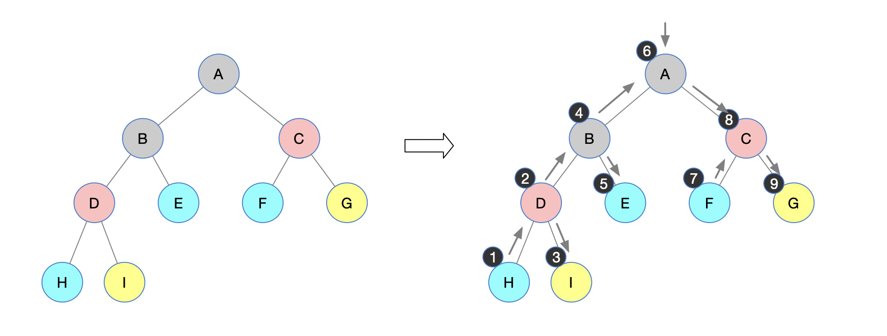
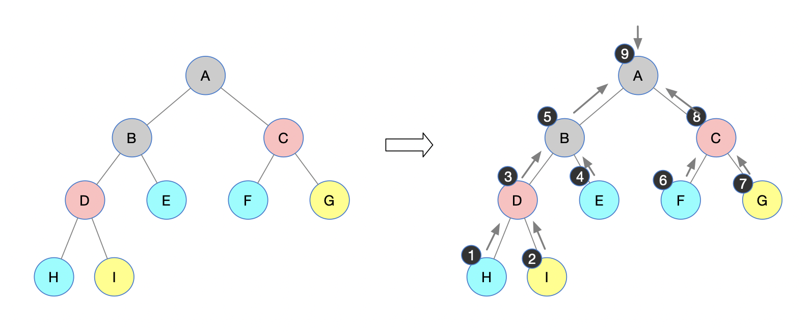
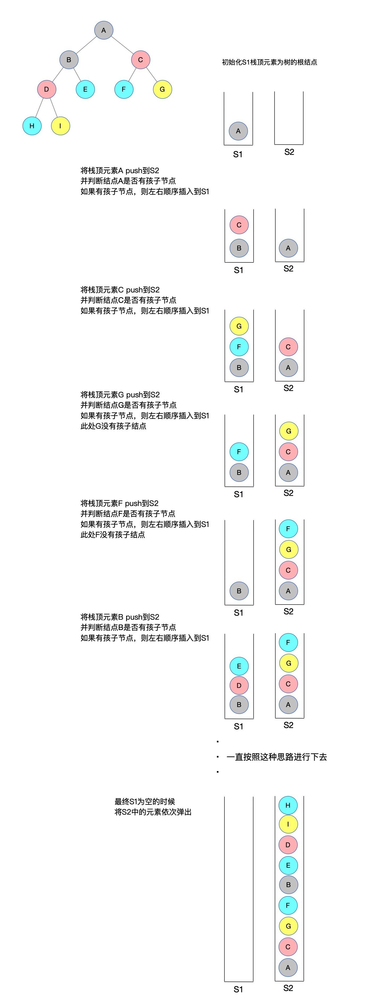
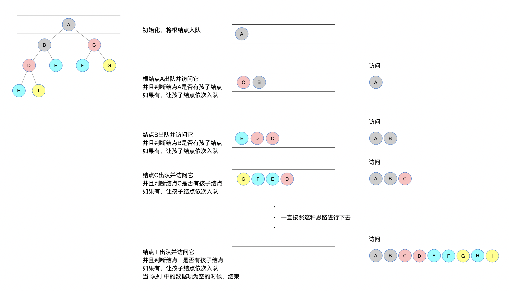

[toc]


### 0


LeetCode树提计划开始有几天了。

今天对「树」的进度做一个简短的小结，群里亲爱的小伙伴进行的怎么样了呢？我这边预计在整个「树」的阶段，预计会进行四个全面的小结。

分布如下：

* 「树」的基础遍历，重点在于「树」的递归的理解
* 模块1：**基础遍历**，对LeetCode中进行刷题标记
* 模块2：遍历变种-自顶向下，对这些题目进行解释和代码编写
* 模块3：遍历变种-非自顶向下，同样也是对这些题目进行解释和代码编写

  

还是把咱们的计划列出来：


所以，今天会是先序、中序、后续、层次遍历的基础代码编写

今天内容相对来说比较容易，就是「树」的 4 种遍历。但是，再强调，多看看递归的写法，多深入理解递归的代码流程，因为，可以说这是后面大多数题目的基础思维逻辑。

后面基本都会使用Python来进行代码的逻辑实现，比较容易以及大众，毕竟算法方面学习的是思想，至于怎么实现的，任何语言都可以对其进行复现

今天是「树」的遍历，咱们先来定义一个树的结构类，以及一颗完整的二叉树！

```python
# 树结点类
class TreeNode:
    def __init__(self, value):
        self.value = value
        self.left = None
        self.right = None
```

构建一棵完整的二叉树：

```python
if __name__ == "__main__":
    # 新建节点
    root = TreeNode('A')
    node_B = TreeNode('B')
    node_C = TreeNode('C')
    node_D = TreeNode('D')
    node_E = TreeNode('E')
    node_F = TreeNode('F')
    node_G = TreeNode('G')
    node_H = TreeNode('H')
    node_I = TreeNode('I')

    # 构建二叉树
    #        A
    #      /   \
    #     B     C
    #    / \   / \
    #   D   E F   G
    #  / \
    # H   I

    root.left, root.right = node_B, node_C
    node_B.left, node_B.right = node_D, node_E
    node_C.left, node_C.right = node_F, node_G
    node_D.left, node_D.right = node_H, node_I
```

首先有一个小提醒：

今天的代码会使用**栈**或者**队列**来辅助实现，在 Python 中，这里使用 list 来操作

```python 
# 栈
stack = []
# 栈 - 压栈
stack.append('结点')
# 栈 - 弹出栈顶元素
stack.pop()

# 队列
queue = []
# 栈 - 入队
queue.append('结点')
# 栈 - 出队
queue.pop(0)
```


### 甜点

**很甜，试着深入理解递归**

递归在很多人看来不容易理解，尤其是处于学生时期的同学，以及一些初学者。其实很多工作几年的人也不是太容易理解递归，而且递归有时候真的会很不容易解释，非得自己去想清楚才能真正转化为自己的一个思维逻辑。

这里我想试着说说看，能不能说清楚，咳、、、尽量吧...

咱们这里用后续遍历举例子，其他递归方式自己烧脑理解哈！


核心代码（以下用**代码1、2、3、4**来表示每一行）：

```python
def post_order_traverse(root):
    代码1 | if not root: return							
    代码2 | post_order_traverse(root.left)
    代码3 | post_order_traverse(root.right)
    代码4 | print(root.value, end=" ")
```

当执行到图中步骤 1 的时候，一定是执行了**代码1**和**代码2**，递归调用到最后，判断结点H左右孩子都为空，执行了 `if not root: return`，随后又执行了**代码4**，将结点 H 打印了出来。

同理，当执行到图中的步骤 2 的时候，也是相同的逻辑，递归调用，判断两个孩子都为空，直接返回，随后将结点 I 打印了出来。

再往上，结点H 和 结点I 打印并且返回之后，进行回溯，将 结点D 进行打印

依次类推...

（上述描述理解起来还是不太容易，有需要讨论的，下面直接加我微信，备注“LeetCode刷题”，我拉群里一起讨论哈）

【我的二维码】


###  1

**先序遍历**

递归遍历过程：

a. 访问**根节点**；

b. 先序遍历其左子树；

c. 先序遍历其右子树；

然后就是一直递归下去，在访问到节点的时候，可以进行节点的相关处理，比如说简单的访问节点值

下图是一棵二叉树，我们来手动模拟一下遍历过程



按照上图中描述，根据顺序能够得到它的一个先序遍历的过程，得到先序遍历序列：

```c
A B D H I E C F G 
```

复现上述逻辑：

```python
class Solution:
    def pre_order_traverse(self, root):
        if not root:
            return
        print(root.value, end=" ")
        self.pre_order_traverse(root.left)
        self.pre_order_traverse(root.right)
```

在整个递归中，看似整齐，阅读性极高的 3 行代码，其实对于初学者来说，脑子里理解它的的实现流程是比较困难的！

如果不太清晰，建议深入理解上面给到的【甜点】，用心理解，不懂的可以群里直接讨论哈！

下面再看看非递归的遍历过程：

a. 访问根结点。
b. 判断是否有右孩子，如果有右孩子，压栈
c. 判断否则有左孩子，如果有左孩子，访问它，否则，弹出栈顶元素
d. 循环执行 2 和 3

非递归的遍历，重点在于利用**栈**来实现将稍后要访问结点入栈，先遍历根结点，再将右孩子入栈，最后访问左孩子这样的思想

```python
class Solution:  
    def pre_order_traverse_no_recursion(self, root):
        if not root:
            return
        stack = [root]
        while stack:
            print(root.value, end=" ")  	# 访问根结点
            if root.right:
                stack.append(root.right)  # 判断是否有右孩子，如果有右孩子，压栈
            if root.left:  								# 判断否则有左孩子，如果有左孩子，访问它，否则，弹出栈顶元素
                root = root.left
            else:
                root = stack.pop()
```

这种思路其实也是递归的变形，将递归中使用到的栈自己定义了出来。


### 2 

**中序遍历**

咱们还是先来递归的实现流程

a. 先序遍历其**左子树**；

b. 访问**根节点**；

c. 先序遍历其**右子树**；

然后就是一直递归下去，在访问到节点的时候，可以进行节点的相关处理，比如说简单的访问节点值

下图是一棵二叉树，我们来手动模拟一下中序遍历过程



按照上述中序遍历的递归过程，得到中序遍历序列：

```c
H D I B E A F C G 
```

下面继续用 Python 来复现上述逻辑：

```python
class Solution:
    def in_order_traverse(self, root):
        if not root:
            return
        self.in_order_traverse(root.left)
        print(root.value, end=" ")
        self.in_order_traverse(root.right)
```

和先序遍历很类似，只是把要被访问结点的 print 语句进行了位置置换。

下面再来看中序遍历的非递归过程：

a. 当遍历到一个结点时，就压栈，然后继续去遍历它的左子树;
b. 当左子树遍历完成后，从栈顶弹出栈顶元素（左子树最后一个元素）并访问它;
c. 最后按照当前指正的右孩子继续中序遍历，若没有右孩子，继续弹出栈顶元素。

```python
class Solution:
  	def in_order_traverse_no_recursion(self, root):
        if not root:
            return
        stack = []
        while stack or root:
            while root:
                stack.append(root)
                root = root.left
            if stack:
                tmp = stack.pop()
                print(tmp.value, end=" ")
                root = tmp.right
```

相信上述的 3 个步骤已经说的足够清楚了，但是还是用更加朴素的语言简单描述一下：

中序遍历的非递归过程也是利用了一个「栈」来实现，由于是中序遍历，那么首先要访问左孩子，进而一定要把每个子结构的根结点入栈，然后访问左孩子，弹出栈顶元素（访问根结点），再进行访问右孩子，访问右孩子的时候，继续将每个子结构的根结点入栈，然后访问左孩子...这样循环下去，直到栈为空或者指向的根结点为空。


### 3

**后续遍历**

依然先用递归来实现

a. 先序遍历其**左子树**；

b. 先序遍历其**右子树**；

c. 访问**根节点**；

然后就是一直递归下去，在访问到节点的时候，可以进行节点的相关处理，比如说简单的访问节点值

下图是一棵二叉树，我们来手动模拟一下后序遍历过程



按照上述后序遍历的过程，得到后序遍历序列：

```c
H I D E B F G C A
```

咱们用代码来实现一下逻辑：

```python
class Solution:
    def post_order_traverse(self, root):
        if not root:
            return
        self.post_order_traverse(root.left)
        self.post_order_traverse(root.right)
        print(root.value, end=" ")
```

依然是很简洁，依然是将访问结点的代码语句的位置进行了调整。

下面来轮到非递归来实现的流程

后续遍历的非递归过程比较曲折，后续遍历需要先访问左右子结点后，才能访问该结点，而这也是非递归的难点所在。可以使用一个辅助栈来实现，但理解起来没有使用 2 个栈实现起来清晰，今天就用 2 个栈来实现非递归的后续遍历。

借助2个栈：s1 和 s2
a. 初始化根结点到s1中
b. 将 s1 栈顶元素 T 弹出，到栈 s2 中
c. 判断 T 是否有左右孩子，如果有依次入栈 s1，否则，执行 b

下面借助图，还是一样的树结构，来梳理一下思路（长图发放，耐心看完，看完之后会发现思路很清晰）：




有了这个思路就应该会很清晰了，下面就按照这个思维逻辑来编写代码：

```python
class Solution:
    def post_order_traverse_no_recursion1(self, root):      
        s1, s2 = [], []
        s1.append(root)             # 初始化根结点到S1中
        while s1:
            T = s1.pop()            # 将 S1 栈顶元素 T 弹出，到栈 S2 中
            s2.append(T)
            if T.left:              # 判断 T 是否有左右孩子，如果有依次入栈 s1
                s1.append(T.left)
            if T.right:
                s1.append(T.right)
        while s2:
            print(s2.pop().value, end=" ")
```

看起来 2 个栈像是在忽悠人，其实思路很清晰，代码很容易就实现了！


### 4

层次遍历

层次遍历属于 BFS 的范畴，层次遍历就是按照「树」的层级进行每一层的扫荡。

遍历从根结点开始，首先将根结点入队，然后开始执行循环：

1. 将头结点入队
2. 弹出队首元素，如果被弹出的队首元素有左右孩子，将它们依次入队
3. 循环第 2 直到队列为空

下面借助一幅图来描述其遍历过程：



这样是不是很清晰，有时候会觉得这种长图会比动图好看一些，能清晰看到每一步，而且中间可以有很详细的解释。关于图像展示方面大家可以给出参考意见，这方面确实可以更进一步。

先看代码吧：

```python
class Solution:
    def level_order_traverse(self, head):
        if not head:
            return
        queue = [head]
        while len(queue) > 0:
            tmp = queue.pop(0)
            print(tmp.value, end=" ")
            if tmp.left:
                queue.append(tmp.left)
            if tmp.right:
                queue.append(tmp.right)
```

今天全部描述完毕！


### 最后

1.深入理解递归，一定一定多思考，咳咳、、我都上了每天上午10点的闹铃了（书读百遍，其义自见）；

2.「树」的非递归遍历所引导的思维方式很重要；

3.下期进行【基础遍历】中LeetCode题目罗列以及利用树递归的方式，会产生一些计算树相关的变形问题

github地址：https://github.com/xiaozhutec/share_leetcode


