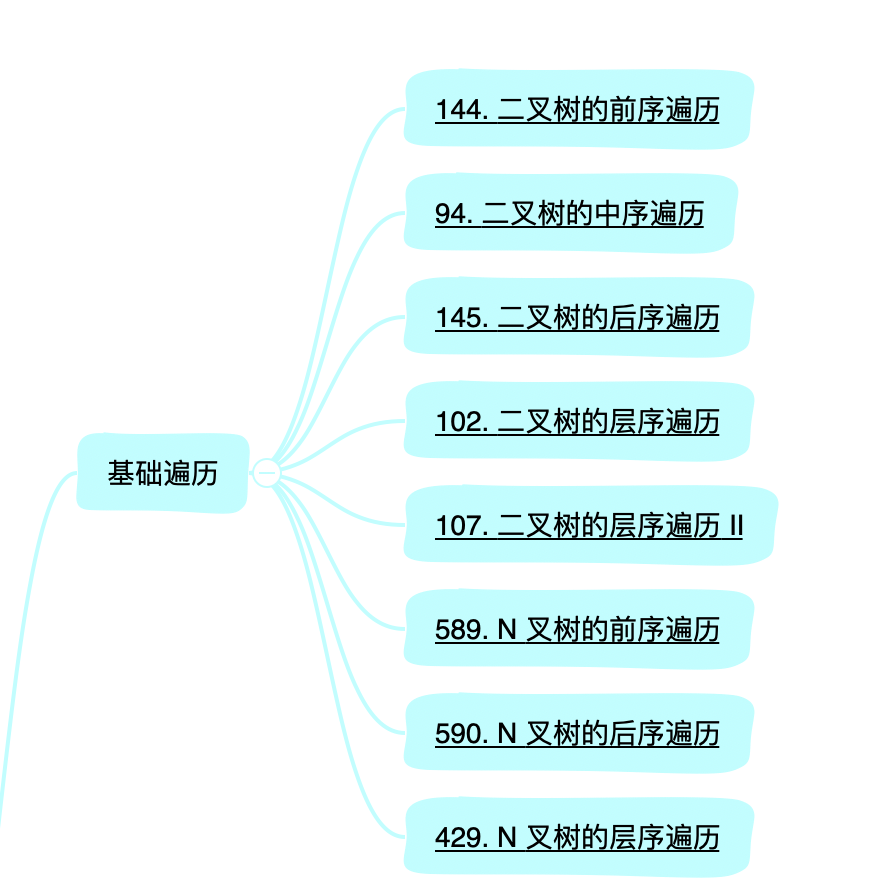

大家好，我是Johngo！

一起刷 LeetCode 以及对刷题感兴趣的小伙伴们，咱们今天对「树」的**遍历**做一个总结，主要是有关N叉树以及层次结点信息打印所注意不到的地方，一起来探究一下。

## 1 前言

对「树」相关题目的刷题已经有一段时间了。

一来二去时间上有所拖延。之前总结过「树」的基础遍历，这一篇来具体题目看看，对于基础遍历能遇到哪些问题。

下图是咱们之前规定的「基础遍历」的一些题目。

围绕，前中后序遍历对于N叉树的适用性，已经层序遍历不同的打印方式，有哪些注意点。

" 

题目如下：

102.二叉树的层序遍历
https://leetcode-cn.com/problems/binary-tree-level-order-traversal  

589.N 叉树的前序遍历
https://leetcode-cn.com/problems/n-ary-tree-preorder-traversal  


107.二叉树的层序遍历 II
https://leetcode-cn.com/problems/binary-tree-level-order-traversal-ii  


145.二叉树的后序遍历
https://leetcode-cn.com/problems/binary-tree-postorder-traversal  


94.二叉树的中序遍历
https://leetcode-cn.com/problems/binary-tree-inorder-traversal  


429.N 叉树的层序遍历
https://leetcode-cn.com/problems/n-ary-tree-level-order-traversal  


144.二叉树的前序遍历
https://leetcode-cn.com/problems/binary-tree-preorder-traversal  

590.N 叉树的后序遍历
https://leetcode-cn.com/problems/n-ary-tree-postorder-traversal  

以上，在 github 记录：https://github.com/xiaozhutec/share_leetcode


## 2 分类

前面我们说过一些基础的「树」的遍历，直达链接：https://mp.weixin.qq.com/s/nTB41DvE7bfrT7_rW_gfXw

有了之前的基础，很直观的，可以将上述遍历的题目分为**两类两方面**

> 两类：
> 		第一类，分别是前序遍历、中序遍历和后续遍历
> 		第二类，层次遍历
> 两方面：
> 		第一方面，递归实现，适用于前序遍历、中序遍历和后续遍历
> 		第二方面，非递归实现适用于前序遍历、中序遍历、后续遍历以及层次遍历


## 3 递归遍历

在之前 https://mp.weixin.qq.com/s/nTB41DvE7bfrT7_rW_gfXw 的一篇文章中已经详细说过了递归的方式，大家可重新翻开看看。

然后该篇文章由于涉及到 N 叉树的遍历方式，因此，咱们对二叉树和N叉树进行对比代码设计，由于其相似性，很容易就破解这几个题目

首先，定义「树」结点类，二叉树和 N叉树的结点定义不同点

```python
# 二叉树
class TreeNode(object):
    def __init__(self, val, left=None, right=None):
        self.val = val
        self.left = left
        self.right = right

# N叉树
class Node(object):
    def __init__(self, val=None, children=[]):
        self.val = val
        self.children = children
```

看起来区别是二叉树的左右孩子和 N叉树的孩子们结点的区别，其实本质是一样的，同理二叉树的左右孩子也能写成children列表的形式。

即：

```python
# 二叉树
class TreeNode(object):
    def __init__(self, val, children=[]):
        self.val = val
        self.children = children
```

而这里二叉树的 children 只有两个孩子，即左孩子 left 和右孩子 right。

描述完上述的孩子结点的定义，下面再看看递归的遍历方式。

```python
# 二叉树
res = []
def pre_order(root):
    if not root:
        return
    res.append(root.val)
    pre_order(root.left)
    pre_order(root.right)
    
# N叉树
res = []
def pre_order(root):
    if not root:
        return
    res.append(root.val)
    for node in root.children:
        pre_order(node)
```

看出区别了吗？区别就在 `res.append(root.val)` 之后的代码。

二叉树的写法是先递归左孩子，再递归右孩子。

N叉树的写法是，利用 `for` 循环，依次递归孩子结点。

所以，区别就是递归的写法，**二叉树写两次递归，N叉树写N次递归**

都是一样的逻辑，是不是很简单。类似于先序遍历，其中中序遍历和后续遍历，都是同样的逻辑去处理（N叉树，N可代表从2到n）

 github 查看详细代码：https://github.com/xiaozhutec/share_leetcode


## 4 非递归遍历

非递归遍历先序、中序和后续遍历的详细逻辑在也这里已经写了，可以返回头看看 https://mp.weixin.qq.com/s/nTB41DvE7bfrT7_rW_gfXw，用长图的形式以及讲的非常明白了。

层次遍历在「树-自顶向下」的类别中运用的比较多，相比较于递归解法，利用层次遍历更加容易理解，而且代码框架比较单一，具体的介绍和案例会在下一篇《讲透树 | 自顶向下类别题目专题》中进行介绍。

本文的非递归遍历主要针对的是**层次遍历**。那为什么之前讲的比较明白了，这里又会说呢？

是这样，之前讲解的层次遍历，咱们打印出来的形式和 LeetCode 题目中打印出来的形式是有些区别的。而且仅仅因为打印的区别，会引出不一样的一个思路，后面很多情况都会遇到这样的思维方式。

如下：

```python
# 经典层次遍历打印形式
['A', 'B', 'C', 'D', 'E', 'F', 'G', 'H', 'I']
# LeetCode 中打印的形式
[['A'], ['B', 'C', 'D'], ['E', 'F', 'G', 'H', 'I']]
```

是的，LeetCode 中打印的形式是要求将每一层的结点元素单独放到一个 list 中，最后再放置到一个大的 list 中。


#### 传统层次遍历打印形式

先来简单回顾一下，传统的打印方式。


跟着上述图中的描述，动手画一下就会明白特别的简单。

一句话总结就是：

> 循环判断队列 queue 中是否有元素，如果有，访问该元素并且判断该结点元素是否有孩子结点，如果有，孩子结点依次入队 queue，否则，继续循环执行。

看代码：

```python
while queue:
    node = queue.pop()
    res.append(node.val)
    if node.left:
        queue.appendleft(node.left)
    if node.right:
        queue.appendleft(node.right)
```

就是不断判断队列中队首是够有元素，如果有元素，访问该结点元素，并且判断该结点是否有孩子结点，如果有，则依次入队。继续循环判断。

其实N叉树来说的话，也是一样的逻辑，只不过是把二叉树中的两个孩子，换为N个孩子，进行入队操作。

```python
while queue:
    node = queue.pop()
    res.append(node.val)
    for child_node in node.children:
      	queue.appendleft(child_node)
```

一样的道理！是不是比较简单。


#### LeetCode 中题目打印方式

也是用一幅图来描述，相较于经典的层次遍历，每层单独存放会稍微复杂一些，需要变换一点点思路。

**核心一句话**

> queue 中存放的是当前层的结点集，level_queue 存放的下一层的结点集合。
>
> 每次循环遍历当前层queue中结点的同时，将该层结点集写进一个临时list，将下一层的结点入队到 level_queue  中。之后将 level_queue 赋值给 queue，循环执行，直到 queue 为空。
>
> 最后，将每层临时 list 写到一个大的 list 中

「点击下图查看高清原图」👇


上图是以二叉树进行举例子，其实和 N叉树的逻辑几乎是一致的，咱们先来看二叉树的相关核心代码：

```python
def levelOrder(self, root):
    res = []
    if not root:
        return res
    queue = [root]
    while queue:
        level_queue = []      # 临时记录每一层结点
        level_res = []        # 临时记录每一行的结点值
        for node in queue:		# 循环遍历每一层所有的结点
            level_res.append(node.val)
            if node.left:
                level_queue.append(node.left)
            if node.right:
                level_queue.append(node.right)
        queue = level_queue
        res.append(level_res)
    return res
```

类似的思路，来看看 N叉树的层次遍历代码：

```python
def levelOrder_leetcode(self, root):
    res = []
    queue = [root]
    if not root:
        return res
    while queue:
        level_queue = []  	# 临时保存每一层结点元素便于下一次进行迭代
        level_res = []    	# 临时保存每一层结点值
        for node in queue:
            level_res.append(node.val)
            if node.children:
                for child_node in node.children:
                    level_queue.append(child_node)
        queue = level_queue
        res.append(level_res)
    return res
```

到这里，应该已经非常熟悉二叉树和N叉树的一些区别了，依旧是在 `level_res.append(node.val)` 之后的几行代码的区别。

本篇文章主要是想说明开篇说的一些关于 LeetCode 上基础的「树遍历」的核心解决思路。

代码和本文的文档都在 https://github.com/xiaozhutec/share_leetcode，需要的小伙伴可以自行下载代码运行跑起来！

github 内容刚刚开始更新，感兴趣的可以一起来学习。私信我 “LeetCode刷题” 群里一起刷题进步。

手里有 star 的，有空可以帮我点点 star。谢过大家！


