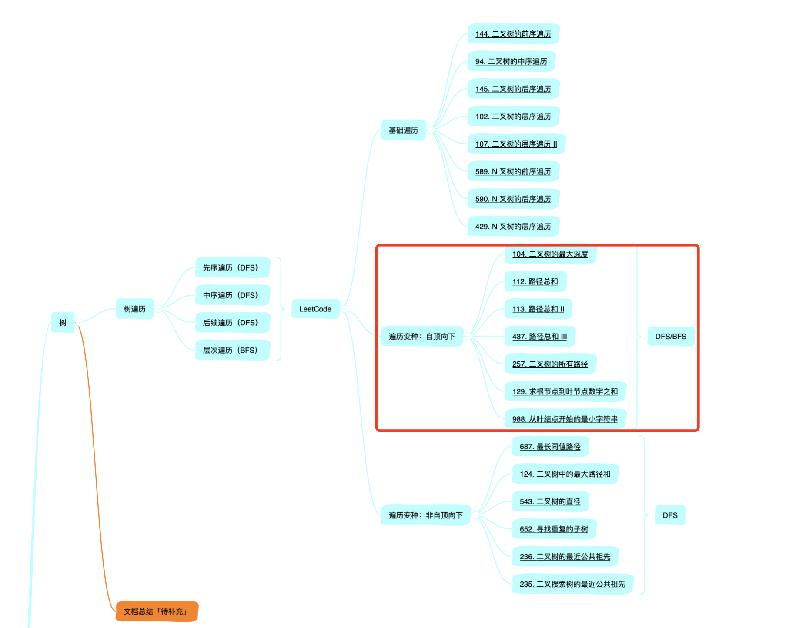
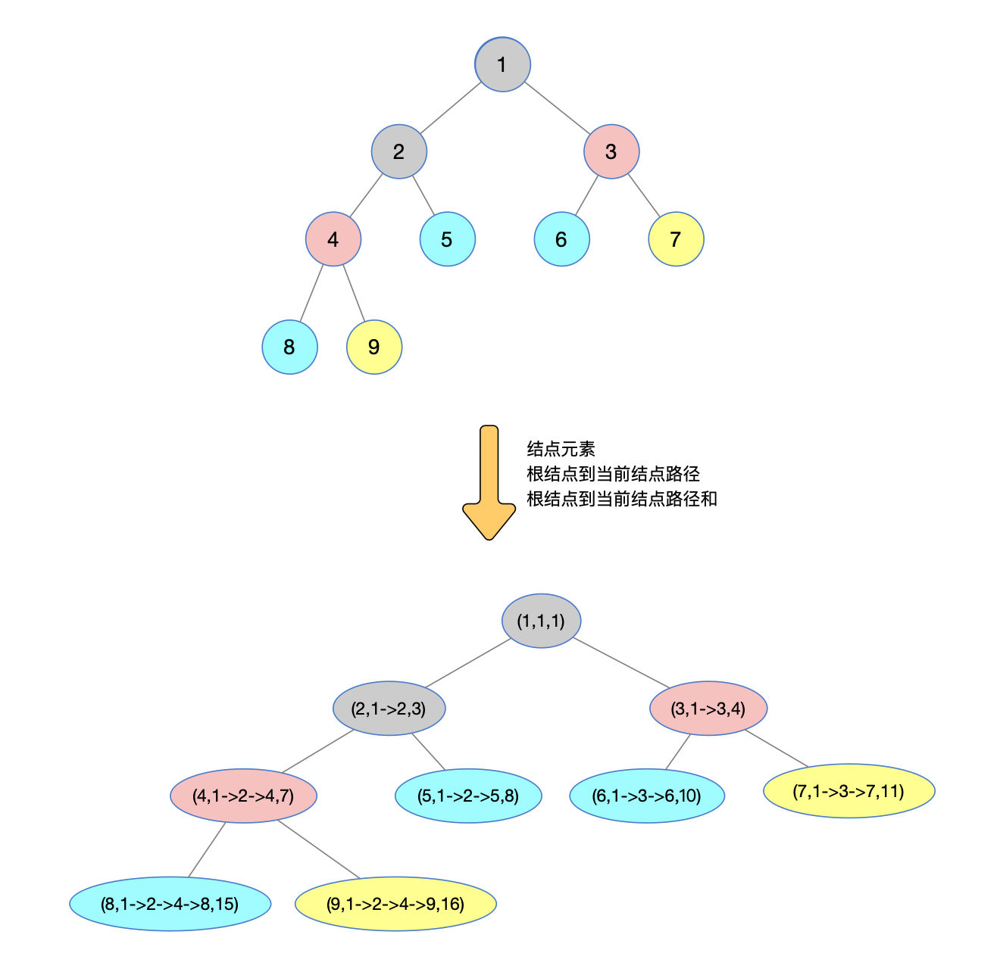
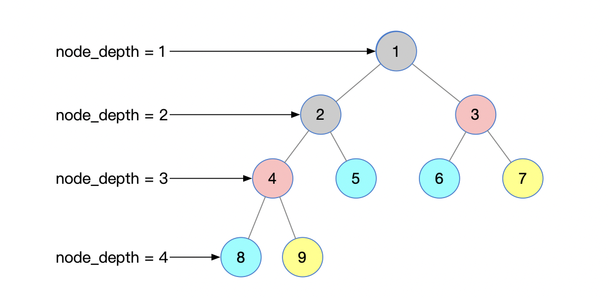

[toc]


大家好！ 

这篇文章是「讲透树」的第 3 篇文章，也是「树」专题中自顶向下这类题目的一个总结。

还是直观的先看看本文的所处的一个进度。





基本上，绝大多数关于「树」的题目，会有很大一类属于「自顶向下」类型的。

什么意思？就是计算结果的时候，通常会涉及从树根到叶子节点的计算过程，比如说最大深度、路径总和、从根结点到叶子结点的所有路径等等，都属于「自顶向下」这类题目。

104.二叉树的最大深度: https://leetcode-cn.com/problems/maximum-depth-of-binary-tree
112.路径总和: https://leetcode-cn.com/problems/path-sum
113.路径总和 II: https://leetcode-cn.com/problems/path-sum-ii
437.路径总和 III: https://leetcode-cn.com/problems/path-sum-iii
257.二叉树的所有路径: https://leetcode-cn.com/problems/binary-tree-paths
129.求根节点到叶节点数字之和: https://leetcode-cn.com/problems/sum-root-to-leaf-numbers
988.从叶结点开始的最小字符串: https://leetcode-cn.com/problems/smallest-string-starting-from-leaf

然后这类题目的解决方法基本又会有两类：

> 第一类：BFS，广度优先，利用层次遍历的方式进行解决
>
> 第二类：DFS，深度优先，利用前中后序遍历树的方式进行问题的解决

既然先说的 BFS，咱们就从 BFS 先说起，后面再描述 DFS 的解决方式。


## BFS

回忆一下经典二叉树的层序遍历问题，把需要的图放出来先看看。


很简单的一个过程。循环判断队列 queue 中是否有元素，如果有，访问该元素并且判断该结点元素是否有孩子结点，如果有，孩子结点依次入队 queue，否则，继续循环执行。

再来看看代码：

```python
res = []
while queue:
    node = queue.pop()
    res.append(node.val)
    if node.left:
        queue.appendleft(node.left)
    if node.right:
        queue.appendleft(node.right)
```

现在想要抛出 2 个问题，看是否可以很容易就解答。

### 问题一

> 遍历过程中能否记录根结点到当前结点的一些信息？
>
> 包括：
>
> 1、根结点到当前结点的路径
>
> 2、根结点到当前结点的路径和

把上述图中结点中的字母对应为数字，达到**问题一**中的要求情况，看下图：



在遍历过程中，不断的进行结点值【包括结点对象、根结点到当前结点路径、根结点到当前结点路径和】的记录。

> node 表示结点对象
> node_path 表示根结点到当前结点路径
> node_val 表示根结点到当前结点路径和
> Python 中使用元祖进行表示结点的三元素信息：(node, node_path, node_val)

代码实现：

```python
res = []

while queue:
    node, node_path, node_val = queue.pop()
    res.append((node, node_path, node_val))
    if node.left:
        queue.appendleft((node.left, node_path+str(node.left), node_val+node.left.val))
    if node.right:
        queue.appendleft((node.right, node_path+str(node.right), node_val+node.right.val))
```

这样，在遍历过程中，就会将三元组的信息随时携带。完美解决！


### 问题二

> 能否在层序遍历过程中，携带一个值进行层序的记录?



对，就是这样，利用一个额外的变量来记录层序。

这个的思路，其实很容易就让我想到之前二叉树按照 LeetCode 形式打印的一个过程（不太记得的小伙伴可以查看mpmpmpmpmpmpmm 回忆下关于LeetCode的层序遍历）

下面我又把 LeetCode 中要求层次遍历的图解过程放出来，作为回忆参考！

「点击下图查看高清原图」👇


即，在每一层遍历的时候，进行 `node_depth+=1` 的操作。先来看最初代码的样子（还。。记得吗？）：

```python
def levelOrder(self, root):
    res = []
    if not root:
        return res
    queue = [root]
    while queue:
        level_queue = []      # 临时记录每一层结点
        level_res = []        # 临时记录每一行的结点值
        for node in queue:
            level_res.append(node.val)
            if node.left:
                level_queue.append(node.left)
            if node.right:
                level_queue.append(node.right)
        queue = level_queue
        res.append(level_res)
    return res
```

每一层的遍历，都是 queue 被赋予新的一个队列 level_queue，即新的一层的所有结点集。

在此思路的基础上

> 首先，初始化变量用作记录层序值 `node_depth = 0`
>
> 其次，在每一次`while queue:` 之后进行 `node_depth+=1` 
>
> 最后 `node_depth` 的值就是你想要的某一层的值

看代码小改动后的实现

```python
def levelOrder(self, root):
    res = []
    # 层序记录
    node_depth = 0
    if not root:
        return res
    queue = [root]
    while queue:
	      node_depth += 1				# 层序值+1
        level_queue = []
        level_res = []
        for node in queue:
            level_res.append(node.val)
            if node.left:
                level_queue.append(node.left)
            if node.right:
                level_queue.append(node.right)
        queue = level_queue
        res.append(level_res)
    return res
```

对，不要找了，就是有注释的那两行，只不过要取的 `node_depth` 的值是你所需要的那个值。

比如说，最大深度的计算，那就是最后 `node_depth` 的值；如果是根结点到某一结点路径和你给到的 `target` 值一致的时候的那个深度，那就是被满足结点所在层序的  `node_depth` 。

好！

两个重要的问题被引出来，有没有什么感觉，是不是比较简单的一个思路。下面就来看看这些简单思路，能处理哪些问题！

LeetCode 第


## DFS 


