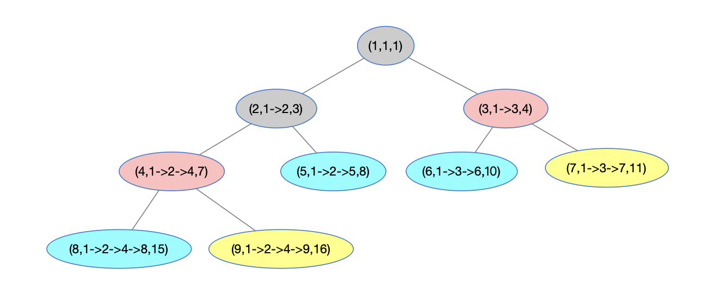

[toc]


## 零

**刷题复盘进度**

大家好，我是Johngo！ 

这篇文章是「讲透树」的第 3 篇文章，也是「树」专题中自顶向下这类题目的一个复盘总结。

一起刷题的小伙伴们，复盘还是要唠叨一句，记录思路，在记录的过程中，又一次深刻体会！

还是直观的先看看本文的所处的一个进度。


基本上，绝大多数关于「树」的题目，会有很大一类属于「自顶向下」类型的。

什么意思？就是计算结果的时候，通常会涉及从树根到叶子节点的计算过程，比如说最大深度、路径总和、从根结点到叶子结点的所有路径等等，都属于「自顶向下」这类题目。

涉及到的题目

104.二叉树的最大深度: https://leetcode-cn.com/problems/maximum-depth-of-binary-tree
112.路径总和: https://leetcode-cn.com/problems/path-sum
113.路径总和 II: https://leetcode-cn.com/problems/path-sum-ii
437.路径总和 III: https://leetcode-cn.com/problems/path-sum-iii
257.二叉树的所有路径: https://leetcode-cn.com/problems/binary-tree-paths
129.求根节点到叶节点数字之和: https://leetcode-cn.com/problems/sum-root-to-leaf-numbers
988.从叶结点开始的最小字符串: https://leetcode-cn.com/problems/smallest-string-starting-from-leaf

然后这类题目的解决方法基本又会有两类：

> 第一类：BFS，广度优先搜索，利用层次遍历的方式进行解决
>
> 第二类：DFS，深度优先搜索，利用前中后序遍历树的方式进行问题的解决

既然先说的 BFS，咱们就从 BFS 先说起，后面再描述 DFS 的解决方式。


## 一 BFS 思路

**BFS 思路**

BFS（Breadth First Search）：广度优先搜索

回忆一下经典二叉树的层序遍历问题，把需要的图放出来先看看。


很简单的一个过程。循环判断队列 queue 中是否有元素，如果有，访问该元素并且判断该结点元素是否有孩子结点，如果有，孩子结点依次入队 queue，否则，继续循环执行。

再来看看代码：

```python
res = []
while queue:
    node = queue.pop()
    res.append(node.val)
    if node.left:
        queue.appendleft(node.left)
    if node.right:
        queue.appendleft(node.right)
```

很顺畅很经典的一个层次遍历的代码。

现在想要抛出 2 个引例，往上述代码中添加点作料，看是否可以很容易就解答。

### 引例一

> 遍历过程中能否记录根结点到当前结点的一些信息？
>
> 包括：
>
> 1、根结点到当前结点的路径信息
>
> 2、根结点到当前结点的路径和

把上述图中结点中的字母对应为数字，达到**引例一**中的要求情况，看下图：


在遍历过程中，不断的进行结点值【**包括结点对象、根结点到当前结点路径、根结点到当前结点路径和**】的记录。

> node 表示结点对象
>
> node_path 表示根结点到当前结点路径
>
> node_val 表示根结点到当前结点路径和
>
> Python 中使用元祖进行表示结点的三元组信息：(node, node_path, node_val)

代码实现：

```python
res = []

while queue:
    node, node_path, node_val = queue.pop()
    res.append((node, node_path, node_val))
    if node.left:
        queue.appendleft((node.left, node_path+str(node.left), node_val+node.left.val))
    if node.right:
        queue.appendleft((node.right, node_path+str(node.right), node_val+node.right.val))
```

这样，在遍历过程中，就会将三元组的信息随时携带。完美解决！


### 引例二

> 能否在层序遍历过程中，携带一个值进行层序的记录?


对，就是这样，利用一个额外的变量来记录层序。

这个的思路，其实很容易就让我想到之前二叉树按照 LeetCode 形式打印的一个过程（不太记得的小伙伴可以查看 https://mp.weixin.qq.com/s/MkCF5TaR1JD3F3E2MKlgVw 回忆下关于LeetCode的层序遍历）

下面我又把 LeetCode 中要求层次遍历的图解过程放出来，作为回忆参考！

「点击下图查看高清原图」👇


即，在每一层遍历的时候，进行 `node_depth+=1` 的操作。先来看最初代码的样子（还。。记得吗~？）：

```python
def levelOrder(self, root):
    res = []
    if not root:
        return res
    queue = [root]
    while queue:
        level_queue = []      # 临时记录每一层结点
        level_res = []        # 临时记录每一行的结点值
        for node in queue:
            level_res.append(node.val)
            if node.left:
                level_queue.append(node.left)
            if node.right:
                level_queue.append(node.right)
        queue = level_queue
        res.append(level_res)
    return res
```

每一层的遍历，都是 queue 被赋予新的一个队列 level_queue，即新的一层的所有结点集。

在此思路的基础上

> 首先，初始化变量用作记录层序值 `node_depth = 0`
>
> 其次，在每一次`while queue:` 之后进行 `node_depth+=1` 
>
> 最后 `node_depth` 的值就是你想要的某一层的值

看代码小改动后的实现

```python
def levelOrder(self, root):
    res = []
    # 层序记录
    node_depth = 0
    if not root:
        return res
    queue = [root]
    while queue:
	      node_depth += 1				# 层序值+1
        level_queue = []
        level_res = []
        for node in queue:
            level_res.append(node.val)
            if node.left:
                level_queue.append(node.left)
            if node.right:
                level_queue.append(node.right)
        queue = level_queue
        res.append(level_res)
    return res
```

哈哈对，不要找了！就是**有注释的那两行**，只不过要取的 `node_depth` 的值是你所需要的那个值。

比如说，最大深度的计算，那就是最后 `node_depth` 的值；如果是根结点到某一结点路径和你给到的 `target` 值一致的时候的那个深度，那就是被满足结点所在层序的  `node_depth` 。

好！

两个重要的问题被引出来，有没有什么感觉，是不是真的是比较简单的一个思路。下面就来看看这些简单思路，能处理哪些问题！

利用上述「引例一」和「引例二」的思路举例看看对 LeetCode 中部分题目有什么帮助？

> LeetCode104.二叉树的最大深度
>
> 题目链接：https://leetcode-cn.com/problems/maximum-depth-of-binary-tree
>
> GitHub解答：https://github.com/xiaozhutec/share_leetcode/blob/master/%E6%A0%91/104.%E4%BA%8C%E5%8F%89%E6%A0%91%E7%9A%84%E6%9C%80%E5%A4%A7%E6%B7%B1%E5%BA%A6.py

其实就是「引例二」中携带一个值进行层序的记录，最后返回的 `node_depth` 就是二叉树的最大深度！

```python
def maxDepth_bfs(self, root):
    if not root:
        return 0
    queue = collections.deque()
    # 初始化深度为 0
    node_depth = 0
    # 初始化队列中的结点元素 root
    queue.appendleft(root)
    while queue:
        # 每一层的遍历，深度 +1
        node_depth += 1
        # 记录每一层的结点集合
        level_queue = []
        for node in queue:
            if node.left:
                level_queue.append(node.left)
            if node.right:
                level_queue.append(node.right)
        queue = level_queue

    return node_depth
```

是不是很容易就解决了！

再来看一个：
> LeetCode112.路径总和:
>
> 题目链接：https://leetcode-cn.com/problems/path-sum
>
> GitHub解答：https://github.com/xiaozhutec/share_leetcode/blob/master/%E6%A0%91/112.%E8%B7%AF%E5%BE%84%E6%80%BB%E5%92%8C.py

LeetCode112题目是从根结点到叶子结点，是否存在路径和为 `target` 的一个路径。

如下图，如果咱们要找路径和为 `target=16` 的一个路径，利用「引例一」中的思路，很容易就可以判断，在最后一个结点中的三元组 `(9, 1->2->4->9, 16)` 中能够得到路径为 `1->2->4->9`。


代码实现起来也很容易

```python
def hasPathSum_bfs(self, root, targetSum):
    if not root:
        return False
    queue = [(root, root.val)]
    while queue:
        node, node_sum = queue.pop(0)
        if not node.left and not node.right and node_sum == targetSum:
            return True
        if node.left:
            queue.append((node.left, node_sum+node.left.val))
        if node.right:
            queue.append((node.right, node_sum+node.right.val))
    return False
```

这里返回了存在该路径，为 `True`，如果想要返回路径，那么直接将路径返回就可以了！

再来看一个：

> LeetCode257.二叉树的所有路径:
>
> 题目链接：https://leetcode-cn.com/problems/binary-tree-paths
>
> GitHub解答：https://github.com/xiaozhutec/share_leetcode/blob/master/%E6%A0%91/257.%E4%BA%8C%E5%8F%89%E6%A0%91%E7%9A%84%E6%89%80%E6%9C%89%E8%B7%AF%E5%BE%84.py

就是要把所有从根结点开始到叶子结点所有的路径遍历出来。其实还是「引例一」中的思路，当遍历到叶子结点的时候，将所有叶子结点中的三元组中的路径值取出。例如叶子结点 `(9, 1->2->4->9, 16)` 中的路径为 `1->2->4->9`取出。



可以得到一个路径集合：

```python
[[1->3->6], [1->3->7], [1->2->4->8], [1->2->4->9]]
```

代码很类似

```python
def binaryTreePaths_bfs(self, root):
    res = []
    if not root:
        return res
    queue = collections.deque()
    queue.appendleft((root, str(root.val)+"->"))
    while queue:
        node, node_val = queue.pop()
        if not node.left and not node.right:
            res.append(node_val[0:-2])
        if node.left:
            queue.appendleft((node.left, node_val + str(node.left.val) + "->"))
        if node.right:
            queue.appendleft((node.right, node_val + str(node.right.val) + "->"))
    return res
```

核心还是记录遍历过程中对路径的记录情况，最后得到想要的结果！

再来看最后一个例子：

> LeetCode129.求根节点到叶节点数字之和
>
> 题目链接：https://leetcode-cn.com/problems/sum-root-to-leaf-numbers
>
> GitHub解答：https://github.com/xiaozhutec/share_leetcode/blob/master/%E6%A0%91/129.%E6%B1%82%E6%A0%B9%E8%8A%82%E7%82%B9%E5%88%B0%E5%8F%B6%E8%8A%82%E7%82%B9%E6%95%B0%E5%AD%97%E4%B9%8B%E5%92%8C.py

这个题目依然延续了「引例一」中的思路，就是将路径中的数字一次记录，转为数字，进行相加。


举例说，图中路径分别为`[[1->3->6], [1->3->7], [1->2->4->8], [1->2->4->9]]`，对应的数字为 [10, 11, 15, 16]，那么，数字之和为 `10+11+15+16=52`。

上一题目是将路径完整的遍历出来，这个题目就是增加了一个步骤，那就是将每个路径转为数字，并且相加。

```python
def sumNumbers_bfs(self, root):
    res = []
    sum = 0
    if not root:
        return 0
    queue = collections.deque()
    queue.append((root, str(root.val)))
    while queue:
        node, node_val = queue.pop()
        if node and not node.left and not node.right:
            res.append(node_val)
        if node.left:
            queue.appendleft((node.left, node_val+str(node.left.val)))
        if node.right:
            queue.appendleft((node.right, node_val+str(node.right.val)))
    for item in res:
        sum += int(item)
    return sum
```

就是最后一个步骤，将数组中的数字型字符串转为整数并且相加。得到最终的结果！

还有一些其他类似的题目，这里就先不说了，文章最开头给出的「自顶向下」这类题目都在 github：https://github.com/xiaozhutec/share_leetcode/tree/master/%E6%A0%91 上进行了记录，细节代码可以参考。

关于这部分题目，重点想说的就是「引例一」和「引例二」两方面的思路，这两方面的思路已经可以把这类题目的绝大多数都可以解决了！

下面再总结下利用 DFS 的思路进行问题的解决。


## 二 DFS 思路

**DFS 思路**

DFS（Depth First Search）：深度优先搜索

回忆下之前的二叉树的递归遍历，也可以说是 DFS 的思路。之前在这篇文章中详细阐述过 https://mp.weixin.qq.com/s/nTB41DvE7bfrT7_rW_gfXw

利用递归进行二叉树的遍历，很简单但是不太容易理解。在之前也详细说过这方面的理解方式。

很多时候我会利用一个很 easy 的思路是，将二叉树的递归遍历利用在「二叉树」的叶子结点以及再向上一层进行理解和问题的解决。

下面先来看看各个遍历的代码。

二叉树的先序遍历：

```python
def pre_order_traverse(self, head):
    if head is None:
        return
    print(head.value, end=" ")
    self.pre_order_traverse(head.left)
    self.pre_order_traverse(head.right)
```

二叉树的中序遍历：

```python
def in_order_traverse(self, head):
    if head is None:
        return
    self.in_order_traverse(head.left)
    print(head.value, end=" ")
    self.in_order_traverse(head.right)
```

二叉树的后续遍历：

```python
def post_order_traverse(self, head):
    if head is None:
        return
    self.post_order_traverse(head.left)
    self.post_order_traverse(head.right)
    print(head.value, end=" ")
```

看完这几段代码，它的整洁性令人舒服，但是它的可读性确实不太高...

下一期，还会复盘一期《讲透树 | 非自顶向下题目专题》，与这一期「自顶向下」题目不同，思路也会有些差别。

这一期先把「自顶向下」这类题目运用 DFS 的思路说明白了！

利用二叉树的递归思路，其实很容易就可以解决这类问题，把 BFS 说到的题目用 DFS 思路解决一下，代码看起来更加的简洁，美观！

> LeetCode104.二叉树的最大深度
>
> 题目链接：https://leetcode-cn.com/problems/maximum-depth-of-binary-tree
>
> GitHub解答：https://github.com/xiaozhutec/share_leetcode/blob/master/%E6%A0%91/104.%E4%BA%8C%E5%8F%89%E6%A0%91%E7%9A%84%E6%9C%80%E5%A4%A7%E6%B7%B1%E5%BA%A6.py

简单到气人，理解到想打人！

```python
def maxDepth_dfs(self, root):
    if not root:
        return 0
    else:
        max_left = self.maxDepth_dfs(root.left)
        max_right = self.maxDepth_dfs(root.right)
        return max(max_left, max_right) + 1
```

太简单了叭！！~~ 

一个后续遍历，很快就把问题解决了！

由于使用了递归调用，那么还是从叶子结点开始考虑：

a.当递归到叶子的时候，程序`return 0`，也就是递归使用 `self.maxDepth_dfs(root.left)`以及 `self.maxDepth_dfs(root.right)`的时候，返回值为 0；

b.往上考虑一层，递归使用 `self.maxDepth_dfs(root.left)`或者 `self.maxDepth_dfs(root.right)`的时候，返回值是`return max(max_left, max_right) + 1`， 是 【a.】的返回值 `0+1`。

通过以上【a. b.】两点锁构造的思路进行代码的设计，一定是正确的。

**重点重点重点：以上的【b.】，不是太容易理解，用心思考，恍然大悟的时候，真的很巧妙！**


下一个题目：

> LeetCode112.路径总和:
>
> 题目链接：https://leetcode-cn.com/problems/path-sum
>
> GitHub解答：https://github.com/xiaozhutec/share_leetcode/blob/master/%E6%A0%91/112.%E8%B7%AF%E5%BE%84%E6%80%BB%E5%92%8C.py

LeetCode112题目是从根结点，寻找路径和为 `target` 的一个路径。

又是一个代码过分简洁的例子：

```python
def hasPathSum(self, root, targetSum):
    if not root:
        return False
    if not root.left and not root.right:
        return root.val == targetSum
    return self.hasPathSum(root.left, targetSum - root.val) or self.hasPathSum(root.right, targetSum - root.val)

```

思路点：递归将 `targetSum-递归到的结点值 `，直到遇到叶子结点的时候，刚好被完全减去，得到0。即存在该路径。

上述是一个很简洁的先序遍历过程。

由于使用了递归调用，那么依然从叶子结点开始考虑：

a.当递归到叶子的时候，程序判断叶子结点的值和`tagetSum`被减的剩余的值是否相等；

b.往上考虑一层，递归使用 `self.hasPathSum(root.left, targetSum - root.val)`以及`self.hasPathSum(root.right, targetSum - root.val)`的时候，返回值是【a.】返回的值。


再来看一个：

> LeetCode257.二叉树的所有路径:
>
> 题目链接：https://leetcode-cn.com/problems/binary-tree-paths
>
> GitHub解答：https://github.com/xiaozhutec/share_leetcode/blob/master/%E6%A0%91/257.%E4%BA%8C%E5%8F%89%E6%A0%91%E7%9A%84%E6%89%80%E6%9C%89%E8%B7%AF%E5%BE%84.py

这个题目用 DFS 解决起来，同样是非常简洁的，但是中间多了一个步骤的记录，所以会多几行代码：

```python
    def binaryTreePaths_dfs(self, root):
        res = []
        if not root:
            return res

        def dfs(root, path):
            if not root:
                return
            if root and not root.left and not root.right:
                res.append(path + str(root.val))
            if root.left:
                dfs(root.left, path + str(root.val) + "->")
            if root.right:
                dfs(root.right, path + str(root.val) + "->")
        dfs(root, "")
        return res
```

核心还是一个递归的先序遍历，依然咱们用递归解决思路步骤来分析一下：

a.当递归到叶子的时候，没有左右孩子，直接将该结点加入到路径中来；

b.往上考虑一层，递归使用 `dfs(root.left, path + str(root.val) + "->")`以及`dfs(root.right, path + str(root.val) + "->")`的时候，就是将当前结点值加入到路径中。

还是依照这样的思路，就可以很容易的将题目解决！


再来看最后一个例子：

> LeetCode129.求根节点到叶节点数字之和
>
> 题目链接：https://leetcode-cn.com/problems/sum-root-to-leaf-numbers
>
> GitHub解答：https://github.com/xiaozhutec/share_leetcode/blob/master/%E6%A0%91/129.%E6%B1%82%E6%A0%B9%E8%8A%82%E7%82%B9%E5%88%B0%E5%8F%B6%E8%8A%82%E7%82%B9%E6%95%B0%E5%AD%97%E4%B9%8B%E5%92%8C.py

这个题目与上一个题目，很类似，就是将计算好的路径值转为整型进行相加，看看代码：

```python 
def sumNumbers_dfs(self, root):
    res = []    # 所有路径集合
    sum = 0     # 所有路径求和

    def dfs(root, path):
        if not root:
            return
        if root and not root.left and not root.right:
            res.append(path + str(root.val))
        if root.left:
            dfs(root.left, path + str(root.val))
        if root.right:
            dfs(root.right, path + str(root.val))

    dfs(root, "")
    for item in res:
        sum += int(item)

    return sum
```

核心本质还是一个递归实现的先序遍历，两个步骤就先不分析了，参考上个题目。


嗯。。大概本篇的「树-自顶向下」已经接近尾声，寻找刷题组织的小伙伴们可以一起参与进来，私信我就OK！咱们一起坚持！


## 三 最后

**总结唠叨几句**

个人刷题经验，难免会出现思路上的欠缺，如果大家有发现的话，一定提出来，一起交流学习！

关于「树-自顶向下」这类题目，既适合用 BFS 思路解决，又适合使用 DFS 的思路进行解决。

用 BFS 解决问题的时候，思路清晰，代码稍微看起来会有些多！

可是用 DFS 的情况是，代码简洁，但是思路有时候会有些混乱，需要大量的练习才能逐渐的清晰起来！

下一期是讲透树 | 非自顶向下题目专题》，专门说说「树-非自顶向下」这一类，不知道会不会再有最后复盘的一期，看思路而定吧。

代码和本文的文档都在 https://github.com/xiaozhutec/share_leetcode，需要的小伙伴可以自行下载代码运行跑起来！方便的话给个 star。谢过大家！


