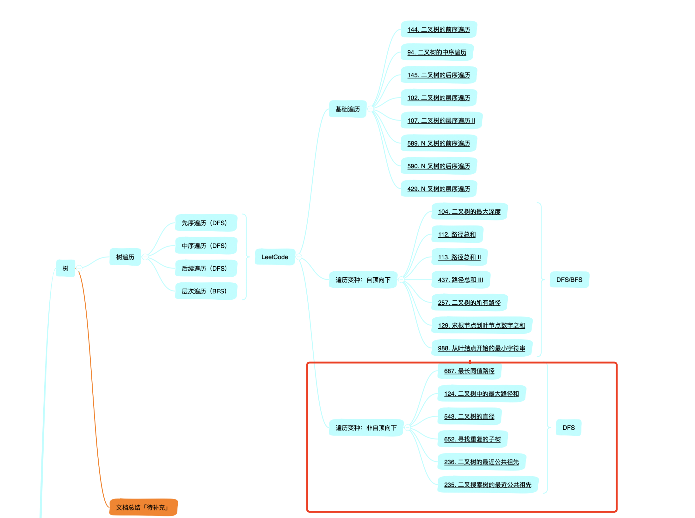

[toc]


大家好，我是Johngo！

这篇文章是「讲透树」系列的第 4 篇文章，也是「树」专题中非自顶向下这类题目的一个复盘总结。

前 3 讲的链接地址在这里了：

讲透树1 | 树的基础遍历专题 https://mp.weixin.qq.com/s/nTB41DvE7bfrT7_rW_gfXw

讲透树2 | 树的遍历复盘专题 https://mp.weixin.qq.com/s/MkCF5TaR1JD3F3E2MKlgVw

讲透树3 | 自顶向下类别题目复盘专题 https://mp.weixin.qq.com/s/9U4P5zZIFppiJO_XK2QFDA

不同的类型已经都进行了各自的总结，相信在后面记忆不太清晰的时候，返回头来看看，这些文档又会和思维激起灵魂碰撞！

### 一、阶段说明

一起刷题的小伙伴们，复盘还是要唠叨一句，记录思路，在记录的过程中，又一次深刻体会！比如说：

> 相信在后面记忆不太清晰的时候，返回头来看看，这些文档又会和思维激起灵魂碰撞！

直观的先看看本文的所处的一个进度



相比较于「自顶向下」的题目，「非自顶向下」的题目相比较下来不太适合用 BFS 来解决，非常适合于用 DFS 来解决。而且相较于「自顶向下」的题目，「非自顶向下」的题目难度会大一点。

关于 BFS 的解题思路对于「自顶向下」这类型题目是非常友好的，思路清晰。可查看这里https://mp.weixin.qq.com/s/9U4P5zZIFppiJO_XK2QFDA。

本篇文章涉及到的题目

687.最长同值路径：https://leetcode-cn.com/problems/longest-univalue-path/

124.二叉树中的最大路径和：https://leetcode-cn.com/problems/binary-tree-maximum-path-sum

543.二叉树的直径：https://leetcode-cn.com/problems/diameter-of-binary-tree

652.寻找重复的子树：https://leetcode-cn.com/problems/find-duplicate-subtrees/

236.二叉树的最近公共祖先：https://leetcode-cn.com/problems/lowest-common-ancestor-of-a-binary-tree

235.二叉搜索树的最近公共祖先：https://leetcode-cn.com/problems/lowest-common-ancestor-of-a-binary-search-tree


### 二、DFS 解题思路

本篇着重说「非自顶向下」的思路以及涉及到的 LeetCode 题目。

在这里总结一句，其实就是下面三种基础递归遍历的变形，这个变形来源于题目的要求，但本质都是递归遍历。

这里我再一次把三种二叉树递归的代码贴出来：

> 二叉树的先序遍历

```python
def pre_order_traverse(self, head):
    if head is None:
        return
    print(head.value, end=" ")
    self.pre_order_traverse(head.left)
    self.pre_order_traverse(head.right)
```

> 二叉树的中序遍历

```python
def in_order_traverse(self, head):
    if head is None:
        return
    self.in_order_traverse(head.left)
    print(head.value, end=" ")
    self.in_order_traverse(head.right)
```

> 二叉树的后续遍历

```python
def post_order_traverse(self, head):
    if head is None:
        return
    self.post_order_traverse(head.left)
    self.post_order_traverse(head.right)
    print(head.value, end=" ")
```

令人**整洁**的舒服...

令人**难以理解**的不舒服...

对的，就是这种整洁的代码，在处理起二叉树的问题来，着实是游刃有余的。


### 三、案例剖析

> LeetCode687.最长同值路径
>
> 题目链接：https://leetcode-cn.com/problems/longest-univalue-path/
>
> GitHub解答：https://github.com/xiaozhutec/share_leetcode/blob/master/%E6%A0%91/687.%E6%9C%80%E9%95%BF%E5%90%8C%E5%80%BC%E8%B7%AF%E5%BE%84.py

这就是一个**后续的递归遍历**，后续递归遍历完，不进行结点的打印，而是进行结点值和相关孩子结点的比对判断：

```python
def longestUnivaluePath_dfs(self, root):
    self.length = 0

    def dfs(root):
        if not root:
            return 0
        left_len = dfs(root.left)
        right_len = dfs(root.right)
        left_tag = right_tag = 0
        if root.left and root.left.val == root.val:
            left_tag = left_len + 1
        if root.right and root.right.val == root.val:
            right_tag = right_len + 1
        # max(最大长度, 左子树最大长度+右子树最大长度)
        self.length = max(self.length, left_tag + right_tag)
        return max(left_tag, right_tag)

    dfs(root)
    return self.length
```

看到了吧，其实就是在`left_len = dfs(root.left)` 和 `right_len = dfs(root.right)` 之后，进行**当前结点和左右孩子结点的结点值比对**，如果相同了，很显然是 `+1`。

另外，就题论题。

**下面会介绍一种很重要的思路，在很多题目中都会遇到。**

这个题目有很关键的一点是`self.length = max(self.length, left_tag + right_tag)`，由于题目不要求一定经过根结点。那么，此时如果左孩子的结点值和根结点的结点值以及右孩子的结点值和根结点的结点值都相同，此时会是下面的一种情况。


谈论红色框内的结点：

灰色结点的左孩子`length=1`，灰色结点的右孩子`length=0`；

再往上层看，灰色结点 5 的左孩子也是 5，那么`left_tag=2`，灰色结点 5 的右孩子也是 5，那么`right_tag=1`；

所以，`length = max(length, left_tag + right_tag)`，那么，得到的结果是`length=3`，也就是黑色所示的粗边。

以上，利用后续遍历的递归思想，就可以把问题解决了！

强调：上面的思路经常会遇到，很重要！


再看一个例子：

> LeetCode124.二叉树中的最大路径和
>
> 题目链接：https://leetcode-cn.com/problems/binary-tree-maximum-path-sum
>
> GitHub解答：https://github.com/xiaozhutec/share_leetcode/blob/master/%E6%A0%91/124.%E4%BA%8C%E5%8F%89%E6%A0%91%E4%B8%AD%E7%9A%84%E6%9C%80%E5%A4%A7%E8%B7%AF%E5%BE%84%E5%92%8C.py

从二叉树中找出一个最大的路径，就是找到一个连续结点值最大的一个路径。

可以参考上一个题目的思路，依然采用后续遍历的思路，进行解决。

```python
def maxPathSum(self, root):
    self.length = float("-inf")

    def dfs(root):
        if not root:
            return 0
        left_len = max(dfs(root.left), 0)   # 只有贡献值大于 0 的，才会选取对应的子结构
        right_len = max(dfs(root.right), 0)
        inner_max = left_len + root.val + right_len

        self.length = max(self.length, inner_max)   # 计算当前结点所在子树的最大路径
        return max(left_len, right_len) + root.val  # 返回当前结点左右子结构的最大路径

    dfs(root)
    return self.length
```

思路依然还是比较轻松的吧，后续遍历的典型变形。

看这句`self.length = max(self.length, inner_max)`，是不是和上一题异曲同工，也是比较上一层递归的 `length` 和本层中 `inner_max`作比较，找出最大值。

两点注意

> 1. 每次递归，需要计算 length 的值，以保证每次递归得到最大路径和
> 2. 每次递归的返回值一定是左子树和右子树中的最大值+当前结点值


再来看一道题目：

> LeetCode543.二叉树的直径
>
> 题目链接：https://leetcode-cn.com/problems/diameter-of-binary-tree
>
> GitHub解答：https://github.com/xiaozhutec/share_leetcode/blob/master/%E6%A0%91/543.%E4%BA%8C%E5%8F%89%E6%A0%91%E7%9A%84%E7%9B%B4%E5%BE%84.py

题目要求返回一颗二叉树的直径，其实还是一个后续递归遍历。

依然还是采用上述「LeetCode687」中介绍的重要思路进行求解。

```python
def diameterOfBinaryTree(self, root):
    self.path_length = 0

    def dfs(root):
        if not root:
            return 0
        left_len = dfs(root.left)
        right_len = dfs(root.right)
        left_tag = right_tag = 0
        if root.left:
            left_tag = left_len + 1
        if root.right:
            right_tag = right_len + 1
        self.path_length = max(self.path_length, left_tag + right_tag)
        return max(left_tag, right_tag)

    dfs(root)
    return self.path_length
```

依然是后续遍历，递归调用后，采用`max(self.path_length, left_tag + right_tag)`，比较上一层返回的 `length`和左右子树中的最大值。

依然是两点：

>1. 每次递归计算 length 的值，找当前结点最长路径
>
>2. 返回左右子树的最大路径长度


上面说了三个题目，大致思路都相同，不同的是一个题目计算路径和、两个题目是计算路径长度。

比较重要的那个点，在「LeetCode687」中介绍的重要思路，这个是最重要的一环，务必理解加以运用！

见得太多，用的也太多！


最后咱们再看两个题目：

> LeetCode236.二叉树的最近公共祖先
>
> 题目链接：https://leetcode-cn.com/problems/lowest-common-ancestor-of-a-binary-tree
>
> GitHub解答：https://github.com/xiaozhutec/share_leetcode/blob/master/%E6%A0%91/236.%E4%BA%8C%E5%8F%89%E6%A0%91%E7%9A%84%E6%9C%80%E8%BF%91%E5%85%AC%E5%85%B1%E7%A5%96%E5%85%88.py

这个是给定两个结点，求解他们的最近公共祖先，也是一个递归的问题。

```python
def lowestCommonAncestor(self, root, p, q):
    if not root or root == p or root == q:
        return root
    left = self.lowestCommonAncestor(root.left, p, q)
    right = self.lowestCommonAncestor(root.right, p, q)
    if not left: return right
    if not right: return left
    return root
```

其实说白了还是递归的思路进行求解，不过这里需要注意四种情况：

​    1.无左孩子 and 无右孩子，直接返回根结点

​    2.无左孩子 and 有右孩子，直接返回根结点

​    3.有左孩子 and 无右孩子，直接返回根结点

​    4.有左孩子 and 有右孩子，继续递归遍历

所以，还是递归的变形进行解决，唯一有一点就是需要深入思考，深入体会。


> LeetCode235.二叉搜索树的最近公共祖先
>
> 题目链接：https://leetcode-cn.com/problems/lowest-common-ancestor-of-a-binary-search-tree
>
> GitHub解答：https://github.com/xiaozhutec/share_leetcode/blob/master/%E6%A0%91/235.%E4%BA%8C%E5%8F%89%E6%90%9C%E7%B4%A2%E6%A0%91%E7%9A%84%E6%9C%80%E8%BF%91%E5%85%AC%E5%85%B1%E7%A5%96%E5%85%88.py

这个题目是上一个题目的变形，难度降低，因为要考察的二叉树由一般结构变为了二叉搜索树。

因此，利用搜索二叉树的性质，稍进行判断就可以解决。

```python
def lowestCommonAncestor(self, root, p, q):
    if p.val < root.val and q.val < root.val:
        return self.lowestCommonAncestor(root.left, p, q)
    if p.val > root.val and q.val > root.val:
        return self.lowestCommonAncestor(root.right, p, q)
    return root.val
```

是不是很简单整洁的代码。

第一个`if`，就是如果`p`和`q`都小于当前结点，那么直接到左子树进行递归调用；

第二个`if`，就是如果`p`和`q`都大于当前结点，那么直接到右子树进行递归调用；

如果都不满足，即就是所需要的答案。

想想看，是不是？利用搜索二叉树的结构，其实思路很清晰简单。


### 四、最后

好了，「树」这一阶段的刷题已经进入尾声，但我理解在第一轮刷题完毕之后，还会继续回来重新来过。

下一阶段就到了「动态规划」的一个刷题时间窗口了，递归和动态规划都是出了名的比较难学，但是它们的思想深入贯彻整个算法的各个节点。所以，坚持把这几部分内容都进行一个总结，让大家把思路逐渐清晰起来！

代码和本文的文档都在 https://github.com/xiaozhutec/share_leetcode，需要的小伙伴可以自行下载代码运行跑起来！方便的话给个 star。谢过大家！


