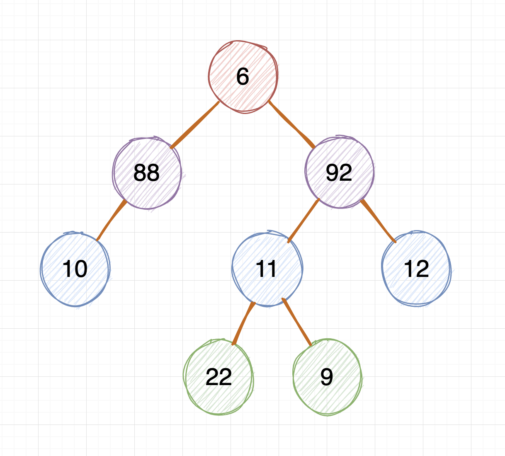

[toc]


【0】

### 前言

偶然看到的一个题目！！~

通常我们面对关于二叉树的题目会是对树的各种操作，而该题目是对整棵树进行序列化存储，然后再反序列化出来，返回二叉树原本的样子。当然最后要返回树的头结点 head \~\~\~


【1】

### 题目

二叉树的序列化和反序列化

序列化：即在生成一棵二叉树以后，按照文本的格式存储到文件中，即为二叉树的序列化

反序列化：将序列化后的二叉树，按照序列化的规则，对其进行解析出原来二叉树的格式，并且返回头结点

下图对应前序遍历的序列化结果 6!88!10!#!#!#!92!11!22!#!#!9!#!#!12!#!#! ：

 


【2】

### 解决方案

#### 1. 构造树结点类

> 这块就用 Python 来举例

```python
class TreeNode:
    def __init__(self, value):
        self.val = value		# 存储结点值
        self.left = None		# 指向左子树
        self.right = None		# 指向右子树
```

然后手动构造二叉树

```python
if __name__ == "__main__":
    # 新建节点
    node_A = TreeNode("6")
    node_B = TreeNode("88")
    node_C = TreeNode("92")
    node_D = TreeNode("10")
    node_E = TreeNode("11")
    node_F = TreeNode("12")
    node_G = TreeNode("22")
    node_H = TreeNode("9")

    # 构建二叉树
    #      6
    #    /   \
    #  88     92
    #  /      / \
    # 10     11  12
    #       / \
    #      22  9
```


#### 2. 二叉树的序列化

第一，序列化二叉树，在序列化的同时，每遍历一个值，在该值后面加!(叹号)，空节点用#(井号)表示

> ! (叹号) 的作用是：表示该节点内容结束，例如：如果不加!(叹号)，88表示8还是88，就会有歧义了
> #(井号) 的作用是：表示结点为空结点，为了保持逻辑一致性，空节点也也用#!表示。其实也可以直接用#表示


第二，我们采用二叉树的前序遍历进行序列化


综合上述两方面，我们可以得到序列化后的内容应该为

```txt
先序序列化：6!88!10!#!#!#!92!11!22!#!#!9!#!#!12!#!#!
```

下面看代码：

```python
def serialize_by_pre_order_traverse(self, root):
  if root is None:
    self.serialize_string += "#!"
    return None
  self.serialize_string += root.val+"!"
  self.serialize_by_pre_order_traverse(root.left)
  self.serialize_by_pre_order_traverse(root.right)
```

递归进行遍历的同时，每遍历一个结点值，就在结点值后面加 "!" (叹号)，每遍历到空结点的时候，自动填 "#" (井号) 并且加 "!" (叹号)


#### 3. 二叉树的反序列化

反序列化的重点在于构造二叉树，如果有构造二叉树的思路，那么反序列化会很简单就可以实现

第一，由于序列化后每个结点是以 "!" (叹号) 隔开的，所以需要将序列化好的结果按照 "!" 分割，存储成数组的形式

下面代码将序列化字符串分割为数组 items_tree_node 

```python
# 先序实现反序列化
def deserialize_by_pre_order_traverse(self, serialize_string):
    items_tree_node = []
    items = serialize_string.split("!")[0:-1]
    # 将各个结点值放置到 list 中
    for item in items:
        items_tree_node.append(item)
    # print(items_tree_node)
    # 构造二叉树
    return self.create_tree(items_tree_node)
```

第二，将数组按照前序遍历的方式，进行构造二叉树

```python
def create_tree(self, item_tree_node):
    if len(item_tree_node) <= 0:
        return None
    item = item_tree_node.pop(0)
    root = None
    if item != '#':
        root = TreeNode(item)
        root.left = self.create_tree(item_tree_node)
        root.right = self.create_tree(item_tree_node)
    return root
```


### 代码

至此，所有的思路都已简述完毕

依据前序遍历的思路，进行了序列化和反序列化的构造

序列化：依据前序遍历每个结点，每个结点用 "!" (叹号) 分割，空结点用  "#" (井号) 表示

反序列化：将序列化好的结果，按照 "!" (叹号) 分割存储为数组，然后依据前序遍历进行二叉树的构造


最后，将上述所有的代码进行整理之后：

```python
# -*- coding:utf-8 -*-
# !/usr/bin/env python

# 树结点类
class TreeNode:
    def __init__(self, value):
        self.val = value
        self.left = None
        self.right = None


class TreeSerializeAndDeserialize(object):

    def __init__(self):
        # 二叉树序列化后字符串结果
        self.serialize_string = ""
        # 二叉树反序列化字符串结果
        self.deserialize_head = None

    def print_tree_pre_order_traverse(self, head):
        if head is None:
            return None
        print(head.val, end=" ")
        self.print_tree_pre_order_traverse(head.left)
        self.print_tree_pre_order_traverse(head.right)

    def create_tree(self, item_tree_node):
        if len(item_tree_node) <= 0:
            return None
        item = item_tree_node.pop(0)
        root = None
        if item != '#':
            root = TreeNode(item)
            root.left = self.create_tree(item_tree_node)
            root.right = self.create_tree(item_tree_node)
        return root

    # 先序实现序列化
    def serialize_by_pre_order_traverse(self, root):
        # 说明：序列化二叉树，在序列化的同时，每遍历一个值，在该值后面加!(叹号)，空节点用#(井号)表示
        # !(叹号) 的作用是：表示该节点内容结束，例如：如果不加!(叹号)，88表示8还是88，就会有歧义了
        # #(井号) 的作用是：表示结点为空结点，为了保持逻辑一致性，空节点也也用#!表示。其实也可以直接用#表示
        # 二叉树结构：
        #      6
        #    /   \
        #  88     92
        #  /      / \
        # 10     11  12
        #       / \
        #      22  9
        # 先序序列化：6!88!10!#!#!#!92!11!22!#!#!9!#!#!12!#!#!
        if root is None:
            self.serialize_string += "#!"
            return None
        self.serialize_string += root.val+"!"
        self.serialize_by_pre_order_traverse(root.left)
        self.serialize_by_pre_order_traverse(root.right)
    
    # 先序实现反序列化
    def deserialize_by_pre_order_traverse(self, serialize_string):
        items_tree_node = []
        items = serialize_string.split("!")[0:-1]
        # 将各个结点值放置到 list 中
        for item in items:
            items_tree_node.append(item)
        # print(items_tree_node)
        # 构造二叉树
        return self.create_tree(items_tree_node)


if __name__ == "__main__":
    # 新建节点
    node_A = TreeNode("6")
    node_B = TreeNode("88")
    node_C = TreeNode("92")
    node_D = TreeNode("10")
    node_E = TreeNode("11")
    node_F = TreeNode("12")
    node_G = TreeNode("22")
    node_H = TreeNode("9")

    # 构建二叉树
    #      6
    #    /   \
    #  88     92
    #  /      / \
    # 10     11  12
    #       / \
    #      22  9

    node_A.left, node_A.right = node_B, node_C
    node_B.left = node_D
    node_C.left, node_C.right = node_E, node_F
    node_E.left, node_E.right = node_G, node_H

    serialize_res = ""
    # 实例化类
    TS = TreeSerializeAndDeserialize()
    print("\n先序遍历树结构: ")
    TS.print_tree_pre_order_traverse(node_A)

    # 利用先序遍历进行序列化
    TS.serialize_by_pre_order_traverse(node_A)
    print("\n通过先序遍历进行序列化：\n", TS.serialize_string)

    # 利用先序遍历进行反序列化
    print("通过先序遍历进行反序列化：")
    TS.deserialize_head = TS.deserialize_by_pre_order_traverse(TS.serialize_string)
    TS.print_tree_pre_order_traverse(TS.deserialize_head)
```

执行之后的结果：

```
先序遍历树结构: 
6 88 10 92 11 22 9 12 
通过先序遍历进行序列化：
6!88!10!#!#!#!92!11!22!#!#!9!#!#!12!#!#!
通过先序遍历进行反序列化：
6 88 10 92 11 22 9 12 
```

